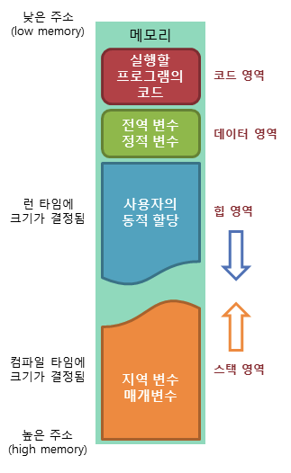

# week1-1 — 변수 · 표현식과 문 · 데이터 타입 · 연산자

부족한 점은 차후 채워 넣겠습니다.. I'm so sorry..

---

## 04. 변수

<details>
<summary><b>🧭 타 언어와 비교해 본, JS에서 메모리가 맡는 역할</b></summary>

<br>

JS 메모리를 검색하면 가끔 이런식으로 작성된 문서들이 있다.

> 원시값(number, string, boolean...)은 **스택**에 저장되고,
> 참조값(object, array, function)은 **힙**에 저장되며 스택에는 그 주소만 담긴다.

이 설명은 JS에선 살짝 어폐가 있다.

---

#### 0. 전통적인 프로세스 메모리 구조

우리가 흔히 배우는 그림은 이것이다.



C 기준으로 각 영역의 **주인**이 명확하다.

| 영역 | 무엇이 사는가 | 크기가 정해지는 시점 | 누가 정하는가 |
| --- | --- | --- | --- |
| **code** | 기계어 명령 | 컴파일 타임 | 컴파일러 |
| **data** | 전역 · static 변수 | 컴파일 타임 | 컴파일러 |
| **heap** | `malloc`으로 잡은 것 | 런타임 | **개발자** |
| **stack** | 지역변수 · 매개변수 · 복귀 주소 | **컴파일 타임 (타입)** | **컴파일러** |

핵심은 **stack의 크기를 컴파일 타임에 확정할 수 있다**는 점이다. 그래야 함수 진입 시 스택 포인터를 한 번에 내릴 수 있다.  
그리고 그게 가능한 이유는 **타입이 크기를 알려주기 때문**이다.

하지만 JS에서는 타입이 크기를 알려줘? 그런건 어림도 없기에 이 그림의 거의 모든 칸이 성립하지 않는다.

---

#### 1. 다른 언어에서 스택/힙 구분은 "타입이 정하는 것"이다

C에서 변수의 저장 위치는 **컴파일 타임에 타입이 결정한다.**

```c
int x = 10;              // 스택에 4바이트(int), 그 자리에 10이 그대로 들어간다
```

컴파일러는 `int`를 보는 순간 "이 슬롯은 4바이트"라고 확정할 수 있다. 그래서 스택 프레임의 크기를 미리 계산할 수 있고, 함수에 진입할 때 그만큼 스택 포인터를 내리면 끝난다.  
**타입이 크기를 알려주기 때문에 스택에 값을 직접 넣을 수 있는 것이다.**

Java도 마찬가지다. `int`, `double` 같은 primitive는 크기가 확정돼 스택 슬롯에 직접 들어가고, 객체는 힙에 두고 참조만 스택에 둔다.  
**"원시값은 스택, 객체는 힙"은 원래 이 언어들의 문장이다.**

---

#### 2. JS는 타입이 변수가 아니라 값에 붙는다

JS에서 같은 변수는 다음 줄에서 완전히 다른 타입이 될 수 있다.

```js
var x = 10;        // number
x = 'hello';       // string
x = { a: 1 };      // object
```

타입이 **변수(슬롯)** 가 아니라 **값 자체**에 붙어 있다. 그래서 엔진은 `x`라는 슬롯의 크기를 미리 정할 수가 없다.

문자열은 더 결정적이다.

```js
let s = 'a';
s = '아주 긴 문자열 ...............';
```

문자열은 길이가 정해져 있지 않다. **런타임에 얼마나 필요한지 결정되는 값을, 컴파일 타임에 크기를 확정해야 하는 스택에 넣는 것은 원리적으로 불가능하다.** 원시값인데도 그렇다.

즉 "원시값이니까 스택"이라는 추론의 **전제(원시값은 크기가 고정이다)가 JS에서는 성립하지 않는다.**

---

#### 3. 클로저 - 스택 모델이 결정적으로 깨지는 지점

C나 Java에서 함수가 리턴하면 스택 프레임은 통째로 사라진다. 지역 변수의 수명은 함수의 수명과 정확히 같다. 이게 스택이라는 자료구조를 쓸 수 있는 이유다.

JS는 이 전제를 깨버린다.

```js
function makeCounter() {
  let count = 0;          // 지역 변수인데
  return function () {
    return count++;       // 함수가 끝난 뒤에도 살아있어야 한다
  };
}

const counter = makeCounter();
counter(); // 0
counter(); // 1
```

`count`는 숫자, 즉 원시값이고 지역 변수다. 통념대로면 스택에 있어야 한다. 그런데 `makeCounter()`가 이미 리턴했는데도 `count`는 살아있고 계속 증가한다.

**스택에서 이미 사라진 프레임 안의 값이, 어떻게 계속 갱신될 수 있는가?** 될 수 없다. `count`는 애초에 스택에 있지 않았던 것이다.

> 클로저가 존재한다는 사실 자체가 "JS의 지역 원시값은 스택에 산다"는 모델과 양립할 수 없다.

---

#### 4. 실제 엔진도 힙에 할당한다

"이론상 그렇다"가 아니라 실제 엔진도 그렇게 만들어져 있다.

JS 엔진(V8, SpiderMonkey)은 **C++로 만든 프로그램**이다. 그래서 "JS 값을 하나 만든다"는 건 결국 **C++ 입장에서 메모리를 잡는 일**이다. 그 코드를 따라가 보면 **문자열이든 객체든 전부 같은 곳에서 끝난다.**

```
JS 코드              엔진이 하는 일 (C++)
─────────────────────────────────────────────
'hello'    ──▶  문자열 만드는 함수  ──┐
{ a: 1 }   ──▶  객체 만드는 함수    ──┤──▶  힙에 할당
[1, 2, 3]  ──▶  배열 만드는 함수    ──┘
```

- **SpiderMonkey** — 문자열 하나가 "힙에 있는 헤더 + 힙에 있는 문자 배열" 두 조각으로 저장된다. 문자열은 원시값인데도 그렇다.
- **V8** — 값을 만드는 모든 경로가 결국 **힙 할당 함수 하나로 모인다.** 엔진이 시작할 때 OS에서 큰 메모리 덩어리를 미리 받아두고, 값이 생길 때마다 거기서 조금씩 잘라 쓴다.

**즉 JS 값은 원시값이든 객체든 결국 힙에 산다. 변수가 들고 있는 건 "값이 있는 곳의 주소"다.**

> 💡 **주의** — 여기서 말하는 "JS의 힙"은 앞에서 본 4분할 그림의 그 힙이 아니다.
> V8 자체가 C++ 프로그램이라 OS에게 힙을 받아 돌아가고, **그 안에 자기만의 스택과 힙을 다시 만들어 쓴다.**
> 즉 층이 하나 더 있다. JS의 스택/힙은 **V8이 관리하는 가상의 공간**이다.

---

### 5. 그럼 스택은 뭘 하는가 — 최적화의 영역

물론 엔진이 스택을 아예 안 쓰는 건 아니다. 다만 **역할의 성격이 완전히 다르다.**

- **지역 변수는 스택에 놓인다. 단, 값이 아니라 포인터가 놓인다.** 그리고 클로저에 캡처되는 변수는 힙으로 옮겨진다.
- **작은 정수는 값이 슬롯에 직접 들어간다.** V8은 **태그드 포인터(SMI)** 로 최하위 비트를 태그 삼아 31/32비트 정수를 워드에 인라인하고, SpiderMonkey는 **NaN-boxing**으로 IEEE754 double의 미사용 NaN 비트 패턴에 타입 태그를 우겨넣는다.

여기서 중요한 건 이것이다.

> C에서 스택/힙 구분은 **개발자가 타입으로 지시하는 것**이지만,
> JS에서 스택은 **엔진이 알아서 하는 최적화이고, 언어 동작에 영향을 주지 않는 구현 세부사항**이다.

C에서 스택이냐 힙이냐는 수명 · 해제 시점 · 성능을 좌우하는 **의미론적 결정**이다. JS에서는 그 결정을 개발자가 내리지 않고, 내릴 수도 없으며, 결과를 관측할 수도 없다.

---

### 7. 그림으로 보는 차이

앞의 전통적인 4분할 그림을 JS 기준으로 다시 그리면 이렇게 된다.

**C — 값이 어디 사는지 타입이 결정한다**

```
낮은 주소
┌──────────────┐
│     code     │  함수 기계어
├──────────────┤
│     data     │  전역 · static 변수  ← 값이 여기 그대로 산다
├──────────────┤
│              │
│     heap     │  malloc한 것        ← 개발자가 직접 잡고 직접 푼다
│              │
├──────────────┤
│              │
│    stack     │  int x = 10;
│              │  ┌────────┐
│              │  │   10   │  ← 값이 스택에 그대로 들어있다
│              │  └────────┘
│              │  char* p;
│              │  ┌────────┐
│              │  │0x7f2a..│──┐  ← 포인터만 스택, 실체는 heap
│              │  └────────┘  │
└──────────────┘              ┘
높은 주소
```

**JS — 값은 전부 힙에 살고, 스택엔 포인터만 스쳐 지나간다**

```
┌───────────────────────────────────────────────────────┐
│                    JS 엔진 (V8 등)                     │
│                                                       │
│  ┌─────────────┐            ┌──────────────────────┐  │
│  │  Call Stack │            │        Heap          │  │
│  │             │            │  (엔진이 전적으로 소유)   │  │
│  │  실행 컨텍스트  │           │                      │  │
│  │  + 포인터들    │           │   ┌──────────────┐   │  │
│  │             │            │   │   'hello'    │   │  │
│  │  ┌───────┐  │            │   └──────────────┘   │  │
│  │  │ ptr ──┼──┼────────────┼──▶│  { a: 1 }    │   │  │
│  │  └───────┘  │            │   └──────────────┘   │  │
│  │  ┌───────┐  │            │   ┌──────────────┐   │  │
│  │  │ ptr ──┼──┼────────────┼──▶│  9007199254  │   │  │  ← 큰 수도 힙
│  │  └───────┘  │            │   └──────────────┘   │  │
│  │  ┌───────┐  │            │   ┌──────────────┐   │  │
│  │  │  42   │  │ ← SMI만 예외 │   │ 환경 레코드     │   │  │
│  │  └───────┘  │   (인라인)   │   │  count: 0    │   │  │  ← 클로저 캡처
│  │             │            │   └──────────────┘   │  │     변수는 여기로
│  └─────────────┘            └──────────────────────┘  │
│         ↑                              ↑              │
│   함수 끝나면 소멸                    GC가 관리             │
└───────────────────────────────────────────────────────┘
        ✋ 개발자는 이 안을 들여다볼 수도, 지시할 수도 없다
```

두 그림의 결정적 차이를 정리하면 이렇다.

| | C | JavaScript |
| --- | --- | --- |
| **data 영역** | 전역변수가 고정 주소에 상주 | **없음.** 전역 변수도 전역 객체 · 환경 레코드라는 힙 객체의 프로퍼티다 |
| **stack에 있는 것** | 값 그 자체 (타입이 크기를 보장) | **포인터** (+ SMI 같은 인라인 최적화 예외) |
| **heap을 잡는 주체** | 개발자 (`malloc` / `free`) | **엔진** (개발자는 요청조차 못 한다) |
| **지역변수의 최후** | 스택 프레임과 함께 소멸 | 캡처되면 **힙의 환경 레코드로 승격**되어 생존 |
| **경계선의 의미** | 수명 · 성능을 좌우하는 **의미론적 결정** | **관측 불가능한 구현 세부사항** |

</details>

---

### 정리

"자바스크립트는 개발자의 직접적인 메모리 제어를 허용하지 않는다"는 문장은 단순한 안전장치 얘기가 아니다. **어떤 값이 어디에 살지를 엔진이 런타임에 자유롭게 결정할 수 있어야 하기 때문에**, 애초에 주소를 노출하는 것이 불가능한 설계다.

C에서 메모리는 개발자가 배치를 설계하는 대상이지만, **JS에서 메모리는 엔진이 전적으로 소유하고 개발자에게는 "값이 있다"는 사실만 보장하는 추상 계층이다.** 그래서 개발자 입장에서는 **모든 JS 값이 힙 기반으로 동작한다**고 이해하는 편이 맞다.

---

## 05. 표현식과 문

> ㅎㅎ; 🙇🏻‍♂️ 그닥 하고픈 말이..

## 06. 데이터 타입

<details>
<summary><b>🔥 falsy와 truthy — 값 자체가 조건이 된다</b></summary>

<br>

JS는 불린 자리에 **아무 값이나** 놓을 수 있고, 엔진이 알아서 참/거짓으로 해석한다. 이때 거짓으로 취급되는 값이 **falsy**, 나머지 전부가 **truthy**다.

**falsy는 딱 8개뿐이다.** 이것만 외우면 나머지는 전부 truthy다.

| falsy | 비고 |
| --- | --- |
| `false` | |
| `0`, `-0` | |
| `0n` | BigInt 0 |
| `''` | 빈 문자열 (`""`, `` `` `` 포함) |
| `null` | |
| `undefined` | |
| `NaN` | |
| `document.all` | 레거시 호환용 예외. 실무에선 무시해도 된다 |

</details>

<details>
<summary><b>⚠️ 빈 배열과 빈 객체는 truthy다</b></summary>

<br>

목록에 **배열과 객체가 없다는 점**이 중요하다. 비어 있어도 참이다.

```js
if ([])  console.log('실행됨');  // ✅ 실행된다
if ({})  console.log('실행됨');  // ✅ 실행된다

Boolean([]);  // true
Boolean({});  // true
```

객체·배열은 **존재 자체가 참**이라 `if (arr)`로는 "비었는지"를 알 수 없다. 길이나 키 개수를 봐야 한다.

```js
if (arr.length)                 { /* 배열에 요소가 있다 */ }
if (Object.keys(obj).length)    { /* 객체에 키가 있다 */ }
```

> 💡 [] 는 truthy인데 `[] == false`는 `true`다. 값의 참/거짓 판정과 `==` 비교는 **서로 다른 규칙**을 쓰기 때문이다. 이래서 `==`를 쓰지 않는다. (→ 07장)

</details>

<details>
<summary><b>🕳️ 실전에서 falsy가 만드는 함정</b></summary>

<br>

**함정 1 — `indexOf`의 0**

```js
const arr = ['a', 'b'];

if (arr.indexOf('a')) { /* ❌ 첫 번째 요소인데 0이라 falsy */ }
if (arr.includes('a')) { /* ✅ */ }
```

`indexOf`는 못 찾으면 `-1`(truthy!), 첫 요소면 `0`(falsy)을 반환한다. **참/거짓이 정확히 뒤집힌다.** 존재 여부만 볼 땐 `includes`를 쓴다.

**함정 2 — `0`과 `''`이 진짜 값일 때**

장바구니 재고를 확인하는 코드를 짠다고 하자.

```js
function checkStock(item) {
  if (!item.stock) {
    return '재고 정보가 없습니다';
  }
  return `재고 ${item.stock}개`;
}

checkStock({ stock: 5 });   // '재고 5개'      ✅
checkStock({});             // '재고 정보 없음'  ✅
checkStock({ stock: 0 });   // '재고 정보 없음'  ❌ ← 품절인데!
```

**품절(`0`)인데 "정보가 없다"고 나온다.** `stock: 0`은 "재고를 세어봤더니 0개"라는 **정확한 정보**인데, `!0`이 `true`라서 정보가 없는 경우와 똑같이 처리된 것이다.

이런 값들이 전부 같은 함정에 빠진다.

| 값 | 실제 의미 | `!값` |
| --- | --- | --- |
| `0` | 품절, 좌표 원점, 0원, 0점 | `true` ❌ |
| `''` | 사용자가 입력을 지웠음 | `true` ❌ |
| `false` | 알림 끄기를 선택했음 | `true` ❌ |

**왜 이런 일이 생기나** — `!item.stock`은 "stock이 없나?"를 묻는 게 아니라 **"stock이 falsy인가?"** 를 묻는다. 우리가 알고 싶은 건 *존재 여부*인데, 물어본 건 *참/거짓*이었다.

**해결 — 없는지를 직접 물어본다**

```js
// ✅ 값이 없을 때만 걸러진다
if (item.stock === undefined) {
  return '재고 정보가 없습니다';
}
```

`null`도 같이 잡고 싶다면 이렇게 쓴다.

```js
if (item.stock == null) { }   // null과 undefined 둘 다 잡힌다
```

> `==`는 쓰지 말라고 했지만 **`== null`만은 예외**로 인정된다. `null`과 `undefined`를 한 번에 검사하는 관용구라서, 대부분의 린터도 이것만은 허용한다.

**가장 편한 방법은 `??`다.** (→ 07장)

```js
const stock = item.stock ?? '정보 없음';

// stock: 0  →  0          ✅ 0은 살아남는다
// stock: 없음 →  '정보 없음'  ✅
```

**함정 3 — truthy면 다 통과시켜 버릴 때**

장비를 다룰 권한이 있는지 검사하는 코드다.

```js
function checkAuth(employee) {
  if (employee.trained) {          // "교육을 받았으면 통과"
    return '작동 가능';
  }
  return '권한 없음';
}

checkAuth({ trained: true });   // '작동 가능'  ✅
checkAuth({ trained: false });  // '권한 없음'  ✅
```

여기까진 잘 된다. 그런데 다른 팀이 이 필드에 **날짜를 넣기 시작했다고 하자.**

```js
checkAuth({ trained: '2019-01-01' });  // '작동 가능'  ❌
checkAuth({ trained: 'not trained' }); // '작동 가능'  ❌❌❌
```

**`'not trained'`(교육 안 받음)인데 통과된다.** 문자열은 비어있지만 않으면 전부 truthy이기 때문이다.

함정 2가 **"진짜 값을 falsy라고 걸러내는"** 문제였다면, 이건 반대로 **"아무 값이나 truthy라고 통과시키는"** 문제다.

| | 함정 2 | 함정 3 |
| --- | --- | --- |
| 증상 | 통과해야 할 게 막힌다 | **막아야 할 게 통과된다** |
| 위험도 | 버그 | **보안 사고** |

**해결 — 원하는 값인지 못 박는다**

"truthy면 통과"가 아니라 **"정확히 `true`일 때만 통과"** 로 바꾼다.

```js
function checkAuth(employee) {
  if (employee.trained !== true) {   // true가 아니면 전부 거절
    return '권한 없음';
  }
  return '작동 가능';
}

checkAuth({ trained: 'not trained' });  // '권한 없음'  ✅
checkAuth({ trained: '2019-01-01' });   // '권한 없음'  ✅
```

> **권한 · 결제 · 삭제처럼 잘못 통과되면 안 되는 검사에는 truthy 판정을 쓰지 않는다.** `=== true`나 `=== '허용된값'`으로 범위를 좁힌다.

</details>

### ✅ 정리

- falsy 8개 외에는 전부 truthy. **빈 배열·빈 객체 포함**
- `if (값)`은 "값이 있는가"가 아니라 **"값이 truthy인가"** 를 묻는다
- `0`, `''`이 유효한 데이터라면 falsy 검사를 쓰면 안 된다

---

## 07. 연산자

<details>
<summary><b>⚖️ <code>==</code> vs <code>===</code></b></summary>

<br>

- `===` **일치(strict equality)** — 값과 타입이 모두 같아야 참
- `==` **동등(loose equality)** — 타입이 다르면 **한쪽을 변환한 뒤** 비교

```js
1 === '1';   // false — 타입이 다르다
1  ==  '1';  // true  — '1'을 1로 변환해서 비교

'' === false; // false
''  == false; // true
```

객체와 배열은 **참조로 비교**한다. 내용이 같아도 다른 객체면 거짓이다.

```js
{ a: 1 } === { a: 1 };  // false — 서로 다른 객체
[1, 2]   === [1, 2];    // false

const a = { x: 1 };
const b = a;
a === b;                // true — 같은 것을 가리킨다
```

**결론: 항상 `===`를 쓰자~~**. 다만 이런 경우는 괜찮을지도

```js
value == null   // null과 undefined를 한 번에 검증 하고 싶을 때
```

</details>

<details>
<summary><b>❓ 삼항 연산자 — 재할당을 없애는 도구</b></summary>

<br>

삼항연산자를 쓰면 const를 써서 값을 바뀔수 있다.. 라는 신호를 제거 할 수 있다.

```js
// ❌ let을 쓸 수밖에 없다 — 값이 나중에 바뀔 수 있다는 신호를 준다
let permissions;
if (title === '과장') {
  permissions = ['근로시간', '수당'];
} else {
  permissions = ['근로시간'];
}

// ✅ const로 한 번에 확정
const permissions = title === '과장' ? ['근로시간', '수당'] : ['근로시간'];
```

블록 안에서 `const`로 선언하면 **블록 밖에서 못 쓴다**는 문제도 함께 해결된다.

```js
if (title === '과장') {
  const permissions = ['근로시간', '수당'];   // 이 블록에 갇힌다
}
permissions;  // ❌ ReferenceError
```

**단, 중첩할 경우 가독성 박살남으로 중첩해서 쓰지는 말자**

```js
// ❌ 읽을 수 없다
const permissions = title === '부장' || title === '과장'
  ? title === '과장'
    ? ['근로시간', '초과근무승인', '수당']
    : ['근로시간', '초과근무승인']
  : ['근로시간'];

// ✅ 함수로 분리한다
function getPermissions(title) {
  if (title === '과장') return ['근로시간', '초과근무승인', '수당'];
  if (title === '부장') return ['근로시간', '초과근무승인'];
  return ['근로시간'];
}
const permissions = getPermissions(title);
```

조건이 **3개를 넘으면 함수로 빼는 것**이 기준선이다.

### 🔀 단락 평가 — 논리 연산자는 불린을 반환하지 않는다

이게 핵심이다. **`&&`와 `||`는 `true`/`false`가 아니라 피연산자 중 하나를 그대로 반환한다.**

```js
'joe' || 'I have no name';   // 'joe'      ← true가 아니다
''    || 'I have no name';   // 'I have no name'

'joe' && 'hello';            // 'hello'
''    && 'hello';            // ''
```

| 연산자 | 왼쪽이 truthy면 | 왼쪽이 falsy면 |
| --- | --- | --- |
| `\|\|` | **왼쪽 반환** (오른쪽 평가 안 함) | 오른쪽 반환 |
| `&&` | 오른쪽 반환 | **왼쪽 반환** (오른쪽 평가 안 함) |

"평가 안 함"이 **단락(short circuit)** 이다. 결과가 확정되면 나머지를 건너뛴다.

**용법 1 — `||`로 기본값**

```js
const path = icon.path || 'uploads/default.png';
```

**용법 2 — `&&`로 가드**

왼쪽이 falsy면 오른쪽을 아예 실행하지 않는다는 성질을 이용해 TypeError를 막는다.

```js
// ❌ images가 없으면 터진다
userConfig.images[0];

// ✅ images가 없으면 [0]에 접근조차 안 한다
userConfig.images && userConfig.images[0];
```

---

### 🆕 2026년의 방식 — `??`와 `?.`

위의 `||`·`&&` 패턴은 **지금은 더 나은 문법으로 대체된다.** 둘 다 ES2020에 들어왔고, 현재는 모든 환경에서 쓸 수 있다.

#### `??` — 널 병합 연산자

`||`의 문제는 **`0`과 `''`까지 falsy라 기본값으로 밀어버린다**는 것이다.

```js
const count = 0;

count || 10;   // 10  ❌ 0은 유효한 값인데 덮어써진다
count ?? 10;   // 0   ✅
```

`??`는 **`null`과 `undefined`일 때만** 오른쪽을 쓴다.

| | `\|\|` | `??` |
| --- | --- | --- |
| 발동 조건 | falsy 전체 (8개) | **`null` · `undefined`만** |
| `0`일 때 | 기본값으로 대체됨 ❌ | `0` 유지 ✅ |
| `''`일 때 | 기본값으로 대체됨 ❌ | `''` 유지 ✅ |
| `false`일 때 | 기본값으로 대체됨 ❌ | `false` 유지 ✅ |

> **판단 기준** — `0`·`''`·`false`가 **유효한 값이면 `??`**, 그것들도 "없음"으로 치고 싶으면 `||`.

#### `?.` — 옵셔널 체이닝

`&&` 가드를 대체한다. 왼쪽이 `null`/`undefined`면 **`undefined`를 반환하고 멈춘다.**

```js
// 예전 방식
userConfig.images && userConfig.images[0];
userConfig.images && userConfig.images.length && userConfig.images[0];

// 지금의 방식
userConfig.images?.[0];
```

메서드 호출과 함수 호출에도 쓸 수 있다.

```js
obj.method?.();      // method가 없으면 호출 안 하고 undefined
arr?.[0];            // arr이 null/undefined면 undefined
callback?.(data);    // callback이 없으면 그냥 넘어감
```

#### 예제를 2026년 문법으로

`&&`와 삼항 연산자를 조합한, 2020년경까지 흔했던 코드다.

```js
// 예전 방식
function getImage(userConfig) {
  const images = userConfig.images;
  return images && images.length ? images[0] : 'default.png';
}
```

지금은 이렇게 쓴다.

```js
// 🆕 지금
function getImage(userConfig) {
  return userConfig.images?.[0] ?? 'default.png';
}
```

**한 줄이 된 것보다 중요한 건 의미가 정확해진 것이다.**
- `?.` — "없으면 접근하지 말고 조용히 undefined"
- `??` — "**null/undefined일 때만** 기본값" (빈 문자열 이미지명이 있다면 그건 살린다)

예전 방식은 `images.length`가 `0`이면 falsy라 기본값으로 갔지만, **의도가 "빈 배열이면 기본값"인지 "값이 없으면 기본값"인지 코드만 봐선 알 수 없었다.** 지금 방식은 `??`가 그 경계를 명시한다.

> ⚠️ **주의** — `??`는 `||`·`&&`와 **괄호 없이 섞어 쓸 수 없다.** 우선순위 혼동을 막으려고 문법 자체가 금지한다.
> ```js
> a || b ?? c;      // ❌ SyntaxError
> (a || b) ?? c;    // ✅
> ```

### ✅ 정리

| 하고 싶은 것 | 쓸 것 |
| --- | --- |
| 값 비교 | `===` (예외: `== null`) |
| 조건에 따라 값 하나 정하기 | 삼항 연산자 + `const` |
| 조건 3개 이상 | **함수로 분리** |
| 기본값 (0·''도 없음으로 치기) | `\|\|` |
| 기본값 (0·''는 유효한 값) | **`??`** |
| 없을 수 있는 값 접근 | **`?.`** |

## 🙋 논의하고 싶은 점


