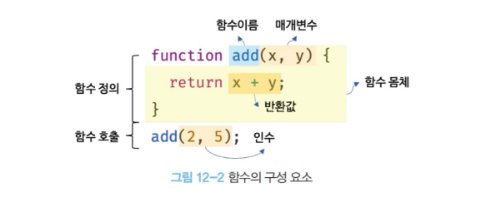
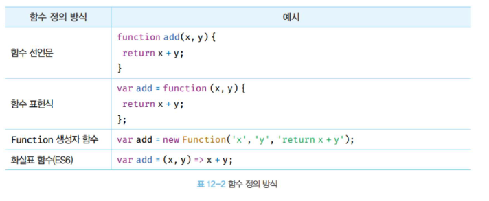

# 12장. 함수

## 12.1 함수란?

- **함수는 자바스크립트에서 가장 중요한 핵심 개념입니다**
  - 다른 자바스크립트의 핵심 개념인 스코프, 실행 컨텍스트, 클로저, 생성자 함수에 의한 객체 생성, 메서드, this, 프로토타입, 모듈화 등이 모두 함수와 깊은 관련이 있습니다.
  - 따라서 함수는 자바스크립트를 정확히 이해하고 사용하기 위해 피해갈 수 없는 핵심 중의 핵심이라고 할 수 있습니다.
- 프로그래밍 언어의 함수는 **일련의 과정을 문 으로 구현하고 코드블록으로 감싸서 하나의 실행 단위로 정의한 것** 입니다.
  - 함수 내부로 입력을 전달받는 변수룰 **매개변수 Parameter**
  - 입력을 **인수 Argument**
  - 출력을 반환값
    이라 합니다.

  

## 12.2 함수를 사용하는 이유

- 함수는 필요할 때 여러 번 호출할 수 있습니다.
  - 재사용이 가능하므로 동일한 작업을 반복적으로 수행해야 한다면 코드를 중복해서 여러 번 작성하는 것이 아니라 미리 정의된 함수를 재사용하는 것이 효율적입니다.
  - 함수는 몇 번이든 호출할 수 있으므로 **코드의 재사용**이라는 측면에서 매우 유용합니다.
- 함수는 **객체 타입의 값** 입니다.
  - 따라서 이름(식별자)을 붙일 수 있습니다.
  - 함수 이름은 변수 이름과 마찬기지로 함수 자신의 역할을 잘 설명해야 합니다.

## 12.3 함수 리터럴

- 자바스크립트의 함수는 객체 타입의 값 입니다.
- 따라서 숫자 값을 숫자 리터럴로 생성하고 객체를 객체 리터럴로 생성하는 것처럼 함수도 함수 리터럴로 생성할 수 있습니다.
  - 함수 리터럴은 function 키워드, 함수 이름, 매개 변수 목록, 함수 몸체로 구성됩니다.

  ```js
  // 변수에 함수 리터럴을 할당
  var f = function add(x, y) {
    return x + y;
  };
  ```

  - 위 예제를 보면 함수 리터럴을 변수에 할당하고 있습니다.
  - 앞선 5장 "리터럴"에서 읽어보았듯이 리터럴은 사람이 이해할 수 있는 문자 또는 약속된 기호를 사용하여 값을 생성하는 표기 방식을 의미합니다.
  - 즉, 리터럴은 값을 생성하기 위한 표기법 입니다.
  - 따라서 함수 리터럴도 평가되어 값을 생성하며, 생성된 값은 객체 입니다. **즉 함수는 객체입니다.**

- 함수는 객체이지만 일반 객체와는 다릅니다.
  - 일반 객체는 호출할 수 없지만 함수는 호출할 수 있습니다.
  - 그리고 일반 객체에는 없는 함수 객체만의 고유한 프로퍼티를 갖습니다.
- **함수가 객체라는 사실은 다른 프로그래밍 언어와 구별되는 자바스크립트의 중요한 특징입니다**

> 이에 대한 내용은 18장 함수와 일급 객체에서 언급할 예정입니다.

## 12.4 함수 정의

- 함수 정의란 함수를 호출하기 이전에 인수를 전달받을 매개변수와 실행할 문들, 그리고 반환할 값을 지정하는 것을 말합니다.
- 정의된 함수는 자바스크립트 엔진에 의해 평가되어 함수 객체가 됩니다.
- 그리고 함수를 정의하는 방법에는 4가지가 있습니다.



- 모든 함수 정의 방식은 함수를 정의한다는 면에서는 동일합니다.
  - 하지만, 미묘하지만 중요한 차이가 있습니다.

#### 잠깐 다시 읽어보는 undefined의 선언과 정의

- 자바스크립트의 undefined에서 이야기하는 정의란 변수에 값을 할당하여 변수의 실체를 명확히 하는 것 입니다.
- 다른 프로그래밍 언어에서는 선언과 정의를 엄격하게 구분해서 사용하는 경우가 있습니다.
  - C 언어 에서의 선언과 정의는 "실제로 메모리 주소를 할당하는가" 로 구분됩니다.
  - 단순히 컴파일러에게 식별자의 존재만 알리는 것은 선언이고, 실제로 컴파일러가 변수를 생성해서 식별자와 메모리 주소가 연결되면 정의로 구분합니다.
- 자바스크립트의 경우 변수를 선언하면 암묵적으로 정의가 이루어지기 때문에 선언과 정의의 구분이 모호합니다.
- ECMAScript에서는 변수는 "선언한다" 라고 표현하고, 함수는 "정의한다" 라고 표현합니다.

#### 다시 돌아와서 읽어보는 변수 선언과 함수 정의 용어 정리

- 변수는 "선언" 한다고 했지만 함수는 "정의" 한다고 표현합니다.
- 함수 선언문이 평가되면 식별자가 암묵적으로 생성되고 함수 객체가 할당됩니다.

### 12.4.1 함수 선언문

```js
// 함수 선언문
function add(x, y) {
  return x + y;
}
```

- 함수 선언문을 함수 리터럴과 형태가 동일합니다.
  - 단, 함수 리터럴은 함수의 이름을 생략할 수 있으나 함수 선언문은 함수의 이름을 생략할 수 없습니다.
- **함수 선언문은 표현식이 아닌 문** 입니다.
  - 콘솔에서 함수 선언물을 실행하면 완료값 undefined가 출력됩니다.
  - 함수 선언문이 만약 표현식인 문이라면 완료 값 undefined 대신 표현식이 평가되어 생성된 함수가 출력되어야 합니다.
    - 왜 와이? 표현식인 문 이라면 값으로 평가될 수 있어야 하기 때문입니다. if문과 삼항연산자의 예시 처럼요
- 함수 선언문은 표현식이 아닌 문이기 때문에 변수에 할당할 수 없어야 합니다.
  - 하지만 아래 예제를 보면 함수 선언문이 변수에 할당되는 것 처럼 동작합니다.

    ```js
    // 함수 선언문은 표현식이 아닌 문이므로 변수에 할당할 수 없습니다.
    // 하지만 함수 선언문이 변수에 할당되는 것 처럼 보이죠?
    var add = function add(x, y) {
      return x + y;
    };

    // 함수 호출
    console.log(add(2, 5)); // 7
    ```

  - 이렇게 동작하는 이유는 자바스크립트 엔진이 코드의 문맥에 따라 동일한 함수 리터럴을 표현식이 아닌 문인 함수 선언문으로 해석하는 경우와 표현식인 문인 함수 리터럴 표현식으로 해석하는 경우가 있기 때문입니다.
    - 이해 안될거같아서 조금 풀어서 써놓겠습니다.
      - 함수 선언문은 값으로 평가될 수 없는, 즉 표현식이 아닌 문 입니다. (like if 문)
        - 그리고 함수 선언문은 함수 이름을 생략할 수 없다는 점 이외에는 함수 리터럴과 형태가 동일합니다.
      - 함수 리터럴은 값으로 평가될 수 있는 표현식인 문 입니다. (like 삼항연산자)
  - 함수 선언문은 함수 이름을 생략할 수 없다는 점을 제외하면 함수 리터럴과 형태가 동일합니다.
    - 이는 함수 이름이 있는 기명 함수 리터럴은 함수 선언문 또는 함수 리터럴 표현식으로 해석될 가능성이 있다는 의미 입니다.

#### 조금 더 이해해보기

- 예를 들어, `{ }`은 블록문일 수도 있으며 객체 리터럴일 수도 있습니다. 즉 중의적 표현이죠.
- 자바스크립트 엔진은 `{ }`을 코드 블록으로 해석할까 객체 리터럴로 해석할까와 같은 대한 중의적인 코드에 대해서는 코드의 문맥에 따라 해석을 달리합니다.
  - 중괄호가 단독으로 존재하면 블록문으로 해석합니다.
  - 하지만 값으로 평가되어야 할 문맥에서 피연산자롤 사용되면 자바스크립트 엔진은 중괄호를 객체 리터럴로 해석합니다.
  - 이처럼 동일한 코드도 코드의 문맥에 따라 해석이 달라질 수 있습니다.
- 기명 함수 리터럴도 중의적인 코드입니다. 따라서 코드의 문맥에 따라 해석이 달라질 수 있습니다.
  - **여기에서 주의해야 할 내용은 함수 선언문이 아닌 함수 리터럴 중에서 기명 함수 리터럴이 중의적인 코드인 점을 명확이 구분해주셔야 합니다**

#### 기명 함수 리터럴

- 자바스크립트 엔진은 **함수 이름이 있는 기명 함수 리터럴**을 단독으로 사용하면 함수 선언문으로 해석합니다.
  - 형태 상 함수 선언문과 다를게 없죠?
  - 값으로 평가되어야 하는 문맥에서는 함수 리터럴을 사용하지 않은 경우, 즉 함수 리터럴을 피연산자로 사용하지 않는 경우 입니다.
- 함수 리터럴이 값으로 평가되어야 하는 문맥에서는 함수 리터럴 표현식으로 해석합니다.
  - 예를 들어 함수 리터럴을 변수에 할당하거나 피연산자로 사용하는 경우
    - **변수에 할당할 수 있음은 표현식인 문이며 값으로 평가될 수 있다는 뜻**

#### 함수 선언문과 함수 리터럴의 차이

- 함수 선언문과 함수 리터럴 표현식 모두 함수가 생성되는 것은 동일합니다.
- 하지만 함수를 생성하는 내부 동작에 차이가 있습니다.

  ```js
  // 기명 함수 리터럴을 단독으로 사용하면 함수 선언문으로 해석됩니다.
  // 함수 선언문에서는 함수 이름을 생략할 수 없습니다.
  function foo() {
    console.log("foo");
  }
  foo(); // foo

  // 함수 리터럴을 피연산자로 사용하면 함수 선언문이 아니라 함수 리터럴 표현식으로 해석됩니다.
  // 함수 리터럴에서는 함수 이름을 생략할 수 있습니다.
  (function bar() {
    console.log("bar");
  });
  bar(); // ReferenceError: bar is not defined
  ```

  - 그룹 연산자 `()` 안에서 작성된 함수 리터럴은 함수 선언문으로 해석되지 않고 함수 리터럴 표현식으로 해석됩니다.
    - 그룹 연산자의 피연산자는 값으로 평가될 수 있는 표현식이어야 합니다.
    - 따라서 표현식이 아닌 문인 함수 선언문은 피연산자로 사용할 수 없습니다.

- 함수 선언문과 함수 리터럴 표현식은 함수 객체를 생성한다는 점에서 동일하지만 호출에 차이가 있습니다.
  - 위 예제에서는 함수 선언문으로 된 foo는 호출할 수 있으나 함수 리터럴 표현식으로 생성된 bar는 참조에러로 호출할 수 없습니다.
  - 앞선 내용에서는 **함수 이름은 함수 몸체 내에서만 참조할 수 있는 식별자 라고 언급을 했습니다.**
    - 이는 함수 몸체 외부에서는 함수 이름으로 함수를 참조할 수 없으므로 함수 몸체 외부에서는 함수 이름으로 함수를 호출할 수 없다는 의미입니다.
      - 쉽게 말해서 참조할 수 없으니까 호출도 안된다는 뜻 입니다.
      - 위 예제에서는 bar함수 호출 시 bar 함수를 가리키는 식별자가 없으므로 ReferenceError이 나온 것 입니다.
  - 하지만 함수 선언문으로 정의된 함수 foo는 호출이 가능했습니다.
    - foo는 함수 몸체 내부에서만 유효한 식별자인 함수 이름이므로 foo 함수를 호출할 수 없어야 정상입니다.
    - foo 라는 이름으로 함수를 호출하려면 foo는 함수 이름이 아닌 함수를 가리키는 식별자 이어야 합니다.
    - 그런데 왜 와이? 결론부터 이야기하면 foo는 자바스크립트 엔진이 암묵적으로 생성한 식별자 입니다.
      자바스크립트 엔진은 함수 선언문을 해석하여 함수 객체를 생성합니다.
    - 이때 함수 이름은 누누히 언급했듯이 함수 몸체 내부에서만 유요한 식별자이므로 함수 이름과는 별도로 생성된 객체를 가리키는 식별자가 필요합니다.
    - 함수 객체를 가리키는 식별자가 없으면 생성된 함수 객체를 참조할 수 없으므로 호출할 수도 없습니다.
    - 따라서 **자바스크립트 엔진은 생성된 함수를 호출하기 위해 함수 이름과 동일한 이름의 식별자를 암묵적으로 생성하고, 거기에 함수 객체를 할당합니다**

#### 함수 선언문을 의사 코드로 표현해보기

```js
// 함수 리터럴 표현식처럼 보여도 함수 선언문이 식별자에 암묵적으로 할당되는 것 처럼 표현한 의사 코드입니다.
var add = function add(x, y) {
  return x + y;
};

console.log(add(2, 5)); // 7
// 여기에서 호출된건 식별자 add 인거임
```

- **함수는 함수 이름으로 호출하는 것이 아니라 함수 객체를 가리키는 식별자로 호출합니다**
  - 즉, 함수 선언문으로 생성한 함수를 호출한 것은 함수 이름 add가 아니라 자바스크립트 엔진이 암묵적으로 생성한 식별자 add인 것 입니다.
- 결론적으로 자바스크립트 엔진은 함수 선언문을 함수 표현식으로 변환하여 함수 객체를 생성한다고 생각할 수 있습니다.
  - **단, 함수 선언문과 함수 표현식이 정확히 동일하게 동작하는 것은 아닙니다**

### 12.4.2 함수 표현식

- 누누히 지속적으로 언급하듯이 자바스크립트의 함수는 객체 타입의 값 입니다.
- 그리고 자바스크립트의 함수는 값처럼 변수에 할당할 수도 있고 프로퍼티 값이 될 수도 있으며 배열의 요소가 될 수도 있습니다.
  - 이처럼 값의 성질을 갖는 객체를 **일급 객체**라 합니다.
  - **자바스크립트의 함수는 일급 객체 입니다**
  - 함수가 일급 객체라는 것은 함수를 값처럼 자유롭게 사용할 수 있다는 의미입니다.
- 함수는 일급 객체이므로 함수 리터럴로 생성한 함수 객체를 변수에 할당할 수 있습니다.
- 그리고 이런 함수 정의 방식을 함수 표현식 이라 합니다.

```js
// 함수 표현식
var add = function (x, y) {
  return x + y;
};

console.log(add(2, 5)); // 7

// 기명 함수 표현식
var add = function foo(x, y) {
  return x + y;
};

// 함수 객체를 가리키는 식별자로 호출
console.log(add(2, 5)); // 7

// 함수 이름으로 호출하면 ReferenceError가 발생합니다.
// 함수 이름은 함수 몸체 내부에서만 유효한 식별자 입니다.
console.log(foo(2, 5)); // ReferenceError: foo is not defined
```

- 함수 리러털의 함수 이름은 생략 가능합니다. 이러한 함수를 익명 함수라 합니다.
  - 함수 표현식의 함수 리터럴은 함수 이름을 생략하는 것이 일반적 입니다.
- 함수 선언문에서 살펴본 바와 같이 함수를 호출할 때는 함수 이름이 아니라 함수 객체를 가리키는 식별자를 사용해야 합니다.
- 함수 이름은 함수 몸체 내부에서만 유효한 식별자이므로 함수 이름으로 함수를 호출할 수 없습니다.

#### 함수 선언문과 함수 표현식

- 자바스크립트 엔진은 함수 선언문의 함수 이름으로 식별자를 암묵적 생성하고 생성된 함수 객체를 할당하므로 함수 표현식과 유사하게 동작하는 것 처럼 보입니다.
  - 하지만 함수 선언문과 함수 표현식이 정확히 동일하게 동작하지는 않습니다.
  - 함수 선언문은 "표현식이 아닌 문"이고 함수 표현식은 "표현식인 문" 입니다.
  - 따라서 미묘하지만 중요한 차이가 있습니다.

### 12.4.3 함수 생성 시점과 함수 호이스팅

```js
// 함수 참조
console.dir(add); // f add(x, y)
console.dir(sub); // undefined

// 함수 호출
console.log(add(2, 5)); // 7
console.log(sub(2, 5)); // TypeError: sub is not a function

// 함수 선언문
function add(x, y) {
  return x + y;
}

// 함수 표현식
var sub = function (x, y) {
  return x - y;
};
```

- 위 예제와 같이 함수 선언문으로 정의한 함수는 함수 선언문 이전에 호출할 수 있습니다.
- 그러나 함수 표현식으로 정의한 함수는 함수 표현식 이전에 호출할 수 없습니다.
  - **이는 함수 선언문으로 정의한 함수와 함수 표현식으로 정의한 함수의 생성 시점이 다르기 때문입니다.**

#### 왜 와이?

- 모든 선언문이 그렇듯 함수 선언문 또한 코드가 한 줄씩 순차적으로 실행되는 시점인 런타임 이전에 자바스크립트 엔진에 의해 먼저 실행됩니다.
  - 함수 선언문으로 함수를 정의하면 런타임 이전에 함수 객체가 먼저 생성됩니다.
  - 그리고 자바스크립트 엔진은 함수 이름과 동일한 이름의 식별자를 암묵적으로 생성하고 생성된 함수 객체를 할당합니다.
  - 즉, 코드가 한 줄씩 순차적으로 실행되기 시작하는 런타임에는 이미 함수 객체가 생성되어 있고 함수 이름과 동일한 식별자에 할당까지 완료된 상태입니다.
  - 따라서 함수 선언문 이전에 함수를 참조할 수 있으며 호출할 수도 있습니다.
  - 이처럼 함수 선언문이 코드의 선두로 끌어올려진 것처럼 동작하는 자바스크립트 고유의 특징을 함수 호이스팅 이라 합니다.

##### 다시보는 변수 선언의 실행 시점과 변수 호이스팅

- var, let, const, function, function\*, class 키워드를 사용해서 선언하는 모든 식별자(변수, 함수, 클래스 등)는 호이스팅 됩니다.
- 모든 선언문은 런타임 이전 단계에서 먼저 실행되기 때문입니다.
  - 자바스크립트 엔진은 소스코드를 한 줄씩 순차적으로 실행하기에 앞서 먼저 소스코드의 평가 과정을 거치면서 소스코드를 실행하기 위한 준비를 합니다.
  - 이때 소스코드 실행을 위한 준비 단계인 소스코드의 평가 과정에서 자바스크립트 엔진은 변수 선언을 포함한 모든 선언문을 소스코드에서 찾아내 먼저 실행합니다.
  - 그리고 소스코드의 평가 과정이 끝나면 비로소 변수 선언을 포함한 모든 선언문을 제외하고 소스코드를 한 줄씩 순차적으로 실행합니다.

#### 변수 호이스팅과의 차이

- 함수 호이스팅과 변수 호이스팅은 미묘한 차이가 있으므로 주의가 필요합니다.
  - var 키워드를 사용한 번수 선언문과 함수 선언문은 런타임 이전에 자바스크립트 엔진에 의해 먼저 실행되어 식별자를 생성한다는 점에서 동일합니다.
  - 하지만 var 키워드로 선언된 변수는 undefined로 초기화되고, 함수 선언문을 통해 암묵적으로 생성된 식별자는 함수 객체로 초기화됩니다.
  - 따라서 var 키워드를 사용한 변수 선언문 이전에 변수를 참조하려고 하면 변수 호이스팅에 의해 undefined로 평가되지만 함수 선언문으로 정의한 함수를 함수 선언문 이전에 호출하면 함수 호이스팅에 의해 호출이 가능합니다.

#### 함수 표현식의 경우

- 함수 표현식은 변수에 할당되는 값이 함수 리터럴인 문 입니다.
  - 따라서 함수 표현식은 변수 선언문과 변수 할당문을 한 번에 기술한 축약 표현과 동일하게 동작합니다.
  - 변수 선언은 런타임 이전에 실행되어 undefined로 초기화되지만 **변수 할당문의 값은 할당문이 실행되는 시점인 런타임에 평가되므로 함수 표현식의 함수 리터럴도 할당문이 실행되는 시점에 평가되어 함수 객체가 됩니다**
  - **따라서 함수 표현식으로 함수를 정의하면 함수 호이스팅이 발생하는 것이 아니라 변수 호이스팅이 발생합니다**
- 정리하자면 함수 표현식 이전에 함수를 참조하면 undefined로 평가됩니다.
  - 이때 함수를 호출하면 undefined를 호출하는 것과 마찬가지 이므로 TypeError가 발생하게 되는 것 입니다.
  - 따라서 함수 표현식으로 정의한 함수는 반드시 함수 표현식 이후에 참조 또는 호출해야 합니다.

##### 번외

- 함수 호이스팅은 함수를 호출하기 이전에 반드시 함수를 선언해야 한다는 당연한 규칙을 무시합니다. 이 같은 문제 때문에 그 긴거의 저자이자 그 긴 이름을 가진 어떤 사람은 함수 선언문 대신 함수 표현식을 사용할 것을 권장합니다.

### 12.4.4 Function 생성자 함수

- Function 생성자 함수 방식은 일반적이지 않으며 바람직하지도 않습니다.
- Function 생성자 함수로 생성한 함수는 클로저를 생성하지 않는 등, 함수 선언문이나 함수 표현식으로 생성한 함수와 다르게 동작합니다.

### 12.4.5 화살표 함수

- ES6에서 도입된 화살표 함수는 항상 익명 함수로 정의합니다.
- 화살표 함수는 기존의 함수 선언문 또는 함수 표현식을 완전히 대체하기 위해 디자인된 것은 아닙니다.
- 화살표 함수는 기존의 함수보다 표현만 간략한 것이 아니라 내부 동작 또한 간략화 되어있습니다.
  - 기존 함수와 this 바인딩 방식이 다르고, prototype 프로퍼티가 없으며 arguments 객체를 생성하지 않습니다.

> 추후 26장에서 더 자세히 알아볼 예정입니다.

## 12.5 함수 호출

- 함수를 호출하면 현재의 실행 흐름을 중단하고 호출된 함수로 실행 흐름을 옮깁니다.
- 이때 매개변수에 인수가 순서대로 할당되고 함수 몸체의 문들이 실행되기 시작합니다.

### 12.5.1 매개변수와 인수

- 인수는 값으로 평가될 수 있는 표현식이어야 합니다.
- 매개변수는 함수를 정의할 때 선언하며, 함수 몸체 내부에서 변수와 동일하게 취급됩니다.
  - 즉, 함수가 호출되면 함수 몸체 내에서 암묵적으로 매개변수가 생성되고 일반 변수와 바찬가지로 undefined로 초기화된 이후 인수가 순서대로 할당됩니다.

## 12.6 참조에 의한 전달과 외부 상태의 변경

- 객체는 참조에 의한 전달 방식으로 동작합니다.
- 매개변수도 함수 몸체 내부에서 변수와 동일하게 취급되므로 매개변수 또한 타입에 따라 값에 의한 전달, 참조에 의한 전달 방식을 그대로 따릅니다.

  ```js
  // 매개변수 primitive는 원시 값을 전달받고, 매개변수 obj는 객체를 전달받는다.
  function changeVal(primitive, obj) {
    primitive += 100;
    obj.name = "Kim";
  }

  // 외부 상태
  var num = 100;
  var person = { name: "Lee" };

  console.log(num); // 100
  console.log(person); // {name: "Lee"}

  // 원시 값은 값 자체가 복사되어 전달되고 객체는 참조 값이 복사되어 전달된다.
  changeVal(num, person);

  // 원시 값은 원본이 훼손되지 않는다.
  console.log(num); // 100

  // 객체는 원본이 훼손된다.
  console.log(person); // {name: "Kim"}
  ```

  - 위 예제에서 changeVal 함수는 매개변수를 통해 전달받은 원시타입 인수와 객체 타입 인수를 함수 몸체에서 변경을 시도합니다.
  - 이때 원시값의 경우는 값 자체가 복사되어 매개변수에 전달되기 때문에 함수 몸체에서 그 값을 변경해도 원본은 훼손되지 않습니다.
    - 즉, 함수 외부에서 함수 몸체 내부로 전달한 원시 값의 원본을 변경하는 어떠한 부수 효과도 발생하지 않습니다.
  - 하지만 객체 타입 인수는 참조 값이 복사되어 매개변수에 전달되기 때문에 함수 몸체에서 참조 값을 통해 객체를 변경할 경우 원본이 훼손됩니다.
    - 즉, 함수 외부에서 함수 몸체 내부로 전달한 참조 값에 의해 원본 객체가 변경되는 부수 효과가 발생합니다.

- 이러한 현상은 객체가 변경할 수 있는 값이며, 참조에 의한 전달 방식으로 동작하기 때문에 발생하는 부작용 입니다.
  - 객체의 변경을 추적하려면 옵저버 패턴 등을 통해 객체를 참조를 공유하는 모든 이들에게 변경 사실을 통지하고 이에 대처하는 추가 대응이 필요합니다.
  - 이러한 문제의 해결 방법 중 하나는 객체를 불변 객체로 만들어 사용하는 것 입니다.
    - 객체의 복사본을 새롭게 생성하는 비용은 들지만 객체를 마치 원시 값처럼 변경 불가능한 값으로 동작하게 만드는 것 입니다.
    - 객체의 변경이 필요한 경우네는 객체의 깊은 복사를 통해 새로운 객체를 생성하고 재할당을 통해 교체하여 이를 통해 부수효과를 없애는 방법도 있습니다.

## 12.7 다양한 함수의 형태

### 12.7.4 콜백함수

- 함수의 매개변수를 통해 다른 함수의 내부로 전달되는 함수를 콜백 함수 라고 합니다.
- 매개 변수를 통해 함수의 외부에서 콜백 함수를 전달받은 함수를 고차 함수 라고 합니다.
  - 그리고 고차 함수는 콜백 함수를 자신의 일부분으로 합성합니다.
  - 고차 함수는 매개변수를 통해 전달받은 콜백 함수의 호출 시점을 결정해서 호출합니다.
    - 다시말해, 콜백 합수는 고차 함수에 의해 호출되며 이때 고차 함수는 필요에 따라 콜백 함수에 인수를 전달할 수 있습니다.

### 12.7.5 순수 함수와 비순수 함수

- 함수형 프로그래밍에서는 어떤 외부 상태에 의존하지도 않고 변경하지도 않는, 즉 부수 효과가 없는 함수를 순수 함수라고 하고, 외부 상태에 의존하거나 외부 상태를 변경하는, 즉 부수 효과가 있는 함수를 비순수 함수라고 합니다.
- 순수 함수는 동일한 인수가 전달되면 언제나 동일한 값을 반환하는 함수입니다.
- 외부 상태에 의존하는 함수는 외부 상태에 따라 반환값이 달라집니다.
  - 외부 상태에는 전역 변수, 서버 데이터, 파일, Console, DOM 등이 있습니다.
  - 만약 외부 상태에는 의존하지 않고 함수 내부 상태에만 의존한다 해도 내부 상태가 호출될 때마다 변화하는 값이라면 순수 함수가 아닙니다.

# 13장. 스코프란?

- 자바스크립트의 스코프는 다른 언어의 스코프와 구별되는 특징이 있으므로 주의가 필요합니다.
  - 그리고 var 키워드로 선언한 변수와 let, const 키워드로 선언한 변수의 스코프도 다르게 동작합니다.
  - 스코프는 변수 그리고 함수와 깊은 관련이 있습니다.
  - 자바스크립트 엔진은 동일한 이름의 두 변수가 존재하는 상황에서 어떤 변수를 참조해야 할 것인지를 **식별자 결정**을 통해 진행하게 됩니다.
    - 이때 자바스크립트 엔진은 스코프를 통해 어떤 변수를 참조해야 할 것인지를 결정합니다.
    - 따라서 스코프란 자바스크립트 엔진이 **식별자를 검색할 때 사용하는 규칙**이라고도 할 수 있습니다.
- 모든 식별자는 자신이 선언된 위치에 의해 다른 코드가 식별자 자신을 참조할 수 있는 유효 범위가 결정됩니다. 이를 스코프라 합니다.
- 즉, 스코프란 식별자가 유효한 범위를 이야기합니다.

> 자바스크립트 엔진을 코드를 실행할 때 코드의 문맥. 즉 컨텍스트를 고려합니다. 코드가 어디서 실행되며 주변에 어떤 코드가 있는지에 따라 다른 결과를 만들어내기도 합니다.

- 그리고 스코프 내에서 식별자는 유일해야 하지만 다른 스코프에는 같은 이름의 식별자를 사용할 수 있습니다.
- **즉, 스코프는 네임스페이스** 입니다.

## 13.2 스코프의 종류

- 코드는 전역과 지역으로 구분할 수 있습니다.

## 13.3 스코프 체인

- 함수는 중첩될 수 있으므로 함수의 지역 스코프도 중첩될 수 있습니다.
- 이는 **스코프가 함수의 중첩에 의해 계층적 구조를 갖는다**는 것을 의미합니다.
  - 다시말해, 중첩 함수의 지역 스코프는 중첩 함수를 포함하는 외부 함수의 지역 스코프와 계층적 구조를 갖습니다.
  - 이때 외부 함수의 지역 스코프를 중첩 함수의 상위 스코프라 합니다.
- 이렇게 스코프가 계층적으로 연결된 것을 **스코프 체인** 이라 합니다.
- **변수를 참조할 때 자바스크립트 엔진은 스코프 체인을 통해 변수를 참조하는 코드의 스코프에서 시작하여 상위 스코프 방향으로 이동하며 선언된 변수를 검색 합니다.**
  - 이를 통해 상위 스코프에서 선언한 변수를 하위 스코프에서도 참조할 수 있게 됩니다.

### 왜 와이?

- 자바스크립트 엔진은 코드를 실행하기에 앞서 렉시컬 환경을 생성합니다.
- 변수 선언이 되면 변수 식별자가 렉시컬 환경에 키로 등록되고 변수 할당이 일어나면 이 자료구조의 변수 식별자에 해당하는 값을 변경합니다.
- 변수의 검색도 이 자료구조 상에서 이루어집니다.

### 다시 이야기해보는 스코프 체인 ⭐️⭐️⭐️⭐️⭐️

- 스코프 체인이란? 현재 실행 컨텍스트의 변수 객체(variable object)와 외부 렉시컬 환경을 연결한 리스트 입니다.
- 변수를 참조할 때 스코프 체인을 따라 상위 스코프를 탐색하게 됩니다.
- 이런 내용을 설명한다 라고 가정한다면 inner함수에서 outer함수로 그리고 outer함수에서도 없으면 global 전역 컨텍스트로 변수를 찾게 된다 라고 이야기 해볼 수 있습니다.
- 그리고 렉시컬 스코프는 자바스크립트 동작 원리 중 가장 핵심 기초입니다.
- **렉시컬 스코프가 있으므로써 코드 예측성 측면에서 매우 중요하며, 이를 활용하여 클로저를 구현해 함수 생성 시점의 환경을 보존할 수 있고, 대표적인 예시가 클로저를 통해 private 변수를 모사하여 사용할 수 있게 됩니다**

> 해당 부분은 통째로 암기하시면 됩니다.

> #### 변수 객체란? (variable object)
>
> 실행 컨텍스트의 3요소 중 하나입니다. 실행 컨텍스트의 프로퍼티중 하나로 이해하시면 됩니다.
> 현재 실행 컨텍스트에서 선언된 변수, 함수, 매개변수 등을 저장하는 객체입니다.
> 자바스크립트 엔진이 코드를 해석할 때 참조하는 "데이터 저장소" 역할을 합니다.

## 13.4 함수 레벨 스코프

- 지역은 함수 몸체 내부를 이야기하고 지역은 지역 스코프를 구성합니다.
- 이는 **코드 블록이 아닌 함수에 의해서만 지역 스코프가 생성된다** 라는 의미 입니다.
  - 다른 대부분의 프로그래밍 언어는 코드 블록으로도 지역 스코프를 만듭니다.
  - 이러한 특성을 **블록 레벨 스코프**라 합니다
- 하지만 **var 키워드로 선언된 변수는 오로지 함수의 코드 블록(함수 몸체)만들 지역 스코프로 인정합니다**
  - **이러한 특성을 함수 레벨 스코프**라고 합니다.
- var 키워드로 선언된 변수는 함수 레벨 스코프만 인정하기 때문에 함수 밖에서 var 키워드로 선언된 변수는 코드 블록 내에서 선언되어도 모두 전역 변수로 선언됩니다.
  - 따라서 전역변수가 중복 선언이 되는 의도치 않은 전역 변수의 재할당이 일어나게 되는 것 입니다.

## 13.5 렉시컬 스코프

```js
var x = 1;

function foo() {
  var x = 10;
  bar();
}

function bar() {
  console.log(x);
}

foo(); // ?
bar(); // ?
```

- 위 예제의 실행 결과는 bar 함수의 상위 스코프가 무엇인지에 따라 결정됩니다.
- 두 가지 패턴을 예측할 수 있습니다
  - **함수를 어디에서 호출**했는지에 따라 함수의 상위 스코프를 결정합니다
  - **함수를 어디에서 정의**했는지에 따라 함수의 상위 스코프를 결정합니다.
- 첫 번째 방식을 동적 스코프라 합니다.
  - 함수를 정의하는 시점에는 함수가 어디에서 호출될지 알 수 없습니다.
  - 따라서 함수가 호출되는 시점에 동적으로 상위 스코프를 결정해야 하기 때문에 동적 스코프라고 부릅니다.
- 두 번째 방식을 렉시컬 스코프 또는 정적 스코프라 합니다.
  - 동적 스코프 방식처럼 상위 스코프가 동적으로 변하지 않고 함수 정의가 평가되는 시점에 상위 스코프가 정적으로 결정되기 때문에 정적 스코프라고 부릅니다.
  - 자바스크립트를 비롯한 대부분의 프로그래밍 언어는 렉시컬 스코프를 따릅니다.

### 자바스크립트의 상위 스코프 결정 방식

- 자바스크립트는 렉시컬 스코프를 따르므로 함수를 어디서 호출했는지가 아니라 함수를 어디에서 정의했는지에 따라 상위 스코프를 결정합니다.
  - 함수가 호출된 위치는 상위 스코프 결정에 어떠한 영향도 주지 않습니다.
  - 즉, **함수의 상위 스코프는 언제나 자신이 정의된 스코프 입니다**
- **이처럼 함수의 상위 스코프는 함수 정의가 실행될 때 정적으로 결정됩니다**. 함수 정의가 실행되어 생성된 함수 객체는 이렇게 결정된 상위 스코프를 기억합니다.
- 그리고 이러한 렉시컬 스코프는 클로저와 깊은 관계가 있으니 이후 장에서 알아보겠읍니다.

#### 더 알아보기

- 렉시컬 스코프는 더 정확한 표현으로 **정적 스코프** 라고도 합니다
- **함수가 정의되는 위치에 따라 결정되는 스코프** 이므로, 자바스크립트의 렉시컬 스코프는 "함수가 태어난 곳(정의된 위치)"을 기준으로 변수의 접근 범위를 정하는 규칙이라고도 할 수 있습니다.

# 14장. 전역 변수의 문제점

- 전역 변수를 왜 지양해야 하는가? 를 답변하기 위해 탐구해봅시다

## 14.1 변수의 생명주기

### 14.1.1 지역 변수의 생명 주기

- 변수는 선언에 의해 생성되고 할당을 통해 값을 갖습니다. 그리고 언젠간 소멸합니다 파스스
- 즉, 변수는 생성되고 소멸되는 생명 주기가 있습니다.
  - 생명 주기가 없다면 한번 선언된 변수는 프로그램이 종료되지 않는 한 영원히 메모리 공간을...
- 변수는 자신이 선언된 위치에서 생성되고 소멸합니다.
  - 전역 변수의 생명 주기는 애플리케이션의 생명 주기와 같습니다.
  - 함수 내부에서 선언된 지역 변수는 함수가 호출되면 생성되고 함수가 종료하면 소멸합니다.

#### 더 알아보기

- 4.4장 변수 선언의 실행 시점과 변수 호이스팅 장에서 보았듯이 변수 선언은 선언문이 어디에 있든 상관없이 가장 먼저 실행됩니다.
  - 다시 야이기하면 변수 선언은 코드가 한 줄씩 순차적으로 실행되는 시점인 런타임에 실행되는 것이 아니라 런타임 이전 단계에서 자바스크립트 엔진에 의해 먼저 실행됩니다.
- 그런데 엄밀히 말하자면 위 이야기는 전역 변수에 한정된 이야기 입니다.
  - 함수 내부에서 선언한 변수는 함수가 호출된 직후에 함수 몸체의 코드가 한 줄씩 순차적으로 실행되기 이전에 자바스크립트 엔진에 의해 먼저 실행됩니다.
  - **그리고 지역변수의 생명 주기는 함수의 생명 주기와 일치합니다.**
- 함수 몸체 내부에서 선언된 지역 변수의 생명 주기는 함수의 생명 주기와 대부분 일치하지만 지역 변수가 함수보다 오래 생존하는 경우도 존재합니다.
  - 변수의 생명 주기는 메모리 공간이 확보된 시점부터 메모리 공간이 해제 되어 가용 메모리 풀에 반환되는 시점까지 입니다.
  - 함수 내부에서 선언된 지역 변수는 함수가 생성한 스코프에 등록됩니다.
    - 이때 함수가 생성한 스코프는 렉시컬 환경이라 부르는 물리적인 실체가 있다고 했습니다.
    - 따라서 변수는 자신이 등록된 스코프가 소멸될 때까지 유효합니다.
  - 이때 누군가가 변수가 할당된 메모리 공간을 참조하고 있으면 스코프는 소멸하지 않고 생존하게 됩니다.

```js
var x = "global";

function foo() {
  console.log(x); // ①
  var x = "local";
}

foo();
console.log(x); // global
```

- 위 코드에서 1의 출력값은 undefined입니다.
  - 전역 변수 x를 참조하는 것이 아닌 함수의 지역 변수 x를 참조하기 때문입니다.
  - 그러므로 변수 할당문이 실행되기 이전까지는 undefined의 값을 갖게 됩니다.
- 이처럼 호이스팅은 스코프를 단위로 동작합니다.
  - 전역 변수의 호이스팅은 전역 변수의 선언이 전역 스코프의 선두로 끌어 올려진 것처럼 동작합니다.
    - 따라서 전역 변수는 전역 전체에서 유효합니다.
  - 지역 변수의 호이스팅은 지역 변수의 선언이 지역 스코프의 선두로 끌어올려지는 것 처럼 동작합니다.
    - 따라서 지역 변수는 함수 전체에서 유효합니다.
- 즉, **호이스팅은 변수 선언이 스코프의 선두로 끌어 올려진 것 처럼 동작하는 자바스크립트 고유의 특징을 이야기합니다**

## 14.2 전역 변수의 문제점

### 암묵적 결합

### 긴 생명주기

### 스코프 체인 상에서 종점에 존재

### 네임스페이스 오염

## 14.3 전역 변수의 사용을 억제하는 방법

### 즉시 실행 함수

- 모든 코드를 즉시 실행 함수로 감싸면 모든 변수는 즉시 실행 함수의 지역 변수가 됩니다.

### 네임스페이스 객체

### 모듈 패턴

### ES6 모듈

- ES6 모듈을 사용하면 더는 전역 변수를 사용할 수 없습니다.
- ES6 모듈은 파일 자체의 독자적인 모듈 스코프를 제공합니다.
- 따라서 모듈 내에서 var 키워드로 선언한 변수는 더는 전역 변수가 아니며 window 객체의 프로퍼티도 아닙니다.
