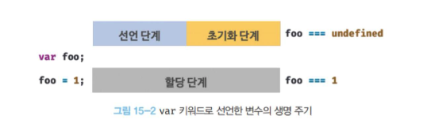
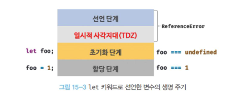
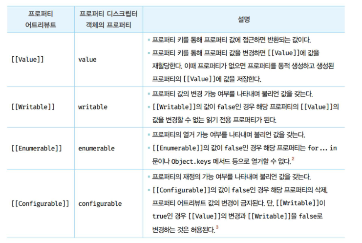
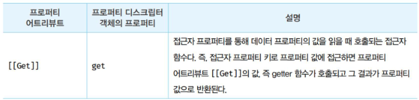
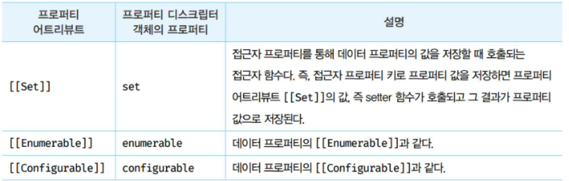

# 15장. let, const 키워드와 블록 레벨 스코프

## 15.1 var 키워드로 선언한 변수의 문제점

- var 키워드로 선언된 변수는 다른 언어와는 구별되는 독특한 특징을 갖고 있습니다. 주의를 기울이지 않으면 의도하지 않은 심각한 문제를 발생시킬 수 있습니다.

### 15.1.1 변수 중복 선언 허용

```js
var x = 1;
var y = 1;

// var 키워드로 선언된 변수는 같은 스코프 내에서 중복 선언을 허용한다.
// 초기화문이 있는 변수 선언문은 자바스크립트 엔진에 의해 var 키워드가 없는 것처럼 동작한다.
var x = 100;

// 초기화문이 없는 변수 선언문은 무시된다.
var y;

console.log(x); // 100
console.log(y); // 1
```

### 15.1.2 함수 레벨 스코프

- var 키워드로 선언한 변수는 오로지 함수의 코드 블록만을 지역 스코프로 인정합니다.
- 따라서 함수 외부에서 var 키워드로 선언한 변수는 코드 블록 내에서 선언해도 모두 전역 변수가 됩니다.

### 15.1.3 변수 호이스팅

- var 키워드로 선언한 변수는 호이스팅으로 인해 변수 선언문이 스코프의 선두로 끌어 올려진 것처럼 동작합니다.
- 즉, 변수 호이스팅에 의해 var 키워드로 선언한 변수는 변수 선언문 이전에 참조할 수 있습니다.
- 단, 할당문 이전에 변수를 참조하면 언제나 undefined를 반환합니다.

## 15.2 let 키워드

### 중복 선언 금지

- let 키워드로 이름이 같은 변수를 중복 선언하면 문법에러 SyntaxError가 발생합니다

### 블록 레벨 스코프

- let 키워드로 선언한 변수는 모든 코드 블록을 지역 스코프로 인정하는 블록 레벨 스코프를 따릅니다.

### 변수 호이스팅

- let 키워드로 선언한 변수는 변수 호이스팅이 발생하지 않는 것처럼 동작합니다.
- let 키워드로 선언한 변수를 변수 선언문 이전에 참조하면 참조에러 ReferenceError가 발생합니다.
- 변수 선언은 런타임 이전에 자바스크립트 엔진에 의해 암묵적으로 "선언 단계"와 "초기화 단계"가 한번에 진행된다고 배웠습니다.
  - 즉, 선언 단계에서 스코프(실행 컨텍스트의 렉시컬 환경)에 변수 식별자를 등록하여 자바스크립트 엔진에 변수의 존재를 알리게 됩니다.
  - 그리고 즉시 초기화 단계에서 undefined로 변수를 초기화 합니다.
    

- **let 키워드로 선언한 변수는 "선언 단계"와 "초기화 단계"가 분리되어 진행됩니다.**
  - 런타임 이전에 자바스크립트 엔진에 의해 암묵적으로 선언 단계가 먼저 실행되지만 초기화 단계는 변수 선언문에 도달했을 때 실행됩니다.
  - 초기화 단계가 실행되기 이전에 변수에 접근하려고 하면 참조 에러 ReferenceError가 발생합니다.
  - let 키워드로 선언한 변수는 스코프의 시작 지점부터 초기화 단계 시작 지점인 변수 선언문 까지 변수를 참조할 수 없습니다.
  - **스코프의 시작 지점부터 초기화 시작 지점까지 변수를 참조할 수 없는 구간을 일시적 사각지대(TDZ)라고 부릅니다.**
    
  - 결국 let 키워드로 선언한 변수는 변수 호이스팅이 발생하지 않는 것처럼 보입니다. 하지만 그렇지 않습니다.

    ```js
    let foo = 1; // 전역 변수

    {
      console.log(foo); // ReferenceError: Cannot access 'foo' before initialization
      let foo = 2; // 지역 변수
    }
    ```

    - let 키워드로 선언한 변수의 경우 변수 호이스팅이 발생하지 않는다면 위 예제는 전역 변수 foo의 값을 출력해야 합니다.
    - 하지만 let 키워드로 선언한 변수도 여전히 호이스팅을 발생하기 때문에 참조에러 ReferenceError가 발생합니다.

### 전역 객체와 let

- var 키워드로 선언한 전역변수와 전역함수, 그리고 선언하지 않은 변수에 값을 할당한 암묵적 전역은 전역 객체 window의 프로퍼티가 됩니다.
- let 키워드로 선언한 전역 변수는 전역 객체의 프로퍼티가 아닙니다.
  - 즉, window.foo와 같이 접근이 불가능합니다.
  - let 전역 변수는 보이지 않는 개념적인 블록 내에 존재하게 되는데 이건 나중에 실행컨텍스트에서 다뤄보겠습니다.
    - 전역 렉시컬 환경의 선언적 환경 레코드 어쩌구

## 15.3 const 키워드

- const 키워드는 상수 선언을 하지 위해 사용하지만 반드시 상수만을 위해 사용하지는 않습니다.
- const 키워드의 특징은 let 키워드와 대부분 동일하므로 let 키워드와 다른 점을 살펴보겠습니다.

### 선언과 초기화

- **const 키워드로 선언한 변수는 반드시 선언과 동시에 초기화해야 합니다.**
  - 그렇지 않으면 문법 에러가 발생합니다.
    ```js
    const fool; // SyntaxError: Missing initialzer in const declaration
    ```
  - const 키워드로 선언한 변수는 let 키워드로 선언한 변수와 마찬가지로 블록 레벨 스코프를 가지며, 변수 호이스팅이 발생하지 않는 것처럼 동작합니다.

### 재할당 금지

### 상수

- const 키워드로 선언한 변수에 원시 값을 할당한 경우 변수 값을 변경할 수 없습니다.
  - 원시 값은 변경 불가능한 값이므로 재할당 없이 값을 변경할 수 있는 방법이 없기 때문입니다.
- 변수의 상대 개념인 상수는 재할당이 금지된 변수를 말합니다.
  - 상수 또한 값을 저장하기 위한 메모리 공간이 필요하므로 변수라고 할 수 있습니다.
- **const 키워드로 선언된 변수에 원시 값을 할당한 경우 원시 값은 변경할 수 없는 값이고 const 키워드에 의해 재할당이 금지되므로 할당한 값을 변경할 수 있는 방법은 없습니다**

### const 키워드와 객체

- const 키워드로 선언된 변수에 원시 값을 할당한 경우 값을 변경할 수 없습니다.
- 하지만 **const 키워드로 선언된 변수에 객체를 할당한 경우 값을 변경할 수 있습니다**
- 변경 불가능한 원시값은 재할당 없이 변경할 수 있는 방법이 없지만 변경 가능한 값인 객체는 재할당 없이도 직접 변경이 가능하기 때문입니다.

  ```js
  const person = {
    name: "Lee",
  };

  // 객체는 변경 가능한 값이다. 따라서 재할당 없이 변경이 가능하다.
  person.name = "Kim";

  console.log(person); // {name: "Kim"}
  ```

  - **const 키워드는 재할당을 금지할 뿐 "불변"을 의미하지는 않습니다**

- const 키워드는 새로운 값을 재할당하는 것은 불가능하지만 프로퍼티 동적 생성, 삭제, 프로퍼티 값의 변경을 통해 객체를 변경하는 것은 가능합니다.
  - 이때 객체가 변경되더라도 변수에 할당된 참조 값은 변경되지 않습니다.

---

# 16장. 프로퍼티 어트리뷰트

## 16.1 내부 슬롯과 내부 메서드

- 프로퍼티 어트리뷰트를 이해하기 위해 먼저 내부 슬롯과 내부 메서드의 개념에 대해 알아보겠습니다.
- 내부 슬롯과 내부 메서드는 자바스크립트 엔진의 구현 알고리즘을 설명하기 위해 ECMAScript 사양에서 사용하는 의사 프로퍼티와 의사 메서드 입니다.
  - ECMAScript 사양에 등장하는 이중 대괄호`([[...]])`로 감싼 이름들이 내부 슬롯과 내부 메서드 입니다.

> #### 의사 코드란?
>
> - 알고리즘을 표현하는 방법 중 하나로, 일반적으로는 자연어를 이용해 만든 문장을 프로그래밍 언어와 유사한 형식으로 배치한 코드를 뜻합니다. 용도는 미술의 스케치와 같습니다.

- 내부 슬롯과 내부 메서드는 ECMAScript 사양에 정의된 대로 구현되어 자바스크립트 엔진에서 실제로 동작하지만 개발자가 직접 접근할 수 있도록 외부로 공개된 객체의 프로퍼티는 아닙니다.
  - 며느리도 알지못하는 비법소스 같은 너낌
- 내부 슬롯과 내부 메서드는 자바스크립트 엔진의 내부 로직이므로 원칙적으로 자바스크립트는 내부 메서드에 직접적으로 접근하거나 호출할 수 있는 방법을 제공하지 않습니다.
  - 단, 일부 내부 슬롯과 내부 메서드에 한하여 간접적으로 접근할 수 있는 수단을 제공합니다.

### 그 어떤 일부의 경우

- 예를들어, 모든 객체는 `[[Prototype]]` 이라는 내부 슬롯을 갖습니다.
- 내부 슬롯은 자바스크립트 엔진의 내부 로직이므로 원칙적으로 작접 접근할 수 없지만 `[[Prototype]]` 내부 슬롯일 경우, `__proto__`를 통해 간접적으로 접근할 수 있습니다.

## 16.2 프로퍼티 어트리뷰트와 프로퍼티 디스크립터 객체

- **자바스크립트 엔진은 프로퍼티를 생성할 때 프로퍼티의 상태를 나타내는 프로퍼티 어트리뷰트를 기본값으로 자동 정의합니다**
  - 프로퍼티의 상태란 프로퍼티의 값, 값의 갱신 가능 여부, 열거 가능 여부, 재정의 가능 여부를 이야기합니다.
  - 프로퍼티 어트리뷰트는 자바스크립트 엔진이 관리하는 내부 상태 값인 내부 슬롯 입니다.
    - 프로퍼티의 값: `[[Value]]`
    - 값의 갱신 가능 여부: `[[Writable]]`
    - 열거 가능 여부: `[[Enumerable]]`
    - 재정의 가능 여부: `[[Cinfigurable]]`
  - 따라서 프로퍼티 어트리뷰트에 직접 접근할 수 없지만 `Object.getOwnPropertyDescriptor` 메서드를 사용하여 간접적으로 확인할 수는 있습니다.
    - `Object.getOwnPropertyDescriptor` 메서드는 프로퍼티 어트리뷰트 정보를 제공하는 프로퍼티 디스크립터 객체를 반환합니다.

## 16.3 데이터 프로퍼티와 접근자 프로퍼티

- 프로퍼티는 데이터 프로퍼티와 접근자 프로퍼티로 구분할 수 있습니다.
  - 데이터 프로퍼티
    - 키와 값으로 구성된 일반적인 프로퍼티 입니다. 지금까지 살펴본 모든 프로퍼티는 데이터 프로퍼티입니다.
  - 접근자 프로퍼티
    - 자체적으로는 값을 갖지 않고 다른 데이터 프로퍼티의 값을 읽거나 저장할 때 호출되는 접근자 함수로 구성된 프로퍼티 입니다.

### 데이터 프로퍼티

- 데이터 프로퍼티는 다음과 같은 프로퍼티 어트리뷰트를 갖습니다. 이 프로퍼티 어트리뷰트는 자바스크립트 엔진이 프로퍼티를 생성할 때 기본값으로 자동 정의됩니다.
  - 프로퍼티의 값: `[[Value]]`
  - 값의 갱신 가능 여부: `[[Writable]]`
  - 열거 가능 여부: `[[Enumerable]]`
  - 재정의 가능 여부: `[[Cinfigurable]]`

  

### 접근자 프로퍼티

- 접근자 프로퍼티는 자체적으로 값을 갖지 않고 다른 데이터 프로퍼티의 값을 읽거나 저장할 때 사용하는 접근자 함수로 구성된 프로퍼티 입니다.




- 접근자 함수는 getter/setter 함수 라고도 부릅니다.
- 접근자 프로퍼티는 getter와 setter 함수 모두 정의할 수도 있고 하나만 정의할 수도 있습니다.

```js
const person = {
  // 데이터 프로퍼티
  firstName: "Ungmo",
  lastName: "Lee",

  // fullName은 접근자 함수로 구성된 접근자 프로퍼티이다.
  // getter 함수
  get fullName() {
    return `${this.firstName} ${this.lastName}`;
  },
  // setter 함수
  set fullName(name) {
    // 배열 디스트럭처링 할당: "31.1 배열 디스트럭처링 할당" 참고
    [this.firstName, this.lastName] = name.split(" ");
  },
};

// 데이터 프로퍼티를 통한 프로퍼티 값의 참조.
console.log(person.firstName + " " + person.lastName); // Ungmo Lee

// 접근자 프로퍼티를 통한 프로퍼티 값의 저장
// 접근자 프로퍼티 fullName에 값을 저장하면 setter 함수가 호출된다.
person.fullName = "Heegun Lee";
console.log(person); // {firstName: "Heegun", lastName: "Lee"}

// 접근자 프로퍼티를 통한 프로퍼티 값의 참조
// 접근자 프로퍼티 fullName에 접근하면 getter 함수가 호출된다.
console.log(person.fullName); // Heegun Lee

// firstName은 데이터 프로퍼티다.
// 데이터 프로퍼티는 [[Value]], [[Writable]], [[Enumerable]], [[Configurable]]
// 프로퍼티 어트리뷰트를 갖는다.
let descriptor = Object.getOwnPropertyDescriptor(person, "firstName");
console.log(descriptor);
// {value: "Heegun", writable: true, enumerable: true, configurable: true}

// fullName은 접근자 프로퍼티다.
// 접근자 프로퍼티는 [[Get]], [[Set]], [[Enumerable]], [[Configurable]]
// 프로퍼티 어트리뷰트를 갖는다.
descriptor = Object.getOwnPropertyDescriptor(person, "fullName");
console.log(descriptor);
// {get: f, set: f, enumerable: true, configurable: true}
```

- 메서드 앞에 get, set이 붙은 메서드가 바로 getter/setter 압니다. 그리고 함수의 이름 fullName이 접근자 프로퍼티 입니다.
  - 접근자 프로퍼티는 자체적으로 값(프로퍼티 어트리뷰트 `[[Value]]`)을 가지지 않으며 데이터 프로퍼티의 값을 읽거나 저장할 때 관여만 합니다.
- 이를 내부 슬롯/메서드 관점에서 보면 다음과 같습니다.
  - 접근자 프로퍼티 fullName을 프로퍼티 값에 접근하면 내부적으로 `[[Get]]` 내부 메서드가 호출되어 아래와 같이 동작합니다.
    1. 프로퍼티 키가 유효한지 확인압니다. 프로퍼티 키는 문자열 또는 심벌이어야 합니다. 프로퍼티 키 "fullName"은 문자열이므로 유효한 프로퍼티 키 입니다.
    2. 프로토타입 체인에서 프로퍼티를 검색합니다. person 객체에 fullName 프로퍼티가 존재합니다.
    3. 검색된 fullName 프로퍼티가 데이터 프로퍼티인지 접근자 프로퍼티인지 확인합니다.
    4. 접근자 프로퍼티 fullName의 프로퍼티 어트리뷰트 `[[Get]]`의 값, 즉 getter 함수를 호출하여 그 결과를 반환합니다.
       fullName의 프로퍼티 어트리뷰트 `[[Get]]`의 값은 `Object.getOwnPropertyDescriptor` 메서드가 반환하는 프로퍼티 디스크립터 객체의 get 프로퍼티 값과 동일합니다.

## 16.4 프로퍼티 정의

- 프로퍼티 정의란 새로운 프로퍼티를 추가하면서 프로퍼티 어트리뷰트를 명시적으로 정의하거나, 기존 프로퍼티의 프로퍼티 어트리뷰트를 재정의 하는 것을 이야기합니다.
  - 아래 속성들을 어떻게 할건지 설정한다는 뜻인거같음!
    - 프로퍼티의 값: `[[Value]]`
    - 값의 갱신 가능 여부: `[[Writable]]`
    - 열거 가능 여부: `[[Enumerable]]`
    - 재정의 가능 여부: `[[Cinfigurable]]`

## 16.5 객체 변경 방지

- 객체는 변경 가능한 값이므로 재할당 없이 직접 변경할 수 있습니다. (const 키워드로 할당된 객체 💀)
- 그리고 자바스크립트는 객체의 변경을 방지하는 다양한 메서드를 제공하고 있습니다.
  - 객체 변경 방지 메서드들은 객체의 변경을 금지하는 강도가 다릅니다.

### 객체 확장 금지

- `Object.preventExtensions` 메서드는 객체의 확장을 금지합니다.
- 객체 확장이란 프로퍼티 추가 금지를 의미합니다.
- 프로퍼티 동적 추가와 `Object.definProperty` 메서드 모두 사용이 금지됩니다.

### 객체 밀봉

- `Object.seal` 메서드는 객체를 밀봉합니다.
- 객체 밀봉 seal 이란 프로퍼티 추가 및 삭제와 프로퍼티 어트리뷰트 재정의 금지를 의미합니다.
- 즉, **밀봉된 객체는 읽기와 쓰기만 가능합니다**
- 그리고 밀봉 여부는 `Object.isSealed` 메서드로 확인 가능합니다.

### 객체 동결

- `Object.freeze` 메서드는 객체를 동결합니다.
- 객체 동결이란 프로퍼티 추가 및 삭제와 프로퍼티 어트리뷰트 재정의 금지, 프로퍼티 값 갱신 금지를 의미합니다.
- 즉, **동결된 객체는 읽기만 가능합니다**
- 객체 동결 여부는 `Object.isFrozen` 으로 확인 가능합니다

### 불변 객체

- 지금까지 살펴본 변경 방지 메서드들은 얕은 변경 방지로 직속 프로퍼티만 변경이 방지되고 중첩 객체까지는 영향을 주지 못합니다.
- 따라서 `Object.freeze` 메서드로 객체를 동결하여도 중첩 객체까지 동결할 수 없습니다.
- 객체의 중첩 객체까지 동결하여 변경이 불가능한 읽기 전용의 불변 객체를 구현하려면 객체를 값으로 갖는 모든 프로퍼티에 대해 재귀적으로 `Object.freeze` 메서드를 호출해야 합니다.

---

# 17장. 생성자 함수에 의한 객체 생성

## 17.1 Object 생성자 함수

- new 연산자와 함께 Object 생성자 함수를 호출하면 빈 객체를 생성하여 반환합니다.
- 빈 객체를 생성한 이후 프로퍼티 또는 메서드를 추가하여 객체를 완성할 수 있습니다.

```js
// 빈 객체의 생성
const person = new Object();

// 프로퍼티 추가
person.name = "Lee";
person.sayHello = function () {
  console.log("Hi! My name is " + this.name);
};

console.log(person); // {name: "Lee", sayHello: f}
person.sayHello(); // Hi! My name is Lee
```

## 17.2 생성자 함수

### 객체 리터럴에 의한 객체 생성 방식의 문제점

- 객체 리터럴에 의한 객체 생성 방식은 직관적이고 간편합니다.
- 하지만 객체 리터럴에 의한 객체 생성 방식은 단 하나의 객체만 생성합니다.
- 따라서 동일한 프로퍼티를 갖는 객체를 여러 개 생성해야 하는 경우에는 비효율적 입니다

### 생성자 함수에 의한 객체 생성 방식의 장점

- 생성자 함수에 의한 객체 생성 방식은 객체 인스턴스를 생성하기 위한 템플릿 처럼 생성자 함수를 사용하여 프로퍼티 구조가 동일한 객체 여러 개를 간편하게 생성할 수 있습니다.

  ```js
  // 생성자 함수
  function Circle(radius) {
    // 생성자 함수 내부의 this는 생성자 함수가 생성할 인스턴스를 가리킨다.
    this.radius = radius;
    this.getDiameter = function () {
      return 2 * this.radius;
    };
  }

  // 인스턴스의 생성
  const circle1 = new Circle(5); // 반지름이 5인 Circle 객체를 생성
  const circle2 = new Circle(10); // 반지름이 10인 Circle 객체를 생성

  console.log(circle1.getDiameter()); // 10
  console.log(circle2.getDiameter()); // 20
  ```

  - 생성자 함수는 이름 그대로 객체 인스턴스를 생성하는 함수입니다.
  - 형식이 정해져 있는것이 아닌 일반 함수와 동일한 방법으로 생성자 함수를 정의하고 **new 연산자와 함께 호출하면 해당 함수는 생성자 함수로 동작합니다**
  - 만약 new 연산자와 함께 생성자 함수를 호출하지 않으면 생성자 함수가 아니라 일반 함수로 동작합니다.

### 생성자 함수의 인스턴스 생성과정

- 생성자 함수의 역할은 프로퍼티 구조가 동일한 인스턴스를 생성하기 위한 템플릿으로서 동작하여 **인스턴스를 생성**하는 것과 **생성된 인스턴스를 초기화(인스턴스 프로퍼티 추가 및 초기값 할당)**하는 것 입니다.
- 생성자 함수가 인스턴스를 생성하는 것은 필수이고, 생성된 인스턴스를 초기화하는 것은 옵션입니다.
  - 위 예제의 생성자 함수 내부 코드를 보면 this에 프로퍼티를 추가하고 필요에 따라 전달된 인수를 프로퍼티의 초기값으로서 할당하여 인스턴스를 초기화 합니다.
  - 하지만 인스턴스를 생성하고 반환하는 코드는 생략 가능합니다.
    - 자바스크립트 엔진은 암묵적인 처리를 통해 인스턴스를 생성하고 반환합니다.
    - new 연산자와 함께 생성자 함수를 호출하면 자바스크립트 엔진은 암묵적으로 인스턴스를 생성하고 인스턴스를 초기화 한 후 암묵적으로 인스턴스를 반환합니다.

#### new 연산자와 함께 생성자 함수를 호출하면 자바스크립트 엔진은 암묵적으로 인스턴스를 생성하고 인스턴스를 초기화 한 후 암묵적으로 인스턴스를 반환합니다. -> 그럼 어떻게?

##### 1. 인스턴스 생성과 this 바인딩

- 암묵적으로 빈 객체가 생성됩니다.
- 빈 객체가 바로 생성자 함수의 인스턴스입니다.
- 그리고 암묵적으로 생성된 빈 객체 인스턴스는 this에 바인딩 됩니다.
- 생성자 함수 내부의 this가 생성자 함수가 생성할 인스턴스를 가리키는 이유가 바로 이것입니다.
- 이 처리는 런타임 이전에 실행됩니다.

> 바인딩이란?!?!? 식별자와 값을 연결하는 과정을 의미합니다. 예를 들어 변수 선언은 변수 이름과 확보된 메모리 공간의 주소를 바인딩 하는 것입니다. this 바인딩은 this(키워드로 분류되지만 식별자 역할을 합니다.)와 this가 가리킬 객체를 바인딩 하는 것입니다.

##### 2. 인스턴스 초기화.

- 생성자 함수가 실행되면서 this에 바인딩되어 있는 인스턴스를 초기화 합니다.
- 즉, this에 바인딩되어 있는 인스턴스에 프로퍼티나 메서드를 추가하고 생성자 함수가 인수로 전달받은 초기값을 인스턴스 프로퍼티에 할당하여 초기화하거나 고정값을 할당합니다.

##### 3. 인스턴스 반환

- 생성자 함수 내부에서 모든 처리가 끝나면 완성된 인스턴스가 바인딩된 this를 암묵적으로 반환합니다.

  ```js
  function Circle(radius) {
    // 1. 암묵적으로 빈 객체가 생성되고 this에 바인딩된다.

    // 2. this에 바인딩되어 있는 인스턴스를 초기화한다.
    this.radius = radius;
    this.getDiameter = function () {
      return 2 * this.radius;
    };

    // 3. 완성된 인스턴스가 바인딩된 this가 암묵적으로 반환된다.
  }

  // 인스턴스 생성. Circle 생성자 함수는 암묵적으로 this를 반환한다.
  const circle = new Circle(1);
  console.log(circle); // Circle {radius: 1, getDiameter: f}
  ```

- 만약 this가 아닌 다른 객체를 명시적으로 반환하면 this가 반환되지 못하고 return문에 명시한 객체가 반환됩니다.
- 생성자 함수 내부에서 명시적으로 this가 아닌 다른 값을 반환하는 것은 생성자 함수의 기본 동작을 훼손합니다.
- 따라서 생성자 함수 내부에서는 return 문을 생략합시다!!

### 내부 메서드 `[[Call]]`과 `[[Construct]]`

- 함수 선언문 또는 함수 표현식으로 정의한 함수는 일반적으로 함수로서 호출할 수 있는 것은 물론 생성자 함수로서 호출할 수 있습니다.
  - 생성자 함수로서 호출한다는 것은 new 연산자와 함께 호출하여 객체를 생성하는 것을 의미합니다.
  - 함수는 객체이므로 일반 객체와 동일하게 동작할 수 있습니다.
  - 함수 객체는 일반 객체가 가지고 있는 내부 슬롯과 내부 메서드를 모두 가지고 있기 때문입니다.

    ```js
    // 함수는 객체다.
    function foo() {}

    // 함수는 객체이므로 프로퍼티를 소유할 수 있다.
    foo.prop = 10;

    // 함수는 객체이므로 메서드를 소유할 수 있다.
    foo.method = function () {
      console.log(this.prop);
    };

    foo.method(); // 10
    ```

- 함수는 객체이지만 일반 객체와는 다릅니다.
  - **일반 객체는 호출할 수 없지만 함수는 호출할 수 있습니다.**
  - 따라서 함수 객체는 일반 객체가 가지고 있는 내부 슬롯과 내부 메서드는 물론, 함수로써 동작하기 위해 함수 객체만들 위한 `[[Environment]]`, `[[FormalParameters]]` 등의 내부 슬롯과 `[[Call]]`, `[[Construct]]` 같은 내부 메서드를 추가로 가지고 있습니다.
  - 함수가 일반 함수로서 호출되면 함수 객체의 내부 메서드 `[[Call]]`이 호출되고 new 연산자와 함께 생성자 함수로써 호출되면 내부 메서드 `[[Construct]]`가 호출됩니다.

#### 추가 설명

- 내부 메서드 `[[Call]]`을 갖는 함수 객체를 callable 이라 합니다.
- 내부 메서드 `[[Construct]]`를 갖는 함수 객체를 constructor 라고 부릅니다.
- callable은 호출할 수 있는 함수 객체를 말하며, constructor는 생성자 함수로서 호출할 수 있는 함수 객체를 의미합니다.
- 그리고 함수 객체는 반드시 호출 가능해야 합니다.

### constructor와 non-constructor의 구분

- constructor: 함수 선언문, 함수 표현식, 클래스(클래스도 함수임)
- non-constructor: 메서드, 화살표 함수

### new 연산자

- 일반 함수와 생성자 함수에 특별한 형식적 차이는 없습니다.
- new 연산자와 함께 함수를 호출하면 해당 함수는 생성자 함수로 동작합니다.
- 다시 말해, 함수 객체의 내부 메서드 `[[Call]]`이 호출되는 것이 아니라 `[[Construct]]`가 호출됩니다.
- 반대로 new 연산자 없이 생성자 함수를 호출하면 일반 함수로 호출됩니다.
- 둘 다 형식적인 차이가 없기 때문에 생성자 함수는 일반적으로 첫 대문자를 대문자로 기술하는 파스칼 케이스로 명명하여 일반 함수와 구별할 수 있도록 노오력 합니다.

### new.target

- 생성자 함수가 new 연산자 없이 호출되는 것을 방지하기 위해 파스칼 케이스를 적용해도 실수는 언제나 따라옵니다.
- 이런 위험성을 회피하기 위한 수단이 ES6의 new.target 입니다.
- new.target은 this와 유사하게 constructor인 모든 함수 내부에서 암묵적인 지역 변수와 같이 사용되며 메타 프로퍼티라고 부릅니다.
  - 함수 내부에서 new.target을 사용하면 new 연산자와 함께 생성자 함수로서 호출되었는지를 확인할 수 있습니다.
  - **new 연산자와 함께 생성자 함수로서 호출되면 함수 내부의 new.target은 함수 자신을 가리킵니다. new 연산자 없이 일반 함수로써 호출된 함수 내부의 new.target은 undefined 입니다**
    > 진짜 this같은 친구처럼 동작하네요

---

# 18장. 함수와 일급 객체

## 18.1 일급 객체 ⭐️⭐️⭐️⭐️⭐️⭐️⭐️

- 다음과 같은 조건을 만족하는 객체를 **일급 객체**라고 부릅니다.
  1. 무명의 리터럴로 생성할 수 있습니다. 즉, 런타임에 생성이 가능합니다.
  2. 변수나 자료구조(객체, 배열 등)에 저장할 수 있습니다.
  3. 함수의 매개변수에 전달할 수 있습니다.
  4. 함수의 반환값으로 사용할 수 있습니다.

- 자바스크립트의 함수는 아래와 같이 모든 조건을 만족하므로 일급 객체입니다.

  ```js
  // 1. 함수는 무명의 리터럴로 생성할 수 있다.
  // 2. 함수는 변수에 저장할 수 있다.
  // 런타임(할당 단계)에 함수 리터럴이 평가되어 함수 객체가 생성되고 변수에 할당된다.
  const increase = function (num) {
    return ++num;
  };

  const decrease = function (num) {
    return --num;
  };

  // 2. 함수는 객체에 저장할 수 있다.
  const auxs = { increase, decrease };

  // 3. 함수의 매개변수에 전달할 수 있다.
  // 4. 함수의 반환값으로 사용할 수 있다.
  function makeCounter(aux) {
    let num = 0;

    return function () {
      num = aux(num);
      return num;
    };
  }

  // 3. 함수는 매개변수에게 함수를 전달할 수 있다.
  const increaser = makeCounter(auxs.increase);
  console.log(increaser()); // 1
  console.log(increaser()); // 2

  // 3. 함수는 매개변수에게 함수를 전달할 수 있다.
  const decreaser = makeCounter(auxs.decrease);
  console.log(decreaser()); // -1
  console.log(decreaser()); // -2
  ```

- 함수가 일급 객체라는 것은 함수를 객체와 동일하게 사용할 수 있다는 의미 입니다.
- 객체는 값이므로 함수는 값과 동일하게 취급할 수 있습니다.
  - 따라서 함수는 값을 사용할 수 있는 곳이라면 어디서든지 리터럴로 정의할 수 있으며 런타임에 함수 객체로 평가됩니다.
    - 변수 할당문
    - 객체의 프로퍼티 값
    - 배열의 요소
    - 함수 호출의 인수
    - 함수 반환문
- 일급 객체로서 함수가 가지는 가장 큰 특징은 일반 객체와 같이 함수의 매개변수에 전달할 수 있으며, 함수의 반환값으로 사용할 수도 있다는 것 입니다.
  - 이는 함수형 프로그래밍을 가능하게 하는 자바스크립트의 장점 중 하나입니다.
- 함수는 객체이지만 일반 객체와 차이도 존재합니다.
  - 일반 객체는 호출할 수 없지만 함수 객체는 호출할 수 있습니다.
  - 그리고 함수 객체는 일반 객체에는 없는 함수 고유의 프로퍼티를 소유합니다.

## 18.2 함수 객체의 프로퍼티

### argments 프로퍼티

- 함수 객체의 arguments 프로퍼티 값은 argument 객체입니다.
- arguments 객체는 함수 호출 시 전달된 인수들의 정보를 담고있는 순회 가능한 이터러블한 유사 배열 객체입니다.
  - 함수 내부에서 지역 변수처럼 사용됩니다.
- arguments 객체는 매개변수 개수를 확정할 수 없는 가변 인자 함수를 구현할 때 유용합니다.

### caller 프로퍼티

### length 프로퍼티

- 함수 객체의 length 프로퍼티는 함수를 정의할 때 선언한 매개변수의 개수를 가리킵니다.

  ```js
  function foo() {}
  console.log(foo.length); // 0

  function bar(x) {
    return x;
  }
  console.log(bar.length); // 1

  function baz(x, y) {
    return x * y;
  }
  console.log(baz.length); // 2
  ```

- 이때 arguments 객체의 length 프로퍼티와 함수 객체의 length 프로퍼티의 값은 다를 수 있으므로 주의하자

### name 프로퍼티

- 함수 객체의 name 프로퍼티는 함수 이름을 나타냅니다.
- ES5에서의 익명 함수 표현식의 경우 name 프로퍼티는 빈 문자열을 값으로 갖습니다.
- ES6에서는 함수 객체를 가리키는 식별자를 값으로 갖습니다.

### `__proto__` 접근자 프로퍼티

- 모든 객체는 `[[Prototype]]`이라는 내부 슬롯을 갖습니다.
  - `[[Prototype]]` 내부 슬롯은 객체지향 프로그래밍의 상속을 구현하는 프로토타입 객체를 가리킵니다.
- `__proto__` 프로퍼티는 `[[Prototype]]` 내부 슬롯이 가리키는 프로토타입 객체에 접근하기 위해 사용하는 접근자 프로퍼티 입니다
  - 내부 슬롯에는 직접 접근할 수 없고 간접적인 접근 방법을 제공하는 경우에 한하여 접근할 수 있습니다.

#### 여기서 잠깐!

- `__proto__`는 최근 deferated 된걸로 알고있습니다 내용을 확인해보시는게 좋을거같아요
  https://developer.mozilla.org/ko/docs/Web/JavaScript/Reference/Global_Objects/Object/proto

### prototype 프로퍼티

- prototype 프로퍼티는 생성자 함수로 호출할 수 있는 함수 객체인 constructor만이 소유하는 프로퍼티 입니다.
- 일반 객체와 생성자 함수로 호출할 수 없는 non-constructor에는 prototype 프로퍼티가 없습니다.
- prototype 프로퍼티는 함수가 객체를 생성하는 생성자 함수로 호출될 때 생성자 함수가 생성할 인스턴스의 프로토타입 객체를 가리킵니다.
