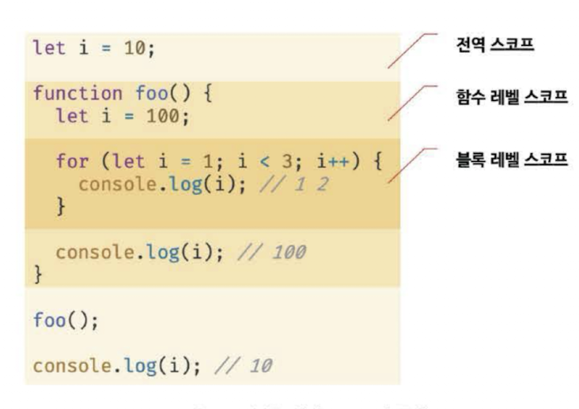
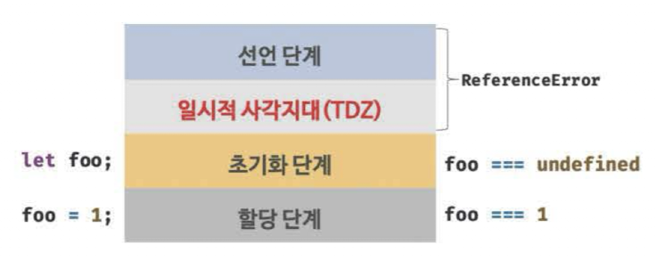

# 15Ch-let, const 키워드와 블록 레벨 스코프

## var 키워드로 선언한 변수의 문제점

### 변수 중복 선언 허용

변수 중복 선언이 가능하여 의도치 않게 먼저 선언된 변수 값이 변경되는 부작용이 존재

```typescript
var x = 1;
var y = 1;

// var 키워드로 선언된 변수는 같은 스코프 내에서 중복 선언을 허용
// 초기화문이 있는 변수 선언문은 자바스크립트 엔진에 의해 var 키워드가 없는 것처럼 동작
var x = 100;
// 초기화문이 없는 변수 선언문은 무시됨
var y;

console.log(x); // 100
console.log(y); // 1
```

초기화문이 있는 변수 선언문은 자바스크립트 엔진에 의해 var 키워드가 없는 것처럼 동작하고, 초기화문이 없는 변수 선언문은 무시됨 + 에러가 발생하지 않음 → 동일한 이름의 변수가 이미 선언된 경우 변수 중복 선언 시, 먼저 선언된 변수 값이 변경됨

### 함수 레벨 스코프

var 키워드로 선언한 변수는 오직 함수의 코드 블록만을 지역 스코프로 인정

즉, 함수 외부에서 var 키워드로 선언한 변수는 코드 블록 내에서 선언해도 모두 전역 변수가 됨

```typescript
var x = 1;

if (true) {
	// x는 전역 변수. 이미 선언된 전역 변수 x가 있으므로 x 변수는 중복 선언됨
	// 이는 곧 의도치 않게 변수값이 변경되는 부작용을 발생
	var x = 10;
}

console.log(x); // 10
```

함수 레벨 스코프는 전역 변수를 남발할 가능성을 높이는데, 이로 인해 의도치 않게 전역 변수가 중복 선언되는 경우가 발생함

### 변수 호이스팅

변수 선언문이 스코프의 선두로 끌어 올려진 것처럼 동작하는 것을 의미

변수 호이스팅에 의해 var 키워드로 선언한 변수는 변수 선언문 이전에 참조가 가능 → 할당문 이전에 변수를 참조하면 언제나 undefined를 반환

```javascript
// 이 시점에는 변수 호이스팅에 의해 이미 foo 변수가 선언됨 (1. 선언 단계)
// 변수 foo는 undefined로 초기화됨 (2. 초기화 단계)
console.log(foo); // undefined

// 변수에 값을 할당(3. 할당 단계)
foo = 123;

console.log(foo); // 123

// 변수 선언은 런타임 이전에 자바스크립트 엔진에 의해 암묵적으로 실행됨
var foo;
```

## let 키워드

var 키워드의 단점을 보완하기 위해 let, const가 도입됨

### 변수 중복 선언 금지

var 키워드로 동일한 변수를 중복 선언 시 아무런 에러가 발생하지 않던 반면, let 키워드를 사용하면 같은 변수를 중복 선언 시 문법 에러가 뜸

### 블록 레벨 스코프

함수 레벨 스코프를 따르는 var와 달리 `let`을 통해 선언된 변수는 모든 코드 블록을 지역 스코프로 인정하는 `블록 레벨 스코프`를 따름

```javascript
let foo = 1; // 전역 변수

{
	let foo = 2; // 지역 변수
	let bar = 3; // 지역 변수
}

console.log(foo); // 1
console.log(bar); // ReferenceError: bar is not defined
```

let 키워드로 선언된 변수는 블록 레벨 스코프를 따르므로, 위 예제의 코드 블록 내에서 선언된 foo 변수와 bar 변수는 지역 변수임. 전역에서 선언된 foo 변수와 코드 블록 내에서 선언된 foo 변수는 다른 **별개의 변수**가 되며, bar 변수 또한 블록 레벨 스코프를 갖는 지역 변수임



### 변수 호이스팅

var 키워드로 선언한 변수와 달리 let 키워드로 선언한 변수는 변수 호이스팅이 발생하지 않는 것처럼 동작함

```typescript
console.log(foo); // ReferenceError: foo is not defined
let foo;
```

- var 키워드로 선언한 변수는 런타임 이전에 자바스크립트 엔진에 의해 암묵적으로 `선언 단계`와 `초기화 단계`가 `한번에` 진행됨

  - **선언 단계**: 스코프(실행 컨텍스트의 렉시컬 환경)에 변수 식별자를 등록해 자바스크립트 엔진에 변수의 존재를 알림
  - **초기화 단계**: undefined로 변수를 초기화
  - 따라서 변수 선언문 이전에 변수에 접근해도 스코프에 변수가 존재하지 않으므로 에러가 발생하지 않으며, 이후 변수 할당문에 도달하면 비로소 값이 할당됨. 다만 `undefined를 반환`

    ```javascript
    // var 키워드로 선언한 변수는 런타임 이전에 선언 단계와 초기화 단계가 실행됨
    // 따라서 변수 선언문 이전에 변수를 참조할 수 있음
    console.log(foo); // undefined

    var foo;
    console.log(foo); // undefined

    foo = 1; // 할당문에서 할당 단계가 실행됨
    console.log(foo); // 1
    ```

- let 키워드로 선언한 변수는 `선언 단계`와 `초기화 단계`가 **`분리`**되어 진행됨

  - 즉, 런타임 이전에 **선언 단계**가 먼저 실행되지만 **초기화 단계**는 변수 선언문에 도달했을 때 실행됨
  - 만약 초기화 단계 이전에 변수에 접근 시 참조 에러가 발생하며, let 키워드로 선언한 변수는 스코프의 시작 지점부터 초기화 단계 시작(변수 선언문)까지 변수를 참조할 수 없으며 이를 `일시적 사각지대(Temporal Dead Zone: TDZ)`라고 부름

    ```javascript
    // 런타임 이전에 선언 단계가 실행됨. 아직 변수가 초기화 되지 않음
    // 초기화 이전의 일시적 사각지대에서는 변수를 참조할 수 없음
    console.log(foo); // ReferenceError: foo is not defined

    let foo; // 변수 선언문에서 초기화 단계가 실행됨
    console.log(foo); // undefined

    foo = 1; // 할당문에서 할당 단계가 실행됨
    console.log(foo); // 1
    ```

    

- 결국 let 키워드로 선언한 변수는 호이스팅이 발생하지 않는 것처럼 보이지만, 그렇지 않음

  ```javascript
  let foo = 1; // 전역 변수
  {
  	console.log(foo); // ReferenceError: cannot access 'foo' before initialization
  	let foo = 2; // 지역 변수
  }
  ```

  동일하게 let 키워드로 선언한 변수도 여전히 호이스팅이 발생하기 때문에 참조 에러가 발생함

### 전역 객체와 let

var 키워드로 선언한 전역 변수와 전역 함수, 선언하지 않은 변수에 값을 할당한 암묵적 전역은 전역 객체 `window`의 프로퍼티가 됨. 전역 객체의 프로퍼티를 참조할 때 window를 생략할 수 있음

let 키워드로 선언한 전역 변수는 전역 객체의 프로퍼티가 아님. 즉, window.foo와 같이 접근 불가능

let 전역 변수는 보이지 않는 개념적인 블록(전역 렉시컬 환경의 선언적 환경 레코드) 내에 존재

## const 키워드

const 키워드는 상수를 선언하기 위해 사용함

### 선언과 초기화

**const 키워드로 선언한 변수는 반드시 선언과 동시에 초기화가 필요**하며, 그렇지 않으면 `SyntaxError: Missing initializer in const declaration`과 같은 문법 에러가 발생함

```typescript
const age = 26;
```

const로 선언한 변수는 let으로 선언된 변수와 마찬가지로 `블록 레벨 스코프`를 가지며, 변수 호이스팅이 발생하지 않는 것처럼 동작함

```javascript
{
	// 변수 호이스팅이 발생하지 않는 것처럼 동작함
	console.log(foo); // ReferenceError: Cannot access 'foo' before initialization
	const foo = 1;
	console.log(foo); // 1
}

// 블록 레벨 스코프를 가짐
console.log(foo); // ReferenceError: foo is not defined
```

### 재할당 금지

const 키워드로 선언한 변수는 재할당이 금지됨

```typescript
const foo = 1;
foo = 2; // TypeError: Assignment to constant variable
```

### 상수

재할당이 금지된 변수로, 상수는 재할당이 금지됨

원시 값은 변경 불가능한 값이므로 재할당 없이 값을 변경할 수 있는 방법이 없기 때문임

- const 키워드로 선언된 변수에 원시 값을 할당한 원시 값은 변경할 수 없는 값
- const 키워드에 의해 재할당이 금지되므로 할당된 값을 변경할 수 있는 방법은 없음

### const 키워드와 객체

const로 원시 값을 할당한 경우 값을 변경할 수 없으나, **const 키워드로 선언된 변수에 객체를 할당한 경우 값을 변경할 수 있음**

```typescript
const person = {
	name: 'jeong'
};

person.name = 'park';

console.log(person); // {name: 'park'}
```

- const 키워드는 재할당을 금지할 뿐 '불변'을 의미하진 않음
- 프로퍼티 동적 생성, 삭제, 프로퍼티 값의 변경을 통해 객체를 변경하는 것은 가능하며, 이때 객체가 변경되더라도 변수에 할당된 참조 값은 변경되지 않음

# 16Ch-프로퍼티 어트리뷰트

내부 슬롯과 내부 메서드는 자바스크립트 엔진의 구현 알고리즘을 설명하기 위해 **ECMAScript 사양에서 사용하는 `의사 프로퍼티(pseudo property)`와 `의사 메서드(pseudo method)`**

- ECMAScript 사양에 정의된 대로 구현되어 자바스크립트 엔진에서 실제로 동작함
- 외부로 공개된 객체의 프로퍼티가 아니므로 원칙적으로 개발자가 직접 접근하거나 호출할 수 없다
  - 자바스크립트 엔진의 내부 로직임
- 일부는 간접적으로 접근할 수 있다
  - 모든 객체는 `[[Prototype]]`이라는 `내부 슬롯`을 갖고 있다
  - 해당 `내부 슬롯`에 `__proto__`를 통하여 간접적으로 접근할 수 있다

## 프로퍼티 어트리뷰트와 프로퍼티 디스크립터 객체

- 자바스크립트 엔진은 프로퍼티를 생성할 때 프로퍼티의 상태를 나타내는 프로퍼티 어트리뷰트를 기본값으로 자동 정의
- 프로퍼티 어트리뷰트에 직접 접근할 수 없지만 `Object.getOwnPropertyDescriptor` 메서드를 사용하여 간접적으로 확인이 가능함
- getOwnPropertyDescriptor 메서드는 프로퍼티 어트리뷰트 정보를 제공하는 **프로퍼티 디스크립터 객체를 반환**
  - 존재하지 않는 프로퍼티나 상속받은 프로퍼티에 대한 프로퍼티 디스크립터 요구 시 undefined가 반환됨
- 프로퍼티 어트리뷰트는 자바스크립트 엔진이 관리하는 내부 상태값인 내부 슬롯 `[[Value]]`, `[[Writable]]`, `[[Enumerable]]`, `[[Configurable]]`임
  - 따라서 프로퍼티 어트리뷰트에 직접 접근할 수 없지만 `Object.getOwnPropertyDescriptor` 메서드를 사용하여 간접적으로 확인할 수는 있음

```javascript
const person = {
	name: 'Jeong'
}

// 프로퍼티 어트리뷰트 정보를 제공하는 프로퍼티 디스크립터 객체를 반환함
console.log(Object.getOwnPropertyDescriptor(person, 'name'));
// {value: "Jeong", writable: true, enumerable: true, configurable: true}
```

## 데이터 프로퍼티와 접근자 프로퍼티

- 데이터 프로퍼티: 키와 값으로 구성된 일반적인 프로퍼티로 지금까지 살펴본 모든 프로퍼티가 해당됨
- 접근자 프로퍼티: 자체적으로 값을 갖지 않고 다른 데이터 프로퍼티의 값을 읽거나 저장할 때 호출되는 접근자 함수로 구성된 프로퍼티

| 프로퍼티 어트리뷰트 | 프로퍼티 디스크립터<br>객체의 프로퍼티 | 설명 |
| --- | --- | --- |
| 값 `[[Value]]` | `value` | • 프로퍼티 키를 통해 프로퍼티 값에 접근하면 반환되는 값<br>• 프로퍼티 키를 통해 프로퍼티 값을 변경하면 `[[Value]]`에 값을 재할당한다. 이때 프로퍼티가 없으면 프로퍼티를 동적 생성하고 생성된 프로퍼티의 `[[Value]]`에 값을 저장함 |
| 값의 갱신 가능 여부 `[[Writable]]` | `writable` | • 프로퍼티 값의 변경 가능 여부를 나타내며 `boolean` 값을 가짐<br>• false인 경우 해당 프로퍼티의 `[[Value]]`의 값을 변경할 수 없는 읽기 전용 프로퍼티가 됨 |
| 열거 가능 여부 `[[Enumerable]]` | `enumerable` | • 프로퍼티의 열거 가능 여부를 나타내며 `boolean` 값을 가짐<br>• false인 경우 해당 프로퍼티는 `for … in` 문이나 `Object.keys` 메서드 등으로 열거할 수 없음 |
| 재정의 가능 여부 `[[Configurable]]` | `configurable` | • 프로퍼티의 재정의 가능 여부를 나타내며 `boolean` 값을 가짐<br>• false인 경우 해당 프로퍼티의 삭제, 프로퍼티 어트리뷰트 값의 변경이 금지됨. 단, `[[Writable]]`이 true인 경우 `[[Value]]`의 변경과 `[[Writable]]`을 false로 변경하는 것은 허용됨 |

## 접근자 프로퍼티

자체적으로는 값을 갖지 않고 다른 데이터 프로퍼티의 값을 읽거나 저장할 때 사용하는 접근자 함수로 구성된 프로퍼티

| 프로퍼티 어트리뷰트 | 프로퍼티 디스크립터<br>객체의 프로퍼티 | 설명 |
| --- | --- | --- |
| `[[Get]]` | `get` | 접근자 프로퍼티를 통해 프로퍼티의 값을 읽을 때 호출되는 접근자 함수 |
| `[[Set]]` | `set` | 접근자 프로퍼티를 통해 프로퍼티의 값을 저장할 때 호출되는 접근자 함수이다. |
| `[[Enumerable]]` | `enumerable` | 열거 가능 여부의 `boolean` |
| `[[Configurable]]` | `configurable` | 재정의 가능 여부의 `boolean` |

- 접근자 함수는 `getter/setter 함수`라고도 칭함
  - 접근자 프로퍼티는 `getter`와 `setter` 함수 모두 정의하거나 하나만 정의할 수도 있음

> 💡 **프로토타입**
>
> 어떤 객체의 상위(부모) 객체의 역할을 하는 객체를 의미. 프로토타입은 하위(자식) 객체에게 자신의 프로퍼티와 메서드를 상속함. 프로토타입 객체의 프로퍼티나 메서드를 상속받은 하위 객체는 자신의 프로퍼티 또는 메서드인 것처럼 자유롭게 사용할 수 있음
>
> 프로토타입 체인은 프로토타입 단방향 링크드 리스트 형태로 연결되어 있는 상속 구조를 말함. 객체의 프로퍼티나 메서드에 접근하려고 할 때 객체에 접근하려는 프로퍼티 또는 메서드가 없다면 프로토타입 체인을 따라 프로토타입의 프로퍼티나 메서드를 차례대로 검색함

## 프로퍼티 정의

새로운 프로퍼티를 추가하면서 프로퍼티 어트리뷰트를 명시적으로 정의하거나, 기존 프로퍼티의 프로퍼티 어트리뷰트를 재정의하는 것

`Object.defineProperty` 메서드를 사용하면 프로퍼티의 어트리뷰트를 정의할 수 있으며, 인수로는 객체의 참조와 데이터 프로퍼티의 키인 문자열, 프로퍼티 디스크립터 객체를 전달함

## 객체 변경 방지

객체는 변경 가능한 값이므로 재할당 없이 직접 변경할 수 있음. 즉, 프로퍼티를 추가하거나 삭제할 수 있고, 프로퍼티 값을 갱신할 수 있으며 `Object.defineProperty` 또는 `Object.defineProperties` 메서드를 사용하여 프로퍼티 어트리뷰트를 재정의할 수 있음

### 객체 확장 금지

- `Object.preventExtensions` 메서드는 객체의 확장( = 프로퍼티 추가 금지)을 금지함
- 확장이 금지된 객체는 프로퍼티 추가가 금지됨
- 확장이 가능한 객체인지 여부는 `Object.isExtensible` 메서드로 확인할 수 있음

### 객체 밀봉

- `Object.seal` 메서드는 객체를 밀봉함
- 객체 밀봉이란 프로퍼티 추가 및 삭제와 프로퍼티 어트리뷰트 재정의 금지를 의미
- 밀봉된 객체는 읽기와 쓰기만 가능하며, 밀봉된 객체인지 여부는 `Object.isSealed` 메서드로 확인 가능

### 객체 동결

- `Object.freeze` 메서드는 객체를 동결함
- 객체 동결이란 프로퍼티 추가 및 삭제와 프로퍼티 어트리뷰트 재정의 금지, 프로퍼티 값 갱신 금지를 의미함. 즉, 동결된 객체는 읽기만 가능

### 불변 객체

지금까지 살펴본 변경 방지 메서드들은 `얕은 변경 방지`로 직속 프로퍼티만 변경이 방지되고 중첩 객체까지는 영향을 주지 못함. 즉, Object.freeze 메서드로 객체를 동결하여도 중첩 객체까지 동결할 수 없음

# 17Ch-생성자 함수에 의한 객체 생성

### Object 생성자 함수

`new` 연산자와 함께 호출하여 객체(인스턴스)를 생성하는 함수로, 생성자 함수에 의해 생성된 객체를 인스턴스라 칭함

```javascript
// 빈 객체의 생성
const person = new Object();

// 프로퍼티 추가
person.name = 'Jeong';
person.sayHello = function () {
	console.log('hi my name is ' + this.name);
}

console.log(person); // {name: "jeong", sayHello: f}
person.sayHello(); // hi my name is Jeong
```

### 생성자 함수

`new` 연산자와 함께 호출하여 객체(인스턴스)를 생성하는 함수를 의미하며, 생성자 함수에 의해 생성된 객체를 인스턴스라 함

JS는 Object 생성자 이외에도 String, Number, Boolean, Function, Array, Date, RegExp, Promise 등의 빌트인 생성자 함수를 제공함

객체 리터럴에 의한 객체 생성 방식은 직관적이고 간편하다는 장점이 있으나, 단 하나의 객체만 생성해야 하는 단점으로 여러 개 생성해야 하는 경우 비효율적이다

- 객체는 프로퍼티를 통해 객체 고유의 상태를 표현함. 그리고 메서드를 통해 상태 데이터인 프로퍼티를 참조하고 조작하는 동작을 표현하므로, 프로퍼티는 객체마다 프로퍼티 값이 다를 수 있지만 메서드는 내용이 동일한 경우가 일반적임

생성자 함수에 의한 객체 생성 방식은 마치 객체(인스턴스)를 생성하기 위한 템플릿(클래스)처럼 생성자 함수를 사용하여 프로퍼티 구조가 동일한 객체 여러 개를 간편하게 생성할 수 있음

> 💡 this는 객체 자신의 프로퍼티나 메서드를 참조하기 위한 자기 참조 변수이다. 즉, this 바인딩은 함수 호출 방식에 따라 동적으로 결정됨

### 생성자 함수의 인스턴스 생성 과정

생성자 함수의 역할은 프로퍼티 구조가 동일한 인스턴스를 생성하기 위한 템플릿(클래스)으로서 동작하여 인스턴스를 생성하는 것과 생성된 인스턴스를 초기화(인스턴스 프로퍼티 추가 및 초기화 할당)하는 것임

생성자 함수가 인스턴스를 생성하는 것은 필수이고, 생성된 인스턴스를 초기화하는 것은 옵션

```javascript
// 생성자 함수
function Circle(radius) {
	// 인스턴스 초기화
	this.radius = radius;
	this.getDiameter = function () {
		return 2 * this.radius;
	};
}

// 인스턴스 생성
const circle = new Circle(5) // 반지름이 5인 Circle 객체를 생성
```

### new 연산자 + 생성자 함수 호출 시 인스턴스 반환 과정

JS 엔진은 다음과 같은 과정을 거쳐 암묵적으로 인스턴스를 생성하고 인스턴스를 초기화한 후 암묵적으로 인스턴스를 반환함

1. 인스턴스 생성과 this 바인딩

   - 암묵적으로 빈 객체가 생성되는데, 이 객체가 바로 생성자 함수가 생성한 인스턴스. 암묵적으로 생성된 빈 객체, 즉 인스턴스는 this에 바인딩 됨
     - 생성자 함수 내부의 this가 생성자 함수가 생성할 인스턴스를 가리키는 이유임
     - 바인딩: 식별자와 값을 연결하는 과정을 의미. 예를 들어 변수 선언은 변수 이름(식별자)과 확보된 메모리 공간의 주소를 바인딩 하는 것. this 바인딩은 this(키워드로 분류되지만 식별자 역할을 함)와 this가 가리킬 객체를 바인딩하는 것
   - 해당 처리는 함수 몸체의 코드가 한 줄씩 실행되는 **런타임 이전**에 실행됨

   ```javascript
   function Circle(radius) {
   	// 1. 암묵적으로 인스턴스가 생성되고 this에 바인딩됨
   	console.log(this); // Circle {}

   	this.radius = radius;
   	this.getDiameter = function () {
   		return 2 * this.radius;
   	};
   }
   ```

2. 인스턴스 초기화

   - 생성자 함수에 기술되어 있는 코드가 한 줄씩 실행되어 this에 바인딩되어 있는 인스턴스를 초기화함
   - 즉, this에 바인딩되어 있는 인스턴스에 프로퍼티나 메서드를 추가하고 생성자 함수가 인수로 전달받은 초기값을 인스턴스 프로퍼티에 할당하여 초기화하거나 고정값을 할당함

3. 인스턴스 반환

   - 생성자 함수 내부의 모든 처리가 끝나면 완성된 인스턴스가 바인딩된 this가 암묵적으로 반환됨
   - 만약 this가 아닌 다른 객체를 명시적으로 반환하면 this가 반환되지 못하고 return 문에 명시한 객체가 반환됨

# 18Ch-함수와 일급 객체

- 다음과 같은 조건을 만족하는 객체를 **`일급 객체`** 라 한다
  1. 무명의 리터럴로 생성할 수 있다. 즉, 런타임에 생성이 가능하다
  2. 변수나 자료구조(객체, 배열 등)에 저장할 수 있다.
  3. 함수의 매개변수에 전달할 수 있다
  4. 함수의 반환값으로 사용할 수 있다

```javascript
// 1. 함수는 무명의 리터럴로 생성할 수 있다.
// 2. 함수는 변수에 저장할 수 있다.
// 런타임(할당 단계)에 함수 리터럴이 평가되어 함수 객체가 생성되고 변수에 할당된다.
const increase = function (num) {
  return ++num;
};

const decrease = function (num) {
  return --num;
};

// 2. 함수는 객체에 저장할 수 있다.
const auxs = { increase, decrease };

// 3. 함수의 매개변수에게 전달할 수 있다.
// 4. 함수의 반환값으로 사용할 수 있다.
function makeCounter(aux) {
  let num = 0;

  return function () {
    num = aux(num);
    return num;
  };
}

// 3. 함수는 매개변수에게 함수를 전달할 수 있다.
const increaser = makeCounter(auxs.increase);
console.log(increaser()); // 1
console.log(increaser()); // 2

// 3. 함수는 매개변수에게 함수를 전달할 수 있다.
const decreaser = makeCounter(auxs.decrease);
console.log(decreaser()); // -1
console.log(decreaser()); // -2
```

- 함수가 일급 객체이다 = 함수를 객체와 동일하게 사용할 수 있다
- 함수는 값과 동일하게 취급할 수 있다
- 값을 사용할 수 있는 곳이라면 어디서든 리터럴로 정의할 수 있으며 런타임 함수에 객체로 평가됨
- 함수의 매개변수에 전달을 할 수 있으며, 함수의 반환값으로 사용할 수 있음
- 일반 객체는 호출할 수 없지만 함수 객체는 호출할 수 있으므로 일반 객체에는 없는 함수 고유의 프로퍼티를 소유함

## 함수 객체의 프로퍼티

### arguments 프로퍼티

```javascript
function sum() {
  let res = 0;

  // arguments 객체는 length 프로퍼티가 있는 유사 배열 객체이므로 for 문으로 순회할 수 있다.
  for (let i = 0; i < arguments.length; i++) {
    res += arguments[i];
  }

  return res;
}

console.log(sum()); // 0
console.log(sum(1, 2)); // 3
console.log(sum(1, 2, 3)); // 6
```

- arguments 프로퍼티 값은 arguments 객체로, 함수 호출 시 전달된 인수들의 정보를 담고 있는 순회 가능한 **유사 배열 객체**
- 함수 내부에서 지역 변수처럼 사용되어 외부에서 접근이 불가능
- 함수 객체 arguments 프로퍼티는 ES3부터 표준에서 폐지되어 Function.arguments의 사용법은 권장되지 않음
- arguments 객체는 인수를 프로퍼티 값으로 소유하며 프로퍼티 키는 인수의 순서를 나타냄
- 함수가 호출되면 인수 개수를 확인하고 이에 따라 함수 동작을 달리 정의할 필요가 있을 수 있으며, 이는 **가변 인자 함수**를 구현할 때 유용
- ES6 이전에는 arguments 객체는 유사 배열 객체로 구분되었지만 이터러블이 도입된 ES6 이후부터 arguments 객체는 유사 배열 객체이면서 동시에 이터러블임

### caller 프로퍼티

- ECMAScript 사양에 포함되지 않은 비표준 프로퍼티

### length 프로퍼티

```javascript
function foo() {}
console.log(foo.length); // 0

function bar(x) {
  return x;
}
console.log(bar.length); // 1

function baz(x, y) {
  return x * y;
}
console.log(baz.length); // 2
```

- 함수를 정의할 때 선언한 매개변수 개수를 가리키며, arguments 객체의 length와 함수 객체의 length 프로퍼티 값은 다를 수 있음
- arguments 객체의 length는 인자(Arguments)의 개수를 가리키고, 함수 객체의 length는 매개변수(Parameter)의 개수를 가리킴

### name 프로퍼티

```javascript
// 기명 함수 표현식
var namedFunc = function foo() {};
console.log(namedFunc.name); // foo

// 익명 함수 표현식
var anonymousFunc = function () {};
// ES5: name 프로퍼티는 빈 문자열을 값으로 갖는다.
// ES6: name 프로퍼티는 함수 객체를 가리키는 변수 이름을 값으로 갖는다.
console.log(anonymousFunc.name); // anonymousFunc

// 함수 선언문(Function declaration)
function bar() {}
console.log(bar.name); // bar
```

- 함수 객체의 name 프로퍼티는 함수 이름을 나타냄
- name 프로퍼티는 ES5와 ES6에서 동작을 달리하는데, **ES5에서 익명 함수 표현식의 name 프로퍼티는 빈 문자열을 값으로 갖는다는 점**과 **ES6에서 함수 객체를 가리키는 식별자를 값으로 갖는다는 점**에서 차이가 있음

### \_\_proto\_\_ 접근자 프로퍼티

```javascript
const obj = { a: 1 };

// 객체 리터럴 방식으로 생성한 객체의 프로토타입 객체는 Object.prototype이다.
console.log(obj.__proto__ === Object.prototype); // true

// 객체 리터럴 방식으로 생성한 객체는 프로토타입 객체인 Object.prototype의 프로퍼티를 상속받는다.
// hasOwnProperty 메서드는 Object.prototype의 메서드다.
console.log(obj.hasOwnProperty("a")); // true
console.log(obj.hasOwnProperty("__proto__")); // false
```

- `[[Prototype]]` 내부 슬롯이 가리키는 프로토타입 객체에 접근하기 위해 사용하는 접근자 프로퍼티

### prototype 프로퍼티

```javascript
// 함수 객체는 prototype 프로퍼티를 소유한다.
(function () {}.hasOwnProperty("prototype")); // -> true

// 일반 객체는 prototype 프로퍼티를 소유하지 않는다.
({}.hasOwnProperty("prototype")); // -> false
```

- 생성자 함수로 호출할 수 있는 객체인 constructor만이 소유하는 프로퍼티
- 함수가 객체를 생성하는 생성자 함수로 호출될 때 생성자 함수가 생성할 인스턴스 프로토타입 객체를 가리킴
