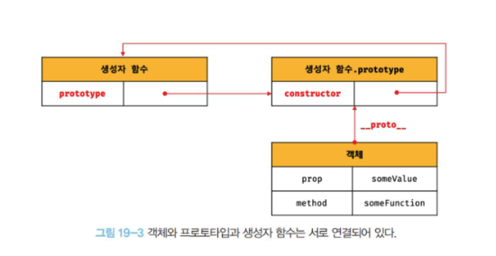

# 19장. 프로토타입

- 자바스크립트는 명령형, 함수형, 프로토타입 기반, 객체지향 프로그래밍을 지원하는 멀티 패러다임 프로그래밍 언어입니다.
- 그리고 자바스크립트는 프로토타입 기반의 객체지향 프로그래밍 언어 입니다.

#### 클래스

- 자바스크립트에서는 클래스도 함수이며, 기존 프로토타입 기반 패턴의 문법적 설탕 이라고 볼 수 있습니다.
- 클래스와 생성자 함수 모두 프로토타입 기반의 인스턴스를 생성하지만 정확히 동일하게 동작하지는 않습니다.
  - 클래스는 생성자 함수보다 엄격하며 클래스는 생성자 함수에서는 제공하지 않는 기능도 제공합니다.
- 따라서 클래스를 프로토타입 기반 객체 생성 패턴의 단순한 "문법적 설탕"으로 보기보다는 새로운 객체 생성 메커니즘으로 보는 것이 조금 더 합당하다고 할 수 있습니다.

## 19.1 객체지향 프로그래밍

- 객체지향 프로그래밍은 프로그램을 명령어 또는 함수의 목록으로 보는 전통적인 명령형 프로그래밍의 절차지향적 관점에서 벗어나 여러 개의 독립적 단위, 즉 객체의 집합으로 프로그램을 표현하려는 프로그래밍 패러다임을 이야기 합니다.
  - 사람의 이름과 주소를 예시로 들어보겠습니다.
  - 이러한 사람의 다양한 속성 중에서 프로그램에 필요한 속성만 간추려 내어 표현하는 것을 **추상화** 라고 이야기합니다.
  - 이때 프로그래머는 이름과 주소 속성으로 표현된 객체를 다른 객체와 구별하여 인식할 수 있습니다.
  - **이처럼 속성을 통해 여러 개의 값을하나의 단위로 구성한 복합적인 자료구조를 객체라 합니다**
  - 객체지향 프로그래밍은 독립적인 객체의 집합으로 프로그램을 표현하려는 프로그래밍 패러다임 입니다.
  - 그리고 객체지향 프로그래밍은 **객체의 상태**를 나타내는 데이터와 상태 데이터를 조작할 수 있는 **동작**을 하나의 논리적인 단위로 묶어 생각합니다.
  - 따라서 **객체는 상태 데이터와 동작을 하나의 논리적인 단위로 묶은 복합적인 자료구조**라고 할 수 있습니다.
    - 이때 객체의 상태 데이터를 프로퍼티, 동작을 메서드 라 부릅니다.

## 19.2 상속과 프로토타입

```js
// 생성자 함수
function Circle(radius) {
  this.radius = radius;
  this.getArea = function () {
    // Math.PI는 원주율을 나타내는 상수다.
    return Math.PI * this.radius ** 2;
  };
}

// 반지름이 1인 인스턴스 생성
const circle1 = new Circle(1);
// 반지름이 2인 인스턴스 생성
const circle2 = new Circle(2);

// Circle 생성자 함수는 인스턴스를 생성할 때마다 동일한 동작을 하는
// getArea 메서드를 중복 생성하고 모든 인스턴스가 중복 소유한다.
// getArea 메서드는 하나만 생성하여 모든 인스턴스가 공유해서 사용하는 것이 바람직하다.
console.log(circle1.getArea === circle2.getArea); // false

console.log(circle1.getArea()); // 3.141592653589793
console.log(circle2.getArea()); // 12.566370614359172
```

- Circle 생성자 함수가 생성하는 getArea 메서드는 모든 객체 인스턴스가 동일한 내용의 메서드를 사용하므로 단 하나만 생성하여 모든 인스턴스가 공유해서 사용하는 것이 바람직합니다.
  - 하지만 지금은 인스턴스마다 생성되어서 모든 인스턴스가 중복 소유하는 구조이지요?
  - 그렇다면 메모리 낭비이지요?
- 이 경우 상속을 통해 불필요한 중복을 제거할 수 있습니다.
  - **그리고 자바스크립트는 프로토타입을 기반으로 상속을 구현합니다**

```js
// 생성자 함수
function Circle(radius) {
  this.radius = radius;
}

// Circle 생성자 함수가 생성한 모든 인스턴스가 getArea 메서드를
// 공유해서 사용할 수 있도록 프로토타입에 추가한다.
// 프로토타입은 Circle 생성자 함수의 prototype 프로퍼티에 바인딩되어 있다.
Circle.prototype.getArea = function () {
  return Math.PI * this.radius ** 2;
};

// 인스턴스 생성
const circle1 = new Circle(1);
const circle2 = new Circle(2);

// Circle 생성자 함수가 생성한 모든 인스턴스는 부모 객체의 역할을 하는
// 프로토타입 Circle.prototype으로부터 getArea 메서드를 상속받는다.
// 즉, Circle 생성자 함수가 생성하는 모든 인스턴스는 하나의 getArea 메서드를 공유한다.
console.log(circle1.getArea === circle2.getArea); // true

console.log(circle1.getArea()); // 3.141592653589793
console.log(circle2.getArea()); // 12.566370614359172
```

## 19.3 프로토타입 객체

- **프로토타입 객체란 객체지향 프로그래밍의 근간을 이루는 객체 간 상속을 구현하기 위해 사용됩니다**
- 모든 객체는 `[[Prototype]]`이라는 내부 슬롯을 가지며, 이 내부 슬롯의 값은 프로토타입의 참조 입니다.
- 그리고 객체가 생성될때 객체 생성 방식에 따라 프로토타입이 결정되고 `[[Prototype]]`에 저장됩니다.
  - 객체 리터럴에 의해 생성된 객체의 프로토타입은 Object.prototype 입니다.
  - 생성자 함수에 의해 생성된 객체의 프로토타입은 생성자 함수의 prototype 프로퍼티에 바인딩되어 있는 객체입니다.
    > 19.6장에서 다시 살펴보겠습니다.
- 모든 객체는 하나의 프로토타입을 갖습니다.
  - 그리고 모든 프로토타입은 생성자 함수와 연결되어 있습니다.
  - 즉, 객체와 프로토타입과 생성자 함수는 서로 연결되어 있습니다.
- `[[Prototype]]` 내부 슬롯에는 직접 접근할 수 없지만, 내부 슬롯이 가리키는 프로토타입에 간접적으로 접근할 수 있습니다.
  - 그리고 프로토타입은 자신의 constructor 프로퍼티를 통해 생성자 함수에 접근할 수 있고, 생성자 함수는 자신의 prototype 프로퍼티를 통해 프로토타입에 접근할 수 있습니다.



### 19.3.1 `__proto__` 접근자 프로퍼티

- **모든 객체는 `__proto__` 접근자 프로퍼티를 통해 자신의 프로토타입, 즉 `[[Prototype]]` 내부 슬롯에 간접적으로 접근할 수 있습니다.**

#### `__proto__`는 접근자 프로퍼티다.

- 앞서 살펴보있듯이 내부 슬롯은 프로퍼티가 아닙니다.
  - 따라서 자바스크립트는 원칙적으로 내부 슬롯과 내부 메서드에 직업적으로 접근하거나 호출할 수 있는 방법을 제공하지 않습니다
  - 단 일부 내부 슬롯과 내부 메서드에 한하여 간접적으로 접근할 수 있는 수단을 제공하기도 합니다.
- `__proto__` 접근자 프로퍼티를 통해 간접적으로 내부 슬롯의 값, 즉 프로토타입에 접근할 수 있습니다.

##### 다시 알아보는 접근자 프로퍼티

- 접근자 프로퍼티는 자체적으로 값 `[[Value]]` 프로퍼티 어트리뷰트를 갖지 않고 다른 데이터 프로퍼티의 값을 읽거나 저장할 때 사용하는 접근자 함수인 `[[Get]]`, `[[Set]]` 프로퍼티 어트리뷰트로 구성됩니다.
- 그리고 Object.prototype의 접근자 프로퍼티인 `__proto__`는 getter/setter 함수라고 부르는 접근자 함수를 통해 `[[Prototype]]` 내부 슬롯의 값, 즉 프로토타입을 취득하거나 할당합니다.

#### `__proto__` 접근자 프로퍼티는 상속을 통해 사용됩니다.

- 객체가 직접 소유하는 프로퍼티가 아닌 Object.prototype의 프로퍼티 입니다

#### `__proto__` 접근자 프로퍼티를 통해 프로토타입에 접근하는 이유

- 프로토타입 체인은 단방향 링크드 리스트로 구현되어야 합니다.
- 순환 참조하는 체인이 만들어지는 순간 프로토타입 종점이 사라지기 때문에 무한 루프가 발생하게 됩니다.

#### `__proto__` 접근자 프로퍼티를 코드 내에서 직접 사용하는 것은 권장하지 않습니다.

- 비표준이었고 모든 객체가 프로토타입을 가지지 않으니까 getPrototypeOf를 사용합시다!!!

### 19.3.2 함수 객체의 prototype 프로퍼티

- **함수 객체만이 소유하는 prototype 프로퍼티는 생성자 함수가 생성할 인스턴스의 프로토타입을 가리킵니다**

  > this와 유사하게 느껴지네요

- 따라서 생성자 함수로서 호출할 수 없는 함수, 즉 non-constructor인 화살표 함수와 ES6 메서드 축약 표현으로 정의한 메서드는 prototype 프로퍼티를 소유하지 않으며 프로토타입도 생성하지 않습니다.
- 생성자 함수로 호출하기 위해 정의하지 않은 일반 함수
  - 말이 너무 어려워서 그냥 생성자 함수로 사용되지 않는 일반함수. 즉 인스턴스를 만들지 않는 함수로 조금 더 풀어서 써보겠습니다.
  - 함수 선언문 또는 함수 표현식으로 호출되는 일반 함수도 prototype 프로퍼티를 소유하지만 객체를 생성하지 않는 일반 함수의 prototype 프로퍼티는 아무런 의미가 없습니다.
- **모든 객체가 가지고 있는 (엄밀히 이야기하면 Object.prototype으로부터 상속받은) `__proto__` 접근자 프로퍼티와 함수 객체만이 가지고 있는 prototype 프로퍼티는 결국 동일한 프로토타입을 가리킵니다.**
  - 하지만 이들의 프로퍼티를 사용하는 주체가 다릅니다.


- 이해를 돕기 위해 생성자 함수로 객체를 생성한 후 `__proto__` 접근자 프로퍼티와 prototype 프로퍼티로 프로토타입 객체에 접근해보겠습니다

```js
// 생성자 함수
function Person(name) {
  this.name = name;
}

const me = new Person("Lee");

// 결국 Person.prototype과 me.__proto__는 결국 동일한 프로토타입을 가진다.
console.log(Person.prototype === me.__proto__);
```


### 19.3.3 프로토타입의 constructor 프로퍼티와 생성자 함수

- 모든 프로토타입은 constructor 프로퍼티를 갖습니다.
- 이 constructor 프로퍼티는 prototype 프로퍼티로 자신을 참조하고 있는 생성자 함수를 가리킵니다.
- 이 연결은 생성자 함수가 생성될 때, 즉 함수 객체가 생성될 때 이루어집니다.


## 19.4 리터럴 표기법에 의해 생성된 객체의 생성자 함수와 프로토타입

- 앞서 살펴본 바에 따르면 생성자 함수에 의해 생성된 인스턴스는 프로토타입의 constructor 프로퍼티에 의해 생성자 함수와 연결됩니다.
- 이때 constructor 프로퍼티가 가리키는 생성자 함수는 인스턴스를 생성한 생성자 함수 입니다.
- 하지만 리터럴 표기법에 의한 객체 생성 방식과 같이 명시적으로 new 연산자와 함께 생성자 함수를 호출하여 인스턴스를 생성하지 않는 객체 생성 방식도 있습니다.
  - 리터럴 표기법에 의해 생성된 객체도 물론 프로토타입이 존재합니다.
  - 하지만 리터럴 표기법에 의해 생성된 객체의 경우 프로토타입의 constructor 프로퍼티가 가리키는 생성자 함수가 반드시 객체를 생성한 생성자 함수라고 단정할 수는 없습니다.

```js
// obj 객체는 Object 생성자 함수로 생성한 객체가 아니라 객체 리터럴로 생성했다.
const obj = {};

// 하지만 obj 객체의 생성자 함수는 Object 생성자 함수다.
console.log(obj.constructor === Object); // true
```

- ECMAScript 사양에서는 Object 생성자 함수는 함수에 인수를 전달하지 않거나 undefined 또는 null을 인수로 전달하면서 호출하면 내부적으로는 추상 연산 OrdinaryObjectCreate를 호출하여 Object.prototype을 프로토타입으로 갖는 빈 객체를 생성합니다.

```js
// 2. Object 생성자 함수에 의한 객체 생성
// 인수가 전달되지 않았을 때 추상 연산 OrdinaryObjectCreate를 호출하여 빈 객체를 생성한다.
let obj = new Object();
console.log(obj); // {}

// 1. new.target이 undefined나 Object가 아닌 경우
// 인스턴스 → Foo.prototype → Object.prototype 순으로 프로토타입 체인이 생성된다.
class Foo extends Object {}
new Foo(); // Foo {}

// 3. 인수가 전달된 경우에는 인수를 객체로 변환한다.
// Number 객체 생성
obj = new Object(123);
console.log(obj); // Number {123}

// String 객체 생성
obj = new Object("123");
console.log(obj); // String {"123"}
```

- 객체 리터럴이 평가될 때는 다음과 같이 추상 연산 OrdinaryObjectCreate를 호출하여 빈 객체를 생성하고 프로퍼티를 추가하도록 정의되어 있습니다.
  - 하지만 추상연산 OrdinaryObjectCreate를를 호출하여 빈 객체를 생성하는 점에서는 동일하지만 new.target의 확인이나 프로퍼티를 추가하는 처리 등 세부 내용은 다릅니다.
    > 생성자 함수에서 this같은 친구였던걸로 기억하는 내용이 나왔네요
- Function 생성자 함수를 호출하여 생성한 함수는 렉시컬 스코프를 만들지 않고 전역 함수인 것처럼 스코프를 생성하며 클로저도 만들지 않습니다.
  - 따라서 함수 선언문과 함수 표현식을 평가하여 함수 객체를 생성한 것은 Function 생성자 함수가 아닙니다.
  - 하지만 constructor 프로퍼티를 통해 확인해보면 foo 함수의 생성자 함수는 Function 생성자 함수입니다.

    ```js
    // foo 함수는 Function 생성자 함수로 생성한 함수 객체가 아니라 함수 선언문으로 생성했다.
    function foo() {}

    // 하지만 constructor 프로퍼티를 통해 확인해보면 함수 foo의 생성자 함수는 Function 생성자 함수다.
    console.log(foo.constructor === Function); // true
    ```

  - 리터럴 표기법에 의해 생성된 객체도 상속을 위해 프로토타입이 필요합니다.
  - 따라서 리터럴 표기법에 의해 생성된 객체도 가상적인 생성자 함수를 갖습니다.
  - 프로토타입은 생성자 함수와 더불어 생성되며 prototype, constructor 프로퍼티에 연결되어 있기 때문입니다.
  - 다시말해, **프로토타입과 생성자 함수는 단독으로 존재할 수 없고 언제나 쌍으로 존재하게 됩니다.**

## 19.5 프로토타입의 생성 시점

- 리터럴 표기법에 의해 생성된 객체도 생성자 함수와 연결이 됩니다
- 결국 객체는 리터럴 표기볍 또는 생성자 함수에 의해 생성되므로 결국 모든 객체는 생성자 함수와 연결되어 있습니다.
- **프로토타입은 생성자 함수가 생성되는 시점에 더불어 생성됩니다**
  - 프로토타입은 생성자 함수와 서로 단독이 아닌 언제나 쌍으로 존재하기 때문입니다.

### 19.5.1 사용자 정의 생성자 함수와 프로토타입 생성 시점

- **생성자 함수로서 호출할 수 있는 함수, 즉 constructor는 함수 정의가 평가되어 함수객체를 생성하는 시점에 프로토타입도 더불어 생성됩니다**
  - 스코프에서 함수는 호출보다 정의가 중요하다고 했죠?

### 19.5.2 빌트인 생성자 함수와 프로토타입 생성 시점

- Object, String, Number, Function, Array, RegExp, Date, Promise 등과 같은 빌드인 생성자 함수도 일반 함수와 마찬가지로 빌트인 생성자 함수가 생성되는 시점에 프로토타입이 생성됩니다.
- 모든 빌트인 생성자 함수는 전역 객체가 생성되는 시점에 생성됩니다.
- 생성된 프로토타입은 빌트인 생성자 함수의 prototype 프로퍼티에 바인딩됩니다.
- **이후 생성자 함수 또는 리터럴 표기법으로 객체를 생성하면 프로토타입은 생성된 객체의 `[[Prototype]]` 내부 슬롯에 할당됩니다.**

## 19.6 객체 생성 방식과 프로토타입의 결정

- 객체는 다양한 생성 방식이 있습니다.
  - 객체 리터럴
  - Object 생성자 함수
  - 생성자 함수
  - Object.create 메서드
  - Class

- 다양한 방식으로 생성되는 모든 객체는 각 방식마다 세부적인 생성 방식의 차이는 있으나 추상 연산 `OrdinaryObjectCreate`에 의해 생성된다는 공통점이 있습니다.
- 그리고 프로토타입은 추상 연산 OrdinaryObjectCreate에 전달되는 인수에 의해 결정됩니다. 이 인수는 객체가 생성되는 시점에 객체 생성 방식에 의해 결정됩니다.

### 19.6.1 객체 리터럴에 의해 생성된 객체의 프로토타입

- 자바스크립트 엔진이 객체 리터럴을 평가하여 객체를 생성할 때 추상 연산 OrdinaryObjectCreate에 전달되는 프로토타입은 Object.prototype 입니다.
- 즉, 객체 리터럴에 의해 생성되는 객체의 프로토타입은 Object.prototype 입니다.

### 19.6.2 Object 생성자 함수에 의해 생성된 객체의 프로토타입

- Object 생성자 함수를 호출하면 객체 리터럴과 마찬가지로 추상 연산 OrdinaryObjectCreate가 호출됩니다.
- 이때 추상 연산 OrdinaryObjectCreate에 전달되는 프로토타입은 Object.prototype 입니다.
- 객체 리터럴 방식과의 차이점은 프로퍼티를 추가하는 방식에 있습니다.
  - 객체 리터럴 방식은 객체 리터럴 내부에 프로퍼티를 추가하지만 Object 생성자 함수 방식은 일단 빈 객체를 생성한 후 프로퍼티를 추가해야 합니다.

### 19.6.3 생성자 함수에 의해 생성된 객체의 프로토타입

- new 연산자와 함께 생성자 함수를 호출하여 인스턴스를 생성하는 방식에서도 OrdinaryObjectCreate가 호출됩니다.
- 이때 추상 연산 OrdinaryObjectCreate에 전달되는 프로토타입은 생성자 함수의 prototype 프로퍼티에 바인딩되어 있는 객체입니다.
  - 즉, 생성자 함수에 의해 생성되는 객체의 프로토타입은 생성자 함수의 prototype 프로퍼티에 바인딩되어 있는 객체입니다.
- Object.prototype과의 차이점은 다양한 빌트인 메서드를 가질 수 있느냐? 입니다.
  - Object.prototype은 hasOwnProperty, propertyIsEnumerable 등을 갖고있지만,
  - 사용자 정의 생성자 함수의 경우 생성된 prototype의 프로퍼티는 constructor뿐 입니다.

## 19.7 프로토타입 체인

- **자바스크립트는 객체의 프로퍼티(메서드 포함)에 접근하려고 할 때 객체에 접근하려는 프로퍼티가 없다면 `[[Prototype]]` 내부 슬롯의 참조를 따라 자신의 부모 역할을 하는 프로토타입의 프로퍼티를 순차적으로 검색합니다.**
- **이를 프로토타입 체인이라고 합니다. 프로토타입 체인은 자바스크립트가 객체지향 프로그래밍의 상속을 구현하는 메커니즘 입니다**
- 프로토타입 체인의 최상위에 위치하는 객체는 언제나 Object.prototype입니다.
  - 따라서 모든 객체는 prototype을 상속받습니다.
  - **Object.prototype을 프로토타입 체인의 종점 이라 합니다.**
  - 그리고 Object.prototype의 프로토타입인 `[[Prototype]]` 내부 슬롯의 값은 null입니다.
- 자바스크립트 엔진은 객체 간의 상속 관계로 이루어진 프로토타입의 계층적인 구조에서 객체의 프로퍼티를 검색합니다.
  - **따라서 프로토타입 체인은 상속과 프러퍼티 검색을 위한 메커니즘**이라고 할 수 있습니다.
- 이에 반해, 프로퍼티가 아닌 식별자는 스코프 체인에서 검색됩니다.
  - 자바스크립트 엔진은 함수의 중첩 관계로 이루어진 스코프의 계층적 구조에서 식별자를 검색합니다.
  - 따라서 **스코프 체인은 식별자 검색을 위한 메커니즘**이라고 할 수 있습니다.
- **스코프 체인과 프로토타입 체인은 서로 연관없이 동작하는 것이 아니라 서로 협력하여 식별자와 프로퍼티를 검색하는데 사용됩니다**
  - 식별자를 먼저 찾고 식별자로 찾은 객체의 프로토타입 체인에서 필요한 프로퍼티 혹은 메서드를 검색한다!!!

## 19.8 오버라이딩과 프로퍼티 섀도잉

- 상속 관계에 의해 프로퍼티가 가려지는 현상을 프로퍼티 섀도잉 이라 합니다.

## 19.9 프로토타입의 교체

- 프로토타입은 임의의 다른 객체로 변경할 수 있습니다.
  - 이는 부모 객체인 프로토타입을 동적으로 변경할 수 있다는 것을 의미합니다.
  - 이러한 특징을 활용하여 객체 간 상속 관계를 동적으로 변경할 수 있습니다.
- 프로토타입은 생성자 함수 또는 인스턴스에 의해 교체할 수 있습니다.

### 생성자 함수에 의한 교체

### 인스턴스에 의한 프로토타입의 교체

### 19.10 instanceof 연산자

- instanceof 연산자는 이항 연산자로 좌변에 객체를 가리키는 식별자, 우변에 생성자 함수를 가리키는 식별자를 피연산자로 받습니다.
  - 만약 우변의 피연산자가 함수가 아닌 경우 TypeError 가 발생합니다

```js
객체 instanceof 생성자 함수
```

- **우변의 생성자 함수의 prototype에 바인딩된 객체가 좌변의 객체의 프로토타입 체인 상에 존재하면 true로 평가되고, 그렇지 않은 경우에는 false로 평가됩니다.**
  - 정확히는 생성자 함수의 prototype에 바인딩된 객체가 프로토타입 체인 상에 존재하는지를 확인합니다.

## 19.11 직접 상속

### 19.11.1 Object.create에 의한 직접 상속

- Object.create 메서드는 명시적으로 프로토타입을 지정하여 새로운 객체를 생성합니다.
  - 그리고 이때 다른 객체 생성 방식과 마찬가지로 추상 연산 OrdinaryObjectCreate를 호출합니다.
  ```js
  /**
   * 지정된 프로토타입 및 프로퍼티를 갖는 새로운 객체를 생성하여 반환한다.
   * @param {Object} prototype - 생성할 객체의 프로토타입으로 지정할 객체
   * @param {Object} [propertiesObject] - 생성할 객체의 프로퍼티를 갖는 객체
   * @returns {Object} 지정된 프로토타입 및 프로퍼티를 갖는 새로운 객체
   */
   Object.create(prototype[, propertiesObject])
  ```

```js
// 프로토타입이 null인 객체를 생성한다. 생성된 객체는 프로토타입 체인의 종점에 위치한다.
// obj -> null
let obj = Object.create(null);
console.log(Object.getPrototypeOf(obj) === null); // true
// Object.prototype을 상속받지 못한다.
// console.log(obj.toString()); // TypeError: obj.toString is not a function

// obj -> Object.prototype -> null
// obj = {};와 동일하다.
obj = Object.create(Object.prototype);
console.log(Object.getPrototypeOf(obj) === Object.prototype); // true

// obj -> Object.prototype -> null
// obj = { x: 1 };와 동일하다.
obj = Object.create(Object.prototype, {
  x: { value: 1, writable: true, enumerable: true, configurable: true },
});

// 위 코드는 아래와 동일하다.
// obj = Object.create(Object.prototype);
// obj.x = 1;
console.log(obj.x); // 1
console.log(Object.getPrototypeOf(obj) === Object.prototype); // true

const myProto = { x: 10 };
// 임의의 객체를 직접 상속받는다.
// obj -> myProto -> Object.prototype -> null
obj = Object.create(myProto);
console.log(obj.x); // 10
console.log(Object.getPrototypeOf(obj) === myProto); // true

// 생성자 함수
function Person(name) {
  this.name = name;
}

// obj -> Person.prototype -> Object.prototype -> null
// obj = new Person('Lee')와 동일하다.
obj = Object.create(Person.prototype);
obj.name = "Lee";
console.log(obj.name); // Lee
console.log(Object.getPrototypeOf(obj) === Person.prototype); // true
```

- 이처럼 Object.create 메서드는 첫 번째 매개변수에 전달한 객체의 프로토타입 체인에 속하는 객체를 생성합니다.
  - 즉, 객체를 생성하면서 직접적으로 상속을 구현하는 것입니다.
- Object.create 메서드의 장점은 아래와 같습니다
  - new 연산자가 없이도 객체를 생성할 수 있습니다.
  - 프로토타입을 지정하면서 객체를 생성할 수 있습니다.
  - 객체 리터럴에 의해 생성된 객체로 상속받을 수 있습니다.

### 19.11.2 객체 리터럴 내부에서 `__proto__`에 의한 직접 상속

## 19.12 정적 프로퍼티/메서드

## 19.13 프로퍼티 존재 확인

### 19.13.1 in 연산자

- in 연산자는 객체 내에 특정 프로퍼티가 존재하는지 여부를 확인합니다.

```js
/**
 * key: 프로퍼티 키를 나타내는 문자열
 * object: 객체로 평가되는 표현식
 */
key in object;
```

```js
const person = {
  name: "Lee",
  address: "Seoul",
};

// person 객체에 name 프로퍼티가 존재한다.
console.log("name" in person); // true

// person 객체에 address 프로퍼티가 존재한다.
console.log("address" in person); // true

// person 객체에 age 프로퍼티가 존재하지 않는다.
console.log("age" in person); // false
```

- in 연산자 대신 Reflect.has 메서드를 사용할 수 도 있습니다.

```js
const person = { name: "Lee" };

console.log(Reflect.has(person, "name")); // true
console.log(Reflect.has(person, "toString")); // true
```

## 19.14 프로퍼티 열거

### for...in 문

- 객체의 모든 프로퍼티를 순회하며 열거 하려면 for...in 문을 사용합니다.
- 정확히 표현해주자면 **for...in 문은 객체의 프로토타입 체인 상에 존재하는 모든 프로토타입의 프로퍼티 중에서 프로퍼티 어트리뷰트 `[[Enumerable]]`의 값이 true인 프로퍼티를 순회하며 열거합니다.**
- 프로퍼티 키가 심벌인 경우는 열거하지 않습니다.
