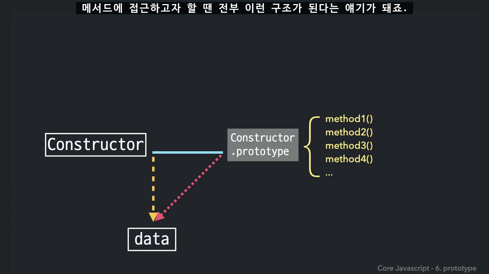

# 모던 자바스크립트 Deep Dive 19장 정리

## 19장. 프로토타입 

> 자바스크립트는 프로토타입 기반 객체지향 프로그래밍 언어다.  

> 자바스크립트는 클래스 기반 객체지향 프로그래밍 언어보다 효율적이며 더 강력한 객체지향 프로그래밍 능력을 가지고 있다.

<details>
<summary>왜 더 효율적이라고 할까?</summary>

```
// 런타임에 상속 관계를 바꿀 수 있음
Object.setPrototypeOf(obj, newParent);

// 인스턴스 하나만 확장 가능
const special = Object.create(base);
special.extraMethod = () => {};
```

클래스 기반에서는 컴파일 타임에 고정되니 이런 게 되지 않는다.

하지만 유연함에는 대가가 있다:
- 구조를 정적으로 검증하기 어려움 (그래서 TypeScript가 나옴)
- 런타임에 프로토타입을 바꾸면 엔진 최적화가 깨짐 (V8의 hidden class 무효화)
- 프로토타입 오염 같은 보안 문제

</details>

## 객체

객체를 연습할 때를 떠올려 보면 주로 사람, 자동차, 붕어빵 등을 class 기반으로 만든다.  

우리가 이런 것들을 떠올리면 생각나는 무언가가 바로 있듯이 

객체는 `확실한 개념이 있는 무언가`, `명확한 의미의 대상` 과 같이 추상적으로 정의할 수 있다.

## 객체지향 프로그래밍

책에서는 `자바스크립트를 이루고 있는 거의 **모든 것** 이 객체다.`라고 한다.

<details>
<summary>음 왜 모든 것 일까?</summary>

사실은 `모든 것` 보다는 `모든 값`이 맞는 표현이다.

if, for 이런 문들은 값이 아니다. 평가해도 값이 남지 않기 때문에 객체냐 원시값이냐를 따질 대상 자체가 아니다.  
(함수 선언문 자체는 객체가 아니다. 선언문으로 만들어진 함수 결과물이 객체다.)

다만 실제로 값 중에서는 원시 값을 제외한 모든 값이 객체라고 해도 성립한다.  
그래서 보다 정확하게는 아래와 같이 표현할 수 있다.

> 자바스크립트를 이루고 있는 원시 값을 제외한 모든 값은 객체다.
</details>

자바스크립트에서의 객체는 그만큼 중요한 개념이며 아까 추상적으로 정리한 객체의 정의를 조금 더 명확히 하면,

> 객체는 `속성을 통해 여러 개의 값을 하나의 단위로 구성한 복합적인 자료구조`

라고 할 수 있다.  

그래서 객체지향 프로그래밍은 `독립적인 객체의 집합으로 프로그램을 표현하려는 프로그래밍 패러다임`이며, 조금 덛붙히면 
- 성능 보다는 데이터 중심의 설계를 위한 패러다임
- 시스템의 데이터 구조와 비즈니스 로직이 일치하게 되어 유지보수와 확장이 용이해진다.
- 모듈식의 개발을 통해 bottom-up 식의 개발이 가능하다. 쪼개고 합치기 좋음.

이런 장점이 있다.

그리고 이 객체를 객체지향적 관점에서는 이렇게 표현한다.

> 객체는 상태 데이터(프로퍼티)와 상태 데이터를 조작할 수 있는 동작(매서드)를 논리적인 단위로 묶은 복합적 자료구조이다. 

> 조금 더 컴퓨터 공학적인 내용으로는.. [옛날 정리](https://github.com/jeongwoo903/study-log/blob/main/2024/08/%5BCS%5D%20%EB%8D%B0%EC%9D%B4%ED%84%B0%20%EC%A4%91%EC%8B%AC%20%EC%84%A4%EA%B3%84%EC%99%80%20%EA%B0%9D%EC%B2%B4%EC%A7%80%ED%96%A5.md)

<details>
<summary>왜 자바스크립트는 객체로 구성되어 있을까? (절망편)</summary>


||
|:---:|

넷스케이프는 자바가 뜨는 걸 보고 "자바처럼 보이는 언어"를 원했다.
그래서 문법은 C/자바를 흉내 내고, 내부 동작은 Scheme + Self(프로토타입 언어)에서 가져온 잡종이 탄생해보린거다..
</details>

## 상속과 프로토타입

- [복사와 상속의 차이](https://claude.ai/code/artifact/17d13429-5dee-4568-a953-c18922baf545?org=96f7fe09-ffca-478d-b701-c1e6cbcfe746)

### 상속

상속은 객체지향의 4가지 특징 중 하나다.

책에서는 이렇게 말한다.
> 어떤 객체의 프로퍼티 또는 매서드를 다른 객체가 상속받아 그대로 사용할 수 있는 것을 말한다.

상속은 코드의 재사용에서 매우 유용하다.  
생성자 함수의 자식인 인스턴스들은 그 부모의 매서드를 별도의 구현없이 사용가능 하기 때문이다.

<details>
<summary>객체지향의 4가지 특징</summary>
- 캡슐화 - 사용하는 사람은 개념을 다 알필요가 없음.
  - private은 외부 파일에서 접근이 안됨.
    - js에서는 private를 어떻게 정의 했을까.
    - _age느낌으로 그냥 개발자들간의 규칙을 정함.
    - closure(스코프 체인)를 통해서 하기도 함.
  - protect는 가능함.
- 상속 - 같은 것을 복제하고 싶다.
- 추상화 - 공통된 개념만 뽑아서 상위로 올림.
- 다형성 - 여러가지를 하나로 묶어서 표현이 가능하다. 코드가 간단해짐
</details>

### 프로토타입

자바스크립트는 
- 프로토타입을 기반으로 상속을 구현한다.
- 상속을 통해 불필요한 중복을 제거한다.

이는 중요한 개념이다.

**모든 객체는 __proto__ 을 지닌다.**  
원시값이라 할지라도 매서드를 사용하려고 하면 임시적으로 래퍼 객체를 씌워 객체처럼 행동 할 수 있다.  
이때 생성자의 prototype을 참고한다.



- [Circle로 알아보는 구조](https://claude.ai/code/artifact/806c756f-abec-4ffc-8731-5b7f5663912d?via=auto_preview)

## 프로토타입 객체

> 프로토타입 객체(또는 줄여서 프로토타입)란 객체지향 프로그래밍의 근간을 이루는 객체 간 상속을 구현하기 위해 사용된다.

**모든 객체는 [[Prototype]] 이라는 내부 슬롯을 가진다.**  
이 내부 슬롯의 값이 곧 프로토타입의 참조이며, 어떤 방식으로 객체를 만들었냐에 따라 무엇이 담길지가 결정된다.

- 객체 리터럴로 만들면 → `Object.prototype`
- 생성자 함수로 만들면 → 그 생성자 함수의 `prototype` 프로퍼티에 바인딩된 객체

정리하면 객체와 프로토타입과 생성자 함수는 서로 물려 있는 삼각형 구조다.

```
생성자 함수  --prototype-->  프로토타입  --constructor-->  생성자 함수
                                ↑
                          __proto__
                                |
                              객체
```

### __proto__ 접근자 프로퍼티

[[Prototype]]은 내부 슬롯이라 직접 접근할 수 없다. 그래서 `__proto__`라는 접근자 프로퍼티를 통해 간접적으로 접근한다.

<details>
<summary>왜 굳이 접근자를 거치게 만들었을까?</summary>

순환 참조를 막기 위해서다.

```js
const parent = {};
const child = {};

child.__proto__ = parent;
parent.__proto__ = child; // TypeError: Cyclic __proto__ value
```

프로토타입 체인은 단방향 링크드 리스트여야 한다. 검색이 한쪽으로만 흘러야 종점에 도달할 수 있기 때문이다.  
서로가 서로의 프로토타입이 되어버리면 종점이 사라지고 프로퍼티를 찾을 때 무한 루프에 빠진다.

그래서 그냥 슬롯을 열어두지 않고, 체크할 수 있는 접근자를 통해서만 교체하도록 구현해둔 것이다.
</details>

그리고 `__proto__`는 본인이 소유한 프로퍼티가 아니다. `Object.prototype`의 것을 상속받아 쓰는 것이다.

```js
const person = { name: 'Lee' };

console.log(person.hasOwnProperty('__proto__')); // false
console.log({}.__proto__ === Object.prototype);  // true
```

<details>
<summary>그런데 __proto__는 쓰지 말라고 한다</summary>

모든 객체가 `__proto__`를 쓸 수 있는 게 아니기 때문이다.

```js
const obj = Object.create(null); // 프로토타입 체인의 종점

console.log(obj.__proto__);              // undefined
console.log(Object.getPrototypeOf(obj)); // null
```

`Object.create(null)`로 만든 객체는 `Object.prototype`을 상속받지 않으니 `__proto__` 자체가 없다.  
그래서 책에서는 아래를 권장한다.

- 프로토타입을 **얻고** 싶으면 → `Object.getPrototypeOf`
- 프로토타입을 **바꾸고** 싶으면 → `Object.setPrototypeOf`

참고로 `__proto__`는 원래 비표준이었는데, 이미 브라우저들이 다 지원하고 있어서 ES6에서 어쩔 수 없이 표준으로 채택한 케이스다.
</details>

### 함수 객체의 prototype 프로퍼티

**함수 객체만이 소유하는 `prototype` 프로퍼티는 생성자 함수가 생성할 인스턴스의 프로토타입을 가리킨다.**

```js
(function () {}).hasOwnProperty('prototype'); // true
({}).hasOwnProperty('prototype');             // false
```

여기서 중요한 건 `prototype`과 `__proto__`가 헷갈리기 쉽다는 점이다. 둘은 **결국 같은 프로토타입을 가리키지만 쓰는 주체가 다르다.**

| 구분 | 소유 | 값 | 사용 주체 | 사용 목적 |
|---|---|---|---|---|
| `__proto__` 접근자 프로퍼티 | 모든 객체 | 프로토타입의 참조 | 모든 객체 | 객체가 **자신의** 프로토타입에 접근/교체 |
| `prototype` 프로퍼티 | constructor | 프로토타입의 참조 | 생성자 함수 | 생성자 함수가 **자신이 생성할 인스턴스의** 프로토타입을 할당 |

```js
function Person(name) { this.name = name; }
const me = new Person('Lee');

console.log(Person.prototype === me.__proto__); // true
```

### 프로토타입의 constructor 프로퍼티

모든 프로토타입은 `constructor` 프로퍼티를 갖고, 이는 자신을 참조하고 있는 생성자 함수를 가리킨다.  
이 연결은 **함수 객체가 생성될 때** 자동으로 이뤄진다.

```js
function Person(name) { this.name = name; }
const me = new Person('Lee');

console.log(me.constructor === Person); // true
```

`me` 자신은 `constructor`가 없지만, 프로토타입인 `Person.prototype`에 있으니 상속받아 쓰는 것이다.

## 리터럴 표기법에 의해 생성된 객체의 생성자 함수와 프로토타입

리터럴로 만든 객체도 `constructor`를 갖는다. 앞에서 확인했듯 `Object`를 가리킨다.

```js
const obj = {};
console.log(obj.constructor === Object); // true
```

## 프로토타입의 생성 시점

**프로토타입은 생성자 함수가 생성되는 시점에 더불어 생성된다.**

프로토타입과 생성자 함수는 언제나 쌍으로 존재하기 때문이다.

```js
// 함수 선언문은 런타임 이전에 평가되므로(호이스팅) 프로토타입도 이미 만들어져 있다.
console.log(Person.prototype); // {constructor: f}

function Person(name) { this.name = name; }
```

반대로 non-constructor는 프로토타입이 만들어지지 않는다.

```js
const Person = name => { this.name = name; };
console.log(Person.prototype); // undefined
```

빌트인 생성자 함수(`Object`, `String`, `Function` 등)도 마찬가지로, 전역 객체가 생성되는 시점에 프로토타입이 먼저 만들어진다.  
그래서 우리가 코드를 한 줄도 쓰기 전에 이미 `Object.prototype`은 존재한다.

## 객체 생성 방식과 프로토타입의 결정

객체를 만드는 방식은 여러 가지지만, 공통적으로 추상 연산 `OrdinaryObjectCreate`를 호출한다는 점은 같다.  
**이때 무엇을 프로토타입으로 넘기느냐가 방식마다 다르고, 그게 곧 그 객체의 프로토타입이 된다.**

| 생성 방식 | 프로토타입 |
|---|---|
| 객체 리터럴 `{}` | `Object.prototype` |
| `new Object()` | `Object.prototype` |
| 생성자 함수 `new Person()` | `Person.prototype` |
| `Object.create(proto)` | 인수로 전달한 `proto` |
| 클래스 `new Circle()` | `Circle.prototype` |

```js
const obj = { x: 1 };
console.log(obj.constructor === Object);     // true
console.log(obj.hasOwnProperty('x'));        // true
```

여기서 사용자 정의 생성자 함수와 빌트인의 차이가 하나 있다.  
`Object.prototype`은 `hasOwnProperty` 같은 빌트인 메서드를 잔뜩 갖고 있지만, 방금 만든 `Person.prototype`이 가진 건 `constructor` 하나뿐이다.

그래서 상속시킬 게 있으면 직접 추가해줘야 한다. 프로토타입도 객체이므로 프로퍼티를 추가/삭제할 수 있고, 이는 **프로토타입 체인에 즉각 반영된다.**

```js
function Person(name) { this.name = name; }

Person.prototype.sayHello = function () {
  console.log(`Hi! My name is ${this.name}`);
};

const me = new Person('Lee');
const you = new Person('Kim');

me.sayHello();  // Hi! My name is Lee
you.sayHello(); // Hi! My name is Kim
```

`me`와 `you`는 `sayHello`를 갖고 있지 않지만, 부모가 가진 걸 그대로 꺼내 쓴다. 그것도 **하나의 함수 객체를 공유해서** 쓴다.

## 프로토타입 체인

앞에서 `me` 객체는 `Person.prototype`을 상속받는다고 했다. 그런데 이런 것도 된다.

```js
console.log(me.hasOwnProperty('name')); // true
```

`hasOwnProperty`는 `Object.prototype`의 메서드다. `Person.prototype`에는 없다.  
그럼에도 호출이 되는 이유는 상속이 한 단계로 끝나지 않기 때문이다.

```
me  →  Person.prototype  →  Object.prototype  →  null
```

**프로토타입의 프로토타입은 언제나 `Object.prototype`이다.**

> 자바스크립트는 객체의 프로퍼티에 접근하려고 할 때 해당 객체에 접근하려는 프로퍼티가 없다면 [[Prototype]] 내부 슬롯의 참조를 따라 자신의 부모 역할을 하는 프로토타입의 프로퍼티를 순차적으로 검색한다. 이를 프로토타입 체인이라 한다.

`me.hasOwnProperty('name')`의 검색 순서는 이렇다.

1. `me`에서 찾는다 → 없다
2. `Person.prototype`으로 올라간다 → 없다
3. `Object.prototype`으로 올라간다 → **있다** → 호출. 이때 `this`는 `me`가 바인딩된다

체인의 끝인 `Object.prototype`을 **프로토타입 체인의 종점**이라 부르고, 여기서도 못 찾으면 `undefined`를 반환한다. 에러가 아니다.

```js
console.log(me.foo); // undefined
```

<details>
<summary>스코프 체인과 프로토타입 체인은 뭐가 다를까</summary>

찾는 대상이 다르다.

- **스코프 체인** = 식별자를 찾는다. 함수의 중첩 관계를 타고 올라간다.
- **프로토타입 체인** = 프로퍼티를 찾는다. 객체의 상속 관계를 타고 올라간다.

그런데 둘은 따로 노는 게 아니라 협력한다.

```js
me.hasOwnProperty('name');
```

이 한 줄에서
1. 먼저 **스코프 체인**에서 `me`라는 식별자를 찾고 (전역에서 발견)
2. 그 다음 `me` 객체의 **프로토타입 체인**에서 `hasOwnProperty`를 찾는다

식별자를 찾아야 객체를 손에 쥘 수 있고, 객체를 쥐어야 프로퍼티를 뒤질 수 있으니 순서가 이렇게 된다.
</details>

## 오버라이딩과 프로퍼티 섀도잉

프로토타입에 있는 메서드와 같은 이름을 인스턴스에 추가하면 어떻게 될까?

```js
const Person = (function () {
  function Person(name) { this.name = name; }

  Person.prototype.sayHello = function () {
    console.log(`Hi! My name is ${this.name}`);
  };

  return Person;
}());

const me = new Person('Lee');

// 인스턴스 메서드
me.sayHello = function () {
  console.log(`Hey! My name is ${this.name}`);
};

me.sayHello(); // Hey! My name is Lee
```

**프로토타입 프로퍼티를 덮어쓰는 게 아니라, 인스턴스 프로퍼티로 추가된다.**  
그 결과 프로토타입의 것이 가려진다. 이를 **프로퍼티 섀도잉**이라 한다.

- **오버라이딩** : 상위 클래스의 메서드를 하위 클래스가 재정의해서 쓰는 것
- **오버로딩** : 이름은 같은데 매개변수의 타입/개수가 다른 메서드를 여러 개 두는 것. JS는 지원하지 않지만 `arguments`로 흉내낼 수는 있다.

그래서 인스턴스 것을 지우면 다시 프로토타입 것이 보인다.

```js
delete me.sayHello;
me.sayHello(); // Hi! My name is Lee

// 한 번 더 지워도 프로토타입 것은 안 지워진다
delete me.sayHello;
me.sayHello(); // Hi! My name is Lee
```

**하위 객체를 통해 프로토타입에 get 액세스는 되지만 set 액세스는 안 된다.**  
바꾸거나 지우고 싶으면 프로토타입에 직접 접근해야 한다.

```js
Person.prototype.sayHello = function () {
  console.log(`Hey! My name is ${this.name}`);
};
me.sayHello(); // Hey! My name is Lee

delete Person.prototype.sayHello;
me.sayHello(); // TypeError: me.sayHello is not a function
```

<details>
<summary>읽기는 올라가는데 쓰기는 왜 안 올라갈까</summary>

만약 쓰기도 체인을 타고 올라간다면, 자식 하나가 값을 바꿀 때마다 부모가 바뀌고 **형제들까지 전부 영향을 받는다.**

```js
const a = Object.create(parent);
const b = Object.create(parent);

a.count = 1; // 만약 이게 parent를 바꾼다면 b.count도 1이 되어버린다
```

각자의 상태는 각자 가져야 하니, 할당은 자기 자리에 꽂히는 게 맞다.

주의할 건 **할당(`=`)과 변형(mutate)은 다르다**는 점이다.

```js
child.list.push(3);  // 읽기로 부모 배열을 가져와서 그걸 건드림 → 부모 오염
child.list = [3];    // 할당 → child에 새로 생김. 부모 무사
```

`push`에는 `=`가 없다. 그래서 섀도잉이 일어날 계기가 없고, 부모가 그대로 오염된다.
</details>

## 프로토타입의 교체

프로토타입은 다른 객체로 바꿔치기할 수 있다. 즉 **상속 관계를 런타임에 동적으로 바꿀 수 있다.**  
교체하는 방법은 두 가지다.

### 생성자 함수에 의한 교체

```js
const Person = (function () {
  function Person(name) { this.name = name; }

  Person.prototype = {          // ← 통째로 교체
    sayHello() {
      console.log(`Hi! My name is ${this.name}`);
    }
  };

  return Person;
}());

const me = new Person('Lee');

console.log(me.constructor === Person); // false
console.log(me.constructor === Object); // true
```

앞에서 `constructor`는 자바스크립트 엔진이 프로토타입을 만들 때 **암묵적으로 추가**하는 프로퍼티라고 했다.  
그런데 객체 리터럴로 통째로 갈아끼우면 그 리터럴에는 `constructor`가 없다. 그래서 연결이 끊긴다.

되살리려면 직접 넣어주면 된다.

```js
Person.prototype = {
  constructor: Person,          // ← 직접 복구
  sayHello() { ... }
};
```

### 인스턴스에 의한 교체

```js
function Person(name) { this.name = name; }
const me = new Person('Lee');

const parent = {
  sayHello() { console.log(`Hi! My name is ${this.name}`); }
};

Object.setPrototypeOf(me, parent);  // me.__proto__ = parent; 와 동일

me.sayHello(); // Hi! My name is Lee
```

<details>
<summary>두 방식의 미묘한 차이</summary>

바라보는 대상이 다르다.

- **생성자 함수에 의한 교체** : `Person.prototype`이 교체된 프로토타입을 **가리킨다**
- **인스턴스에 의한 교체** : `Person.prototype`은 교체된 프로토타입을 **가리키지 않는다**

즉 생성자 함수 쪽은 `prototype` 프로퍼티와의 연결이 살아있고, 인스턴스 쪽은 그 연결까지 끊어진다.  
그래서 인스턴스로 교체한 경우엔 두 군데를 다 손봐야 완전히 복구된다.

```js
Person.prototype = parent;          // 생성자 함수와 프로토타입 연결
Object.setPrototypeOf(me, parent);  // 인스턴스와 프로토타입 연결
```

시점도 다르다. 생성자 함수의 `prototype`을 바꾸는 건 **앞으로 만들 인스턴스**의 프로토타입을 바꾸는 것이고, `__proto__`로 바꾸는 건 **이미 만들어진 객체**의 프로토타입을 바꾸는 것이다.

결론은 책에서도 말하듯 **프로토타입은 직접 교체하지 않는 게 좋다.** 번거롭고 실수하기 쉽다.  
상속 관계를 만들고 싶으면 직접 상속이나 ES6 클래스를 쓰는 게 맞다.
</details>

## instanceof 연산자

```
객체 instanceof 생성자 함수
```

> **우변의 생성자 함수의 `prototype`에 바인딩된 객체가 좌변 객체의 프로토타입 체인 상에 존재하면 `true`로 평가된다.**

여기서 중요한 건 `constructor`를 보는 게 아니라는 점이다.

```js
const Person = (function () {
  function Person(name) { this.name = name; }
  Person.prototype = { sayHello() { ... } };  // constructor 연결 파괴
  return Person;
}());

const me = new Person('Lee');

console.log(me.constructor === Person); // false ← 연결은 끊겼지만
console.log(me instanceof Person);      // true  ← instanceof는 멀쩡
```

`constructor` 연결이 파괴되어도 `prototype` 프로퍼티와 프로토타입 간의 연결은 살아있기 때문에 `instanceof`는 영향을 받지 않는다.

직접 구현해보면 동작이 명확해진다.

```js
function isInstanceof(instance, constructor) {
  const prototype = Object.getPrototypeOf(instance);

  // 종점에 도달하면 false
  if (prototype === null) return false;

  // 찾았거나, 못 찾았으면 한 칸 위로 올라가서 다시
  return prototype === constructor.prototype || isInstanceof(prototype, constructor);
}
```

결국 **체인을 타고 올라가며 `constructor.prototype`이 있는지 확인**하는 것이다.

## 직접 상속

### Object.create

`Object.create`는 명시적으로 프로토타입을 지정해서 객체를 만든다.

```js
Object.create(prototype[, propertiesObject])
```

```js
// obj → null (프로토타입 체인의 종점)
let obj = Object.create(null);

// obj → Object.prototype → null   ( = {} 와 동일)
obj = Object.create(Object.prototype);

// obj → myProto → Object.prototype → null
const myProto = { x: 10 };
obj = Object.create(myProto);
console.log(obj.x); // 10
```

장점은 세 가지다.

- `new` 연산자 없이 객체를 생성할 수 있다
- 프로토타입을 지정하면서 객체를 생성할 수 있다
- 객체 리터럴로 만든 객체도 상속받을 수 있다

<details>
<summary>hasOwnProperty를 객체가 직접 호출하지 말라는 이유</summary>

`Object.create(null)`로 만든 객체는 `Object.prototype`을 상속받지 않기 때문이다.

```js
const obj = Object.create(null);
obj.a = 1;

console.log(obj.hasOwnProperty('a'));
// TypeError: obj.hasOwnProperty is not a function
```

그래서 ESLint는 직접 호출을 권장하지 않고, 아래처럼 간접 호출하라고 한다.

```js
console.log(Object.prototype.hasOwnProperty.call(obj, 'a')); // true
```

앞에서 `Object.create(null)`이 왜 필요한지 이야기했는데, 순수한 키-값 저장소가 필요할 때다.  
`toString` 같은 상속 프로퍼티가 데이터와 섞이지 않으니 `in`이나 `[]`로 안전하게 검사할 수 있다.
</details>

### 객체 리터럴 내부에서 __proto__로 직접 상속

`Object.create`는 두 번째 인자로 프로퍼티를 정의하는 게 번거롭다. ES6부터는 리터럴 안에서 바로 할 수 있다.

```js
const myProto = { x: 10 };

const obj = {
  y: 20,
  __proto__: myProto    // obj → myProto → Object.prototype → null
};

console.log(obj.x, obj.y); // 10 20
```

## 정적 프로퍼티/메서드

> 정적 프로퍼티/메서드는 생성자 함수로 인스턴스를 생성하지 않아도 참조/호출할 수 있는 프로퍼티/메서드를 말한다.

생성자 함수도 객체이므로 자기 프로퍼티를 가질 수 있다. 그게 정적 프로퍼티/메서드다.

```js
function Person(name) { this.name = name; }

Person.prototype.sayHello = function () { ... };  // 프로토타입 메서드
Person.staticMethod = function () { ... };        // 정적 메서드

const me = new Person('Lee');

Person.staticMethod(); // OK
me.staticMethod();     // TypeError: me.staticMethod is not a function
```

**정적 메서드는 인스턴스의 프로토타입 체인에 속하지 않는다.** 그래서 인스턴스로는 접근할 수 없다.

```
me → Person.prototype → Object.prototype   ← staticMethod는 이 체인 밖에 있다
```

우리가 늘 쓰는 것들도 이 구분에 해당한다.

```js
Object.create(...)              // 정적 메서드 → Object로 호출
obj.hasOwnProperty('name')      // 프로토타입 메서드 → 인스턴스로 호출
```

<details>
<summary>언제 정적 메서드로 만들까</summary>

**메서드 안에서 `this`를 쓰지 않는다면** 정적 메서드로 바꿔도 된다.

`this`는 인스턴스를 가리키는데, 인스턴스를 참조할 일이 없다면 굳이 인스턴스를 만들어서 호출할 이유가 없기 때문이다.

```js
// this를 안 쓰는 프로토타입 메서드 — 인스턴스를 만들어야만 호출 가능
Foo.prototype.x = function () { console.log('x'); };
const foo = new Foo();
foo.x();

// 정적 메서드 — 바로 호출 가능
Foo.x = function () { console.log('x'); };
Foo.x();
```

참고로 MDN 문서에서도 `Object.keys()`(정적)와 `Object.prototype.hasOwnProperty()`(프로토타입)를 구분해서 표기한다. 표기법만 봐도 구분할 수 있어야 한다.
</details>

## 프로퍼티 존재 확인

### in 연산자

```js
const person = { name: 'Lee', address: 'Seoul' };

console.log('name' in person);    // true
console.log('age' in person);     // false
```

주의할 건 **상속받은 프로퍼티까지 전부 확인한다**는 점이다.

```js
console.log('toString' in person); // true ← 넣은 적 없는데 true
```

ES6의 `Reflect.has`도 동일하게 동작한다.

### hasOwnProperty

이름 그대로 **객체 고유의 프로퍼티일 때만** `true`를 반환한다.

```js
console.log(person.hasOwnProperty('name'));     // true
console.log(person.hasOwnProperty('toString')); // false ← in과 다른 지점
```

## 프로퍼티 열거

### for...in 문

> **for...in 문은 객체의 프로토타입 체인 상에 존재하는 모든 프로토타입의 프로퍼티 중에서 프로퍼티 어트리뷰트 [[Enumerable]]의 값이 true인 프로퍼티를 순회하며 열거한다.**

`in` 연산자처럼 상속받은 것도 열거한다. 그런데 `toString`은 안 나온다.

```js
const person = { name: 'Lee', address: 'Seoul' };

for (const key in person) {
  console.log(key + ': ' + person[key]);
}
// name: Lee
// address: Seoul     ← toString은 없다
```

`Object.prototype.toString`의 `[[Enumerable]]`이 `false`이기 때문이다.

```js
console.log(Object.getOwnPropertyDescriptor(Object.prototype, 'toString'));
// {value: f, writable: true, enumerable: false, configurable: true}
```

반대로 직접 상속시킨 건 열거된다.

```js
const person = {
  name: 'Lee',
  address: 'Seoul',
  __proto__: { age: 20 }
};

for (const key in person) { console.log(key); }
// name, address, age  ← 상속받은 age도 나온다
```

그래서 자기 것만 열거하려면 필터링이 필요하다.

```js
for (const key in person) {
  if (!person.hasOwnProperty(key)) continue;
  console.log(key);
}
```

몇 가지 더 알아둘 것.

- 프로퍼티 키가 **심벌**인 프로퍼티는 열거하지 않는다
- 열거 **순서를 보장하지 않는다**. 다만 대부분의 모던 브라우저는 순서를 지키고, 숫자 키는 정렬한다
- **배열에는 쓰지 말자.** 배열도 객체라 프로퍼티가 열거되어 버린다

```js
const arr = [1, 2, 3];
arr.x = 10;

for (const i in arr) { console.log(arr[i]); }  // 1 2 3 10  ← x까지
for (let i = 0; i < arr.length; i++) { ... }   // 1 2 3
arr.forEach(v => console.log(v));              // 1 2 3
for (const value of arr) { ... }               // 1 2 3
```

### Object.keys / values / entries

`for...in`은 필터링이 필요하니, 자기 고유 프로퍼티만 열거할 거면 이쪽이 낫다.

```js
const person = {
  name: 'Lee',
  address: 'Seoul',
  __proto__: { age: 20 }
};

Object.keys(person);    // ["name", "address"]
Object.values(person);  // ["Lee", "Seoul"]         (ES8)
Object.entries(person); // [["name","Lee"], ["address","Seoul"]]  (ES8)

Object.entries(person).forEach(([key, value]) => console.log(key, value));
// name Lee
// address Seoul
```

상속받은 `age`가 안 나오는 걸 보면 차이가 명확하다.