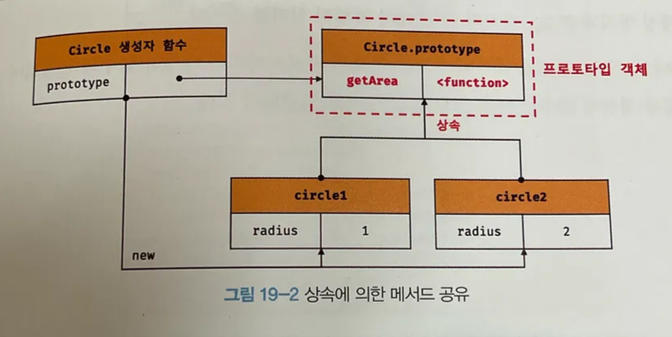
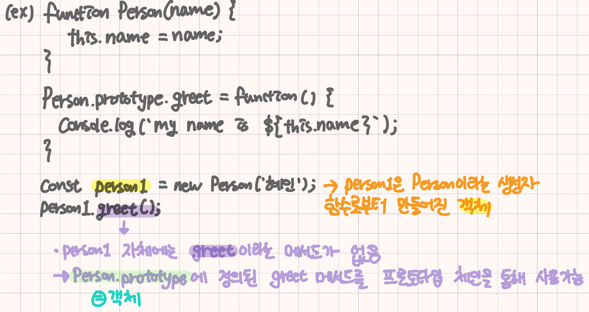
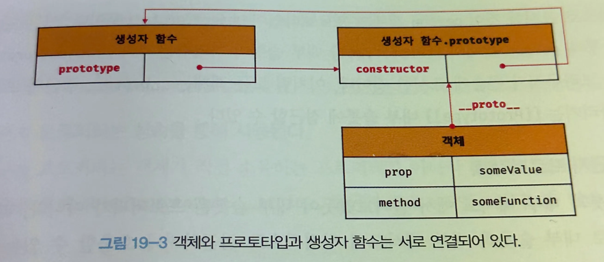

# 19Ch-프로토타입

- 자바스크립트는 **프로토타입 기반**의 객체지향으로 명령형, 함수형, 프로토타입 기반 객체지향 프로그래밍을 지원하는 `멀티 패러다임 프로그래밍 언어`
- JS는 객체 기반의 프로그래밍 언어이며 자바스크립트를 이루고 있는 `모든 것`이 객체라고 할 수 있다. 원시 타입의 값을 제외한 나머지 값들(함수, 배열, 정규표현식 등)은 모두 객체에 해당

⇒ 즉, JS에서 객체는 다른 객체로부터 상속을 받을 수 있는데 이 상속을 가능하게 해주는 메커니즘이라 할 수 있음

## 객체지향 프로그래밍

프로그램을 명령어 또는 함수의 목록으로 보는 전통적인 명령형 프로그래밍의 절차지향적 관점에서 벗어나 여러 개의 독립적 단위, 즉 객체의 집합으로 프로그램을 표현하려는 프로그래밍 패러다임

- **절차지향적 프로그래밍**은 순서대로 실행되는 함수나 명령어를 나열 → 데이터를 다루는 함수와 데이터 자체가 별개로 존재
- **객체지향적 프로그래밍**은 데이터(프로퍼티)와 기능(메서드)를 한 곳에 묶어 실제 세상의 사물처럼 만듦
- 실세계의 실체(사물이나 개념)를 인식하는 철학적 사고를 프로그래밍에 접목하려는 시도에서 시작
- 실체는 특징이나 성질을 나타내는 속성을 지니고 있음
- `추상화`: 다양한 속성 중에서 프로그램에 필요한 속성만 간추려 내어 표현하는 것

```javascript
// 이름과 주소 속성을 갖는 객체
const person = {
	name: 'jeong',
	address: 'seoul'
};
// name, address가 person이라는 객체의 프로퍼티가 되는 것

console.log(person); // {name: 'jeong', address: 'seoul'}
```

- `객체`란, 즉 속성을 통해 여러 개의 값을 하나의 단위로 구성한 복합적인 자료구조를 의미
- 객체지향 프로그래밍은 독립적인 객체의 집합으로 프로그램을 표현하려는 프로그래밍 패러다임이라 할 수 있음
- 객체의 상태를 나타내는 데이터와 상태 데이터를 조작할 수 있는 동작을 하나의 논리적인 단위로 묶어 생각함
- 즉, 객체는 **상태 데이터와 동작을 하나의 논리적인 단위로 묶은 복합적인 자료구조**라고 할 수 있으며, **상태 데이터**를 **프로퍼티**, **동작**을 **메서드**라고 부름

> **헷갈림주의)** 프로퍼티는 객체 자체에 직접 정의된 값을, 프로토타입은 객체가 다른 객체(프로토타입)으로부터 프로퍼티나 메서드를 상속받게 해주는 메커니즘을 의미

## 상속과 프로토타입

- `상속`: 객체지향 프로그래밍의 핵심 개념으로, 어떤 객체의 프로퍼티 또는 메서드를 다른 객체가 상속받아 그대로 사용할 수 있는 것을 의미
- JS는 프로토타입을 기반으로 상속을 구현하고, 기존의 코드를 적극적으로 재사용함으로 **불필요한 코드 중복을 제거**함

```javascript
function Circle(radius) {
	this.radius = radius;
	this.getArea = function () {
		// 원주율을 나타내는 상수
		return Math.PI * this.radius ** 2;
	};
}

// 인스턴스 생성
const circle1 = new Circle(1);
const circle2 = new Circle(2);

// Circle 생성자 함수는 인스턴스를 생성할 때마다 동일한 동작을 하는
// getArea 메서드를 중복 생성하고 모든 인스턴스가 중복 소유
// -> 메서드를 하나만 생성해서 모든 인스턴스가 공유해서 사용하는 것이 바람직
console.log(circle1.getArea === circle2.getArea); // false

console.log(circle1.getArea()); // 3.141592...
console.log(circle2.getArea()); // 12.56637...
```

- Circle 생성자 함수가 생성하는 모든 객체는 radius 프로퍼티와 getArea 메서드를 가지며, radius 프로퍼티 값은 일반적으로 인스턴스마다 다름
- 그런데 Circle 생성자 함수는 인스턴스를 생성할 때마다 getArea 메서드를 중복 생성하고 모든 인스턴스가 중복 소유함

이처럼 모든 인스턴스가 동일한 생성자 함수에 의해 생성된 메서드를 중복 소유하는 것은 **불필요한 메모리 낭비**로 이어짐 + 인스턴스 생성시마다 메서드를 생성하므로 **퍼포먼스에 악영향**을 끼침

**⇒ 자바스크립트는 프로토타입을 기반으로 상속을 구현함**

```javascript
function Circle(radius) {
	this.radius = radius;
}

// Circle 생성자 함수가 생성한 모든 인스턴스가 getArea 메서드를
// 공유해서 사용할 수 있도록 프로토타입에 추가
// 프로토타입은 Circle 생성자 함수의 prototype 프로퍼티에 바인딩되어있음
Circle.prototype.getArea = function () {
	return Math.PI * this.radius ** 2;
}

// 인스턴스 생성
const circle1 = new Circle(1);
const circle2 = new Circle(2);

// Circle 생성자 함수가 생성한 모든 인스턴스는 부모 객체의 역할을 하는
// 프로토타입 Circle.prototype으로부터 getArea 메서드를 상속받음
// 즉, Circle 생성자 함수가 생성하는 모든 인스턴스는 하나의 getArea 메서드를 공유함
console.log(circle1.getArea === circle2.getArea); // true

console.log(circle1.getArea()); // 3.141592...
console.log(circle2.getArea()); // 12.56637...
```



Circle 생성자 함수가 생성한 모든 인스턴스는 자신의 프로토타입, 즉 상위(부모) 객체 역할을 하는 Circle.prototype의 모든 프로퍼티와 메서드를 상속받음

### 코드를 이해해보자

→ 생성자 함수를 만들었으므로 이 함수에 prototype이라는 속성이 추가됨. 이때, prototype은 일종의 객체로 나중에 그 생성자 함수로 만든 모든 인스턴스들이 공유할 속성이나 메서드를 담을 수 있음

→ 현재 Circle.prototype이라는 객체를 자동으로 만들어두는 것과 같음

→ Circle.prototype에 getArea 메서드를 추가함으로써 Circle로 생성된 모든 인스턴스들이 해당 메서드를 공유하게 됨

→ circle1, circle2는 각각 Circle 생성자 함수를 통해 만들어진 객체(인스턴스)이며, 각자마다 radius라는 고유 프로퍼티만 지니고 있음

→ circle1, circle2는 자신들의 프로토타입으로 Circle.prototype를 참조

→ Circle.prototype에 정의된 getArea를 사용할 수 있음

> 💡 **🤔 그렇다면 Circle.prototype으로 선언을 해야하나?**
>
> 정답은 No!
> Circle.prototype은 자바스크립트가 자동으로 생성해주는데, 생성자 함수(Circle)이 선언되면 Circle.prototype 객체도 자동으로 생성됨!
> 해당 prototype 객체에 메서드나 속성을 추가해서 생성된 모든 **인스턴스**들이 해당것들을 공유할 수 있게됨

추가 예시



## 프로토타입 객체

객체지향 프로그래밍의 근간을 이루는 객체 간 상속을 구현하기 위해 사용됨. 즉, **하나의 객체가 다른 객체에게 공유할 수 있는 속성이나 메서드를 제공해주는 역할**

- 어떤 객체의 상위(부모) 객체의 역할을 하는 객체로서 다른 객체에 공유 프로퍼티(메서드 포함)를 제공

  ```javascript
  // 예시
  function Animal(name) {
    this.name = name;
  }

  // Animal.prototype에 메서드를 추가
  Animal.prototype.sayName = function() {
    console.log(this.name);
  };

  const dog = new Animal('Dog');
  const cat = new Animal('Cat');

  dog.sayName(); // "Dog"
  cat.sayName(); // "Cat"

  // dog와 cat은 각기 다른 인스턴스
  // 둘 다 Animal.prototype에 정의된 sayName 메서드를 공유해서 사용
  ```

- 프로토타입을 상속받은 하위(자식) 객체는 상위 객체의 프로퍼티를 자신의 프로퍼티처럼 자유롭게 사용 가능
  - 예시로, 위의 코드에서 `dog` 객체는 `sayName`이라는 메서드를 직접 갖고있지 않지만 `Animal.prototype`으로부터 상속받아 마치 자신것처럼 쓰고있음
- **모든 객체는 `[[Prototype]]`이라는 내부 슬롯을 가지며, 이에 저장되는 프로토타입은 객체 생성 방식에 의해 결정됨 → 어떤 부모 객체(프로토타입)와 연결되어 있는지를 가리킴**
  - 예시의 코드는 생성자 함수로 생성된 객체 → 해당 생성자 함수의 prototype 속성을 프로토타입으로 갖게됨(dog, cat은 Animal.prototype을 프로토타입으로 갖게됨)
- `프로토타입 체인`: 객체가 `[[Prototype]]`을 통해 다른 객체(프로토타입)와 연결되는 것으로, 어떤 객체가 특정 속성이나 메서드를 갖고있지 않다면 그 객체의 프로토타입을 따라 올라가서(체인을 타고) 메서드를 찾으려함
- 모든 객체는 하나의 프로토타입을 갖고, 모든 프로토타입은 생성자 함수와 연결되어있음

  

### `__proto__` 접근자 프로퍼티

- `__proto__` 접근자 프로퍼티를 통해 자신의 `[[Prototype]]` 내부 슬롯이 가리키는 프로토타입에 간접적으로 접근이 가능함 → 즉, 객체의 프로토타입에 접근하거나 수정할 수 있는 접근자 프로퍼티
- 모든 객체는 `__proto__` 접근자 프로퍼티를 통해 자신의 프로토타입 내부 슬롯에 간접적으로 접근 가능
- 내부 슬롯은 프로퍼티가 아님
- JS는 원칙적으로 내부 슬롯과 내부 메서드에 직접적으로 접근하거나 호출할 수 있는 방법을 제공하지 않음
- `__proto__`는 getter/setter 함수와 같은 접근자 함수를 통해 프로토타입을 취득하거나 할당함

  ```javascript
  const obj = {};
  const hyein = { name: '혜인' };

  // getter 함수인 get __proto__가 호출되어 obj 객체의 프로토타입 취득
  console.log(obj.__proto__);  // Object.prototype
  // setter 함수인 set __proto__가 호출되어 obj 객체의 프로토타입 교체
  obj.__proto__ = hyein;

  console.log(obj.name); // 혜인
  ```

- `__proto__` 접근자 프로퍼티는 객체가 직접 소유하는 프로퍼티가 아니라 Object.prototype의 프로퍼티
- 모든 객체는 상속을 통해 `Object.prototype.__proto__` 접근자 프로퍼티를 사용할 수 있음

  ```javascript
  const person = { name: 'jeong'};

  console.log(person.hasOwnProperty('__proto__')); // false
  ```

- 프로토타입에 접근하기 위해 접근자 프로퍼티를 사용하는 이유는 상호 참조에 의해 프로토타입 체인이 생성되는 것을 방지하기 위함
- 프로토타입 체인은 단방향 링크드 리스트로 구현되어야함(한쪽 방향으로만 흘러가야함)
  - 순환 참조의 체인이 만들어지면 체인 종점이 존재하지 않으므로, 프로퍼티 검색시 무한 루프에 빠짐 → 프로토타입을 교체할 수 없도록 `__proto__` 접근자 프로퍼티를 통해 프로토타입에 접근하고 교체할 수 있도록 구현해야함
- 모든 객체가 `__proto__` 접근자 프로퍼티를 사용할 수 있는 것은 아니므로 직접 사용은 권장하지 않음
- `__proto__` 접근자 프로퍼티 대신 프로토타입의 참조를 취득하고 싶은 경우 Object.getPrototypeOf 메서드를 사용하고, 프로토타입을 교체하고 싶은 경우에는 Object.setPrototypeOf 메서드 사용을 권장

> 💡 `__proto__`를 요약하자면
>
> 1. `__proto__`는 객체의 프로토타입에 접근하거나 수정할 수 있는 **비표준 접근자**를 의미
> 2. `Object.getPrototypeOf()`, `Object.setPrototypeOf()`와 같은 방법으로 대체하는 것을 권장
> 3. `__proto__`를 통해 직접 수정하는 것은 성능에 안 좋은 영향을 줄 수 있음

- 함수 객체만이 소유하는 prototype 프로퍼티는 생성자 함수가 생성할 인스턴스의 프로토타입을 가리킴 = 생성자 함수가 새로운 객체를 만들 때 그 객체는 생성자 함수의 prototype에 연결이되고, 연결된 객체는 공유된 메서드나 속성을 prototype을 통해 사용할 수 있음

  ```javascript
  // 함수 객체는 prototype 프로퍼티를 소유함
  (function () {}).hasOwnProperty('prototype'); // true

  // 일반 객체는 prototype 프로퍼티를 소유하지 않음
  ({}).hasOwnProperty('prototype'); // false
  ```

- prototype 프로퍼티는 생성자 함수가 생성할 객체(인스턴스)의 프로토타입을 가리킴
- 화살표 함수와 ES6 메서드 축약 표현으로 정의한 메서드는 prototype 프로퍼티를 소유하지 않으며 프로토타입도 생성하지 않음
- **모든 객체가 지닌 `__proto__` 접근자 프로퍼티와 함수 객체만이 가지고 있는 prototype 프로퍼티는 결국 동일한 프로토타입을 가리키나, 사용하는 주체는 다름**

  | 구분 | 소유 | 값 | 사용 주체 | 사용 목적 |
  | --- | --- | --- | --- | --- |
  | `__proto__` 접근자 프로퍼티 | 모든 객체 | 프로토타입의 참조 | 모든 객체 | 객체가 자신의 프로토타입에 접근 또는 교체하기 위해 사용 |
  | prototype 프로퍼티 | constructor | 프로토타입의 참조 | 생성자 함수 | 생성자 함수가 자신이 생성할 객체(인스턴스)의 프로토타입을 할당하기 위해 사용 |

- 모든 프로토타입은 constructor 프로퍼티를 지니며, prototype 프로퍼티로 자신을 참조하고 있는 생성자 함수를 가리킴
  - 즉, 이 연결은 함수 객체가 생성될 때 이루어짐

✋🏻 `prototype`은 생성자 함수가 가지고 있는 속성이고, 생성된 객체들은 `__proto__`를 통해 이 prototype 객체를 참조하게 되는 것과 같음

## 리터럴 표기법에 의해 생성된 객체의 생성자 함수와 프로토타입

- 생성자 함수에 의해 생성된 인스턴스는 프로토타입의 constructor 프로퍼티에 의해 생성자 함수와 연결됨
- 리터럴 표기법에 의해 생성된 객체의 경우 프로토타입의 constructor 프로퍼티가 가리키는 생성자 함수가 반드시 객체를 생성한 생성자 함수라고 단정지을 수 없음
- 리터럴 표기법에 의해 생성된 객체도 가상적인 생성자 함수를 지님
- 프로토타입과 생성자 함수는 단독으로 존재할 수 없고 언제나 쌍으로 존재함
- 리터럴 표기법에 의해 생성된 객체는 함수에 의해 생성된 객체는 아니나, 함수로 생성한 객체와 본질적인 면에서 큰 차이는 없다. 즉, 객체로서 동일한 특성을 가짐
- Function 생성자 함수를 호출하여 생성한 함수는 렉시컬 스코프를 만들지 않고 전역 함수인 것처럼 스코프를 생성하며 클로저도 만들지 않음
- constructor 프로퍼티를 통해 확인해보면 foo 함수의 생성자 함수는 Function 생성자 함수임
- 리터럴 표기법에 의해 생성된 객체도 상속을 위해 프로토타입이 필요함. 따라서 리터럴 표기법에 의해 생성된 객체도 가상적인 생성자 함수를 가짐

**⇒ 즉, 프로토타입과 생성자 함수는 단독으로 존재할 수 없고 언제나 쌍으로 존재함**

## 프로토타입의 생성 시점

- 객체는 리터럴 표기법 또는 생성자 함수에 의해 생성되므로 결국 모든 객체는 생성자 함수와 연결되어 있음
- 프로토타입은 생성자 함수가 생성되는 시점에 더불어 생성됨
- 생성자 함수는 사용자가 직접 정의한 사용자 정의 생성자 함수와 자바스크립트가 기본 제공하는 빌트인 생성자 함수로 구분할 수 있음
- 화살표 함수나 ES6의 메서드 축약 표현으로 정의하지 않고 일반 함수로 정의한 함수 객체는 new 연산자와 함께 생성자 함수로서 호출할 수 있음
- **즉, constructor는 함수 정의가 평가되어 함수 객체를 생성하는 시점에 프로토타입도 더불어 생성됨**
- 즉, non-constructor는 프로토타입이 생성되지 않음
- 모든 객체는 프로토타입을 가지므로 프로토타입도 자신의 프로토타입을 지님
- 모든 빌트인 생성자 함수는 전역 객체가 생성되는 시점에 생성됨
- 빌트인 생성자 함수가 아닌 사용자 정의 생성자 함수는 자신이 평가되어 함수 객체로 생성되는 시점에 프로토타입도 더불어 생성되며, 생성된 프로토타입의 프로토타입은 언제나 Object.prototype임
- 빌트인 생성자 함수도 빌트인 생성자 함수가 생성되는 시점에 프로토타입이 생성됨
- 객체가 생성되기 이전에 생성자 함수와 프로토타입은 이미 객체화되어 존재함
- 이후 **생성자 함수 또는 리터럴 표기법으로 객체를 생성하면 프로토타입은 생성된 객체의 `[[Prototype]]` 내부 슬롯에 할당됨**
- **`프로토타입 체인`**: 객체의 프로퍼티에 접근하려고 할 때 해당 객체에 접근하려는 프로퍼티가 없다면 `[[Prototype]]` 내부 슬롯의 참조를 따라 자신의 부모 역할을 하는 프로토타입의 프로퍼티를 순차적으로 검색하는 것으로, 객체지향 프로그래밍의 상속을 구현하는 메커니즘
- 프로토타입 체인의 최상위에 위치하는 객체는 언제나 Object.prototype에 해당 → 따라서 모든 객체는 Object.prototype을 상속받음
- Object.prototype의 프로토타입, 즉 `[[Prototype]]` 내부 슬롯의 값은 null임
- Object 생성자 함수를 인수 없이 호출하면 빈 객체가 생성되는데, 마찬가지로 추상 연산 OrdinaryObjectCreate가 호출되며 이에 의해 Object 생성자 함수와 Object.prototype과 생성된 객체 사이에 연결이 만들어짐
- Object.prototype을 프로토타입 체인의 종점이라하며, `[[Prototype]]` 내부 슬롯의 값은 null을 지님
  - 프로퍼티를 검색할 수 없는 경우 undefined를 반환
- 객체 간의 상속 관계로 이루어진 프로토타입의 계층적인 구조에서 객체의 프로퍼티를 검색 ⇒ 프로토타입 체인은 상속과 프로퍼티 검색을 위한 메커니즘이라 할 수 있음
- 스코프 체인은 식별자 검색을 위한 메커니즘
- 스코프 체인과 프로토타입 체인은 서로 연관없이 별도로 동작하는 것이 아니라 서로 협력하여 식별자와 프로퍼티를 검색하는 데 사용됨
- 프로토타입이 소유한 프로퍼티를 프로토타입 프로퍼티, 인스턴스가 소유한 프로퍼티를 인스턴스 프로퍼티라고 부름
- **`프로퍼티 섀도잉`**: 상속 관계에 의해 프로퍼티가 가려지는 현상
  → 즉, 객체가 자신의 프로퍼티와 프로토타입 체인에서 상속받은 프로퍼티를 동시에 갖고있을 때 발생하는 현상을 의미(ex. 객체 스스로 직접 정의한 프로퍼티가 있고, 같은 이름의 프로퍼티가 프로토타입 체인에 존재하는 경우 직접 정의된 프로퍼티가 우선적으로 정의됨)

  ```javascript
  function Person(name) {
    this.name = name;
  }

  // 프로토타입에 동일한 name 프로퍼티 정의
  Person.prototype.name = 'Unknown';

  const person1 = new Person('혜인');

  console.log(person1.name);  // "혜인" 출력
  ```

  > **오버라이딩**: 상위 클래스가 가지고 있는 메서드를 하위 클래스가 재정의하여 사용하는 방식
  > **오버로딩**: 함수의 이름은 동일하지만 매개변수의 타입 또는 개수가 다른 메서드를 구현하고 매개변수에 의해 메서드를 구별하여 호출하는 방식

- 하위 객체를 통해 프로토타입의 프로퍼티를 변경 또는 삭제하는 것은 불가능
  = 프로토타입에 get 액세스는 허용되나 set 액세스는 허용되지 않음

## 프로토타입의 교체

- 프로토타입은 생성자 함수 또는 인스턴스에 의해 교체할 수 있음
- 프로토타입은 임의의 다른 객체로 변경이 가능
  = 부모 객체인 프로토타입을 동적으로 변경할 수 있음
  = 객체가 원래 상속받던 프로토타입 대신에 다른 프로토타입으로 바꿀 수 있다는 것을 의미
- 객체 간의 상속 관계를 동적으로 변경 가능
- 프로토타입은 생성자 함수 또는 인스턴스에 의해 교체 가능
- 프로토타입으로 교체한 객체 리터럴에는 constructor 프로퍼티가 없음
- 프로토타입을 교체하면 constructor 프로퍼티와 생성자 함수 간의 연결이 파괴됨
- 프로토타입으로 교체한 객체 리터럴에 constructor 프로퍼티를 추가하여 프로토타입의 constructor 프로퍼티를 되살림
- 프로토타입으로 교체한 객체에는 constructor 프로퍼티가 없으므로 constructor 프로퍼티와 생성자 함수 간의 연결이 파괴됨
- 프로토타입은 직접 교체하는 것보단 `직접 상속`이 더 편리하고 안전함

## instanceof 연산자

우변에 생성자 함수를 가리키는 식별자를 피연산자로 받으며, 우변의 피연산자가 함수가 아닌 경우 TypeError가 발생

```javascript
객체 instanceof 생성자 함수
```

- 우변의 생성자 함수의 prototype에 바인딩된 객체가 좌변의 객체의 프로토타입 체인 상에 존재하면 true로 평가되고, 그렇지 않은 경우에는 false로 평가됨
- instanceof 연산자는 프로토타입의 constructor 프로퍼티가 가리키는 생성자 함수를 찾는 것이 아니라 생성자 함수의 prototype에 바인딩된 객체가 프로토타입 체인 상에 존재하는지 확인함

## 직접 상속

- Object.create 메서드는 명시적으로 프로토타입을 지정하여 새로운 객체를 생성
- Object.create 메서드의 첫 번째 매개변수에는 생성할 객체의 프로토타입으로 지정할 객체를 전달함
- 두번째 매개변수에는 생성할 객체의 프로퍼티 키와 프로퍼티 디스크립터 객체로 이루어진 객체를 전달하며, 이 객체의 형식은 Object.defineProperties 메서드의 두번째 인수와 동일함
- Object.create 메서드는 첫 번째 매개변수에 전달한 객체의 프로토타입 체인에 속하는 객체를 생성하는데, 즉 객체를 생성하면서 직접적으로 상속을 구현하는 것과 같으며 장점은 이와 같음
  - new 연산자가 없이도 객체 생성이 가능
  - 프로토타입을 지정하면서 객체 생성이 가능
  - 객체 리터럴에 의해 생성된 객체도 상속을 받을 수 있음
- Object.create 메서드를 통해 프로토타입 체인의 종점에 위치하는 객체를 생성할 수 있으므로 Object.create의 빌트인 메서드를 객체가 직접 호출하는 것을 권장하지 않음

## 정적 프로퍼티/메서드

정적 프로퍼티/메서드는 생성자 함수로 인스턴스를 생성하지 않아도 참조/호출할 수 있는 프로퍼티/메서드를 의미

```javascript
// 생성자 함수
function Person(name) {
	this.name = name;
}

// 프로토타입 메서드
Person.prototype.sayHello = function () {
	console.log(`hi! my name is ${this.name}`);
};

// 정적 프로퍼티
Person.staticProp = 'static prop';

// 정적 메서드
Person.staticMethod = function () {
	console.log(`staticMethod`);
};

const me = new Person('Lee');

// 생성자 함수에 추가한 정적 프로퍼티/메서드는 생성자 함수로 참조/호출함
Person.staticMethod(); // staticMethod

// 정적 프로퍼티/메서드는 생성자 함수가 생성한 인스턴스로 참조/호출이 불가능
// 인스턴스로 참조/호출할 수 있는 프로퍼티/메서드는 프로토타입 체인 상에 존재해야함
me.staticMethod(); // TypeError: me.staticMethod is not a function
```

- Person 생성자 함수는 객체이므로 자신의 프로퍼티/메서드 소유가 가능
- 정적 프로퍼티/메서드는 생성자 함수가 생성한 인스턴스로 참조/호출이 불가능
- 생성자 함수가 생성한 인스턴스는 자신의 프로토타입 체인에 속한 객체의 프로퍼티/메서드에 접근이 가능하지만, 정적 프로퍼티/메서드는 인스턴스의 프로토타입 체인에 속한 객체의 프로퍼티/메서드가 아니므로 인스턴스로 접근할 수 없음
- 인스턴스/프로토타입 메서드 내에서 this 사용이 없다면 그 메서드는 정적 메서드로 변경이 가능
- 인스턴스를 참조할 필요가 없다면 정적 메서드로 변경하여도 동작
- 프로토타입 메서드를 호출하려면 인스턴스를 생성해야 하지만 정적 메서드는 인스턴스를 생성하지 않아도 호출이 가능함
- ESLint와 같은 린트 도구를 통해 strict mode와 유사한 효과를 얻을 수 있음

## 프로퍼티 존재 확인

### in 연산자

객체 내에 특정 프로퍼티가 존재하는지 여부를 확인하며 사용법은 아래와 같음

```javascript
/**
* key: 프로퍼티 키를 나타내는 문자열
* object: 객체로 평가되는 표현식
*/
key in object
```

### Object.prototype.hasOwnProperty 메서드

객체에 특정 프로퍼티가 존재하는지 확인이 가능하며, 인수로 전달받은 프로퍼티 키가 객체 고유의 프로퍼티 키인 경우에만 true를 반환하고 상속받은 프로토타입의 프로퍼티 키인 경우 false를 반환

```javascript
const person = { name: 'Lee' };

console.log(Reflect.has(person, 'name')); // true
console.log(Reflect.has(person, 'toString')); // true
```

## 프로퍼티 열거

### for…in 문

객체의 모든 프로퍼티를 순회하며 열거 시에 사용

```javascript
for (변수선언문 in 객체) {...}
```

- for…in 문은 객체의 프로토타입 체인 상에 존재하는 모든 프로토타입의 프로퍼티 중에서 프로퍼티 어트리뷰트 `[[Enumerable]]`의 값이 true인 프로퍼티를 순회하며 열거함

```javascript
const person = {
	name: 'Lee',
	address: 'Seoul',
	__proto__: { age: 20 }
};

for (const key in person) {
	console.log(key + ': ' + person[key]);
}
// name: Lee
// address: Seoul
// age: 20
```

- for…in 문은 프로퍼티 키가 심벌인 프로퍼티는 열거하지 않음
- 이때, 상속받은 프로퍼티는 제외하고 객체 자신의 프로퍼티만 열거하려면 Object.prototype.hasOwnProperty 메서드를 사용하여 객체 자신의 프로퍼티인지 확인해야함
- for…in 문은 프로퍼티 열거 시 **순서를 보장하지 않으므로 주의**해야함

### Object.keys/values/entries 메서드

- 객체 자신의 고유 프로퍼티만 열거하기 위해서는 for…in 문을 사용하는 것보다 Object.keys/values/entries 메서드를 사용하는 것을 권장
- `Object.keys` 메서드는 객체 자신의 열거 가능한 프로퍼티 **키를 배열로 반환**
- `Object.entries` 메서드는 객체 자신의 열거 가능한 **프로퍼티 키와 값의 쌍의 배열을 배열에 담아 반환**
