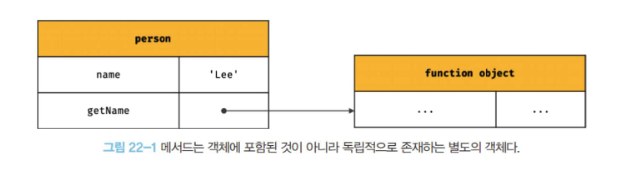

# 20장.strict mode

## 20.1 strict mode란?

```js
function foo() {
  x = 10;
}

foo();

console.log(x); // reference error??
```

- foo 함수 내에서 선헌하지 않은 변수 x에 값 10을 할당했습니다.
- 이때 변수 x를 찾아야 값을 할당할 수 있기 때문에 자바스크립트 엔진은 변수 x가 어디에서 선언되었는지 스코프 체인을 통해 검색하기 시작합니다.
- **전역 스코프에도 변수 x의 선언이 존재하지 않기 때문에 ReferenceError를 발생시킬 것 같지만 자바스크립트 엔진은 암묵적으로 전역 객체아 x 프로퍼티를 동적으로 생성합니다.**
- 이때 전역 객체의 x 프로퍼티는 마치 전역 변수처럼 사용할 수 있습니다.
- 그리고 이러한 현상을 **암묵적 전역**이라 합니다.

> 왜 그런가 했더니 키워드를 사용해서 선언한 변수가 아니었군요

- 이러한 코드를 근본적으로 방어하기 위해, 잠재적인 오류를 발생시키는 환경울 근본적으로 해결하기 위해 ES5부터 strict mode 엄격 모드가 추가되었습니다.
- 하지만 ESLint가 더 낫기도 하고 코드 컨벤션까지 설정 가능하기 때문에 필자는 strict mode보다는 린트 도구의 사용을 선호한다는 내용도 있네요?

## 20.3 전역에 strict mode를 적용하는 것은 피하자

- 전역에 적용한 strict mode는 스크립트 단위로 적용됩니다.
- 외부 서드파티 라이브러리가 non strict mode인 경우가 존재하기 때문에 전역에 strict mode를 적용하면 서로 혼용되어 오류를 발생시킬 수 있습니다.

## 20.4 함수 단위로 strict mode를 적용하는 것도 피해야 합니다.

- 함수도 적용 하고 안하고를 중구난방으로 어지럽히는건 바람직하지 않으며 함수에 일일히 적용하는것도 번거로운 일 입니다.
- 또 strict mode가 적용된 함수가 참조할 함수 외부의 컨텍스트에 strict mode를 적용하지 않는다면 이 또한 문제가 발생할 수 있습니다.
- 따라서 strict mode는 즉시 실행 함수로 감싼 스크립트 단위로 적용하는 것이 바람직합니다.

## 20.5 strict mode가 발생시키는 에러

### 암묵적 전역

- 선언하지 않은 변수를 참조하면 ReferenceError가 발생합니다.

### 변수, 함수, 매개변수의 삭제

- delete 연산자로 변수, 함수, 매개변수를 삭제하면 SyntaxError가 발생합니다.

### 매개변수 이름의 중복

- 중복된 매개변수 이름을 사용하면 SyntaxError가 발생합니다.

### with 문의 사용

## 20.6 strict mode 적용에 의한 변화

### 일반 함수의 this

- strict mode에서 함수를 일반 함수로서 호출하면 this에 undefined가 바인딩됩니다.
- 생성자 함수가 아닌 일반 함수 내부에서는 this를 사용할 필요가 없기 때문입니다.

### arguments 객체

- strict mode에서는 매개변수에 전달된 인수를 재할당하여 변경해도 arguments 객체에 반영되지 않습니다.

```js
(function (a) {
  "use strict";
  // 매개변수에 전달된 인수를 재할당하여 변경
  a = 2;

  // 변경된 인수가 arguments 객체에 반영되지 않는다.
  console.log(arguments); // { 0: 1, length: 1}
});
```

## 궁금해서 찾아본 JS와 React의 strict mode 차이점

- 이름만 동일하고 완전히 다른기능입니다!!!!
- JS의 엄격모드는 린트와 같은 언어 규칙이고, React의 엄격보드는 개발 중 버그를 더 잘 드러내도록 검사하는 도구입니다.

### JS strict mode

- 자바스크립트 엔진이 코드를 더 엄격하게 해석할 수 있도록 런타임 동작 자체를 바꿔버림

```js
"use strict";
x = 10; // ReferenceError
```

### React Strict Mode

- React가 개발 중에만 자식 트리를 더 엄하게 검사합니다.
- 공식 문서 기준으로 이야기해본다면,
  1. 렌더를 한 번 더 — 순수하지 않은 렌더링(렌더 중에 바깥 상태를 바꿈)을 찾음
  2. Effect를 한 번 더 — cleanup이 빠진 useEffect를 찾음
  3. ref 콜백을 한 번 더 — ref cleanup 누락을 찾음
  4. deprecated API 사용 경고

> 그래서 개발 중 useEffect가 두 번 도는 현상이 생깁니다. 버그가 아니라 Strict Mode가 마운트 → 언마운트 → 다시 마운트를 시뮬레이션하는 것

### 두 엄격모두 철학은 비슷하다?

- JS: 언어가 조용히 넘어가던 실수를 에러로 잡아내기 위해 근본적으로 런타임 동작을 변경함
- React: 컴포넌트가 운 좋게 한 번만 동작하던 실수를 두 번 실행해서 캐치함

### 하지만 대상은 다르다?

- 엄격모드로 확인할 수 있는 동작에 차이가 존재합니다.
- JS는 this·스코프·문법이고, React는 렌더 순수성·Effect cleanup·레거시 API입니다.

### 실제 런타임에서의 체감 차이

- JS strict mode를 어기면 앱이 죽습니다. (ReferenceError)
- React Strict Mode를 어기면 개발 중 콘솔 경고가 뜨거나, Effect가 두 번 돌아 버그가 눈에 띕니다. 프로덕션에선 그 검사가 사라지므로, “개발에선 두 번 호출되는데 배포하면 한 번만 된다”가 정상입니다.

---

# 21장. 빌트인 객체

## 21.1 자바스크립트 객체의 분류

### 표준 빌트인 객체

- 표준 빌트인 객체는 ECMAScript 사양에 정의된 객체를 말하며, 애플리케이션 전역의 공통 기능을 제공합니다.
- 표준 빌트인 객체는 ECMAStript 사양에 정의된 객체이므로 자바스크립트 실행 환경과 관계없이 언제나 사용 가능합니다.
- 표준 빌트인 객체는 전역 객체의 프로퍼티로서 제공됩니다.

### 호스트 객체

- 호스트 객체는 ECMAScript 사양에 정의되어 있지 않지만 자바스크립트 실행 환경에서 추가로 제공하는 객체를 이야기합니다.
- 브라우저 환경에서는 DOM, BOM, Canvas, XMLHttpRequest, fetch, rAF, SVG, Web Storage, Web Component, Web Worker와 같은 클라이언트 사이드 Web API를 호스트 객체로 제공합니다.
- Node.js 환경에서는 Node.js 고유의 API를 호스트 객체로 제공합니다.

### 사용자 정의 객체

- 사용자 정의 객체는 표준 빌트인 객체와 호스트 객체처럼 기본 제공되는 객체가 아닌 사용자가 직접 정의한 객체를 이야기합니다.

## 21.2 표준 빌트인 객체

- 자바스크립트는 Object, String, Number, Boolean, Symbol, Date, Math, RegExp, Array, Map/Set, Function, Promise, Reflect, Proxy, Json, Error 등 40여 개의 표준 빌트인 객체를 제공합니다.
- Math, Reflect, JSON을 제외한 표준 빌트인 객체는 모두 인스턴스를 생성할 수 있는 생성자 함수 객체 입니다.
  - 생성자 함수 객체인 표준 빌트인 객체는 프로토타입 메서드와 정적 메서드를 제공합니다
  - 생성자 함수 객체가 아닌 표준 빌트인 객체는 정적 메서드만 제공합니다.

## 21.3 원시값과 래퍼 객체

- 문자열이나 숫자, 불리언 등의 원시값이 있는데 문자열, 숫자, 불리언 객체를 생성하는 String, Number, Boolean 등의 표준 빌트인 생성자 함수가 존재하는 이유가 무엇인지 알아보겠습니다.

  ```js
  const str = "hello";

  // 원시 타입인 문자열이 프로퍼티와 메서드를 갖고 있는 객체처럼 동작합니다.
  console.log(str.length); // 5
  console.log(str.toUpperCase()); // HELLO
  ```

  - 위 예저와 같이 원시값에 대해 객체처럼 접근하는 경우 자바스크립트 엔진이 일시적으로 그리고 암묵적으료 원시값을 연관된 객체로 변환을 시켜줍니다.
    - 암묵적으로 연관된 객체를 생성하여 객체로 프로퍼티에 접근하거나 메서드를 호출하고 다시 원시값으로 되돌려 주는 동작이 존재합니다.

- 이처럼 **문자열, 숫자, 불리언 값에 대해 객체처럼 접근하면 생성되는 임시 객체를 래퍼객체**라 합니다.
- 그리고 객체라 함은 내부 슬롯이 존재하겠죠?
  - 문자열 래퍼객체에 접근한다면 `[[StringData]]`와 같은 내부 슬롯이 생성되는 인스턴스에 할당되겠죠?
  - 그리고 이때 생성된 래퍼객체의 인스턴스는 `String.prototype`의 메서드를 상속받아 사용할 수 있겠죠?
- 그 후 래퍼 객체의 처리가 종료되면 래퍼 객체의 `[[StringData]]` 내부 슬롯에 할당된 원시값으로 원리 생태, 즉 식별자가 원시값을 갖도록 되돌리고 래퍼 객체는 GC의 대상이 됩니다.

```js
// ① 식별자 str은 문자열을 값으로 가지고 있다.
const str = "hello";

// ② 식별자 str은 암묵적으로 생성된 래퍼 객체를 가리킨다.
// 식별자 str의 값 'hello'는 래퍼 객체의 [[StringData]] 내부 슬롯에 할당된다.
// 래퍼 객체에 name 프로퍼티가 동적 추가된다.
str.name = "Lee";

// ③ 식별자 str은 다시 원래의 문자열, 즉 래퍼 객체의 [[StringData]] 내부 슬롯에 할당된 원시값을 갖는다.
// 이때 ②에서 생성된 래퍼 객체는 아무도 참조하지 않는 상태이므로 가비지 컬렉션의 대상이 된다.

// ④ 식별자 str은 새롭게 암묵적으로 생성된(②에서 생성된 래퍼 객체와는 다른) 래퍼 객체를 가리킨다.
// 새롭게 생성된 래퍼 객체에는 name 프로퍼티가 존재하지 않는다.
console.log(str.name); // undefined

// ⑤ 식별자 str은 다시 원래의 문자열, 즉 래퍼 객체의 [[StringData]] 내부 슬롯에 할당된 원시값을 갖는다.
// 이때 ④에서 생성된 래퍼 객체는 아무도 참조하지 않는 상태이므로 가비지 컬렉션의 대상이 된다.
console.log(typeof str, str); // string hello
```

- 그리고 문자열, 숫자, 불리언 심벌 이외의 원시값인 null과 undefined는 래퍼 객체를 생성하지 않습니다.
  - 따라서 null과 undefined 값을 객체처럼 사용하면 에러가 발생합니다.

## 21.4 전역 객체

- 전역 객체는 코드가 실행되기 이전 단계에 자바스크립트 엔진에 의해 어떤 객체보다도 먼저 생성되는 특수한, 어떤 객체에도 속하지 않은 최상위 객체입니다.
- 전역 객체의 특징은 다음과 같습니다
  - 전역 객체는 개발자가 의도적으로 생성할 수 없습니다. 즉, 전역 객체는 생성할 수 있는 생성자 함수가 제공되지 않습니다.
  - 전역 객체의 프로퍼티를 참조할 때 window(또는 global)를 생략할 수 있습니다.
  - 전역 객체는 모든 표준 빌트인 객체를 프로퍼티로 갖고있습니다.
  - 자바스크립트 실행 환경에 따라 추가적으로 프로퍼티와 메서드를 갖습니다.
  - var 키워드로 선언한 전역 변수와 선언하지 않은 변수에 값을 할당한 암묵적 전역, 그리고 전역 함수는 전역 객체의 프로퍼티가 됩니다.

    ```js
    // var 키워드로 선언한 전역 변수
    var foo = 1;
    console.log(window.foo); // 1

    // 선언하지 않은 변수에 값을 암묵적 전역. bar는 전역 변수가 아니라 전역 객체의 프로퍼티다.
    bar = 2; // window.bar = 2
    console.log(window.bar); // 2

    // 전역 함수
    function baz() {
      return 3;
    }
    console.log(window.baz()); // 3
    ```

  - let 이나 const 키워드로 선언한 전역 변수는 전역 객체의 프로퍼티가 아닙니다. let 이나 const 키워드로 선언한 전역 변수는 보이지 않는 개념적인 블록(전역 렉시컬 환경의 선언적 환경 레코드) 내에 존재하게 됩니다.
  - 브라우저 환경의 모든 자바스크립트 코드는 하나의 전역 객체 window를 공유합니다.

#### 보이지 않는 개념적인 블록(전역 렉시컬 환경의 선언적 환경 레코드) 이게 뭔데?

```js
var foo = 1; // window.foo === 1
let bar = 2; // window.bar === undefined
const baz = 3; // window.baz === undefined

console.log(bar); // 2  ← 식별자로는 접근 가능
```

- let/const는 블록 스코프입니다. 그런데 전역 코드에는 { }가 없습니다.
- 블록이 없는데도 bar는 window에 붙지 않습니다.
- 자바스크립트 엔진이 전역을 눈에 안 보이는 가상 블록처럼 취급하기 때문입니다. 그 가상 블록의 실체가 전역 렉시컬 환경의 선언적 환경 레코드입니다.

```md
전역 렉시컬 환경
├─ 환경 레코드
│ ├─ 객체 환경 레코드 ──→ 전역 객체(window)
│ │ foo: 1
│ │ baz: ƒ
│ │
│ └─ 선언적 환경 레코드 ← “보이지 않는 개념적 블록”
│ bar: 2
│ qux: 3
│
└─ 외부 참조: null (더 바깥 스코프가 없음)
```

- 대충 이런너낌

```js
var foo = 1;
console.log(window.foo); // 1  ← 객체 환경 레코드 = window 프로퍼티

bar = 2; // 암묵적 전역도 window에 붙음
console.log(window.bar); // 2

function baz() {
  return 3;
}
console.log(window.baz()); // 3
```

- 여기에 let이 들어온다면?

```js
let name = "Lee";

console.log(name); // "Lee"  ← 선언적 환경 레코드에서 찾음
console.log(window.name); // "" 또는 다른 값. name은 window 프로퍼티가 아님
```

- 그러므로 해당 내용을 관통하는 한마디
- 전역 let/const는 window 프로퍼티가 아닙니다. { }는 없지만, 전역 렉시컬 환경의 선언적 환경 레코드가 블록 역할을 한다.

### 빌트인 프로퍼티

### 빌트인 전역함수

### 암묵적 전역

##### 그냥 주저리주저리

- console은 표준 빌트인이 아닙니다. 하지만 전역 객체에 있는 것은 맞습니다.
- 왜 표준이 아니냐?
  - ECMAScript 사양이 아닙니다. 브라우저와 Node같은 런타임에서 추가여 붙여주는 호스트 객체 입니다.

##### console에 대한 개인 경험 주저리주저리

- 이전에 개발환경에서만 console이 동작했으면 좋겠다고 생각했고 실제로 구현을 진행해본적이 있었습니다.

```js
if (isDev) console.log("이영훈 바보");

// 전역에 사용자 정의 함수를 추가한 것
window.devLog = (...args) => {
  if (process.env.NODE_ENV === "development") {
    console.log(...args);
  }
};

devLog("이영훈 바보");
```

- 실제로 이렇게 쓰이는 문법을 개선했고, import를 생략하고 바로 사용할 수 있어서 편했는데, 현 시점에서는 전역을 더럽히는 좋지않은 케이스라고 판단이 되네요.
  - 여기에서 이런 경험을 기반으로 스스로에게 던져볼 포인트가 몇개 있었습니다.
    - 전역에 붙이는 것과 import { logger } from '@/utils/logger'의 차이는?
    - console.log 자체를 덮어쓰는 것과, 새 이름을 전역에 추가하는 것은 뭐가 다른가?
    - globalThis를 쓰면 브라우저/window, Node/global을 어떻게 하나로 보나?

---

# 22장. this

## 22.1 this 키워드

- 앞서 살펴보았듯 **객체는 상태를 나타내는 프로퍼티와 동작을 나타내는 메서드를 하나의 논리적인 단위로 묶은 복합적인 자료구조 입니다.**
- **객체는 상태를 나타내는 프로퍼티와 동작을 나타내는 메서드를 하나의 논리적인 단위로 묶은 복합적인 자료구조 입니다.**
- **객체는 상태를 나타내는 프로퍼티와 동작을 나타내는 메서드를 하나의 논리적인 단위로 묶은 복합적인 자료구조 입니다.**
- **객체는 상태를 나타내는 프로퍼티와 동작을 나타내는 메서드를 하나의 논리적인 단위로 묶은 복합적인 자료구조 입니다.**
- **객체는 상태를 나타내는 프로퍼티와 동작을 나타내는 메서드를 하나의 논리적인 단위로 묶은 복합적인 자료구조 입니다.**
- 동작을 나타내는 메서드는 자신이 속한 객체의 상태, 즉 프로퍼티를 참조하고 변경할 수 있어야 합니다.
  - 이때 메서드가 자신이 속한 객체의 프로퍼티를 참조하려면 **먼저 자신이 속한 객체를 가리키는 식별자를 참조할 수 있어야 합니다.**
- 생성자 함수를 정의하는 시점에는 아직 인스턴스를 생성하기 이전이므로 생성자 함수가 생성할 인스턴스를 가리키는 식별자를 알 수 없습니다.
  - 따라서 자신이 속한 객체 또는 자신이 생성할 인스턴스를 가리키는 특수한 식별자가 필요합니다.
  - 이를 위해 자바스크립트는 this라는 특수한 식별자를 제공합니다.
- **this는 자신이 속한 객체 또는 자신이 생성할 인스턴스를 가리키는 자기 참조 변수 입니다.**
  - **this를 통해 자신이 속한 객체 또는 자신이 생성할 인스턴스의 프로퍼티나 메서드를 참조할 수 있습니다**
  - this는 자바스크립트 엔진에 의해 암묵적으로 생성되며, 코드 어디서든 참조할 수 있습니다.
  - 함수를 호출하면 arguments 객체와 this가 암묵적으로 함수 내부에 전달됩니다.
  - 함수 내부에서 arguments 객체를 지역 변수처럼 사용할 수 있는 것처럼 this도 지역 변수처럼 사용할 수 있습니다.
  - 단, **this가 가리키는 값, 즉 this 바인딩은 함수 호출 방식에 의해 동적으로 결정됩니다**

> 바인딩이란? 식별자와 값을 연결하는 과정을 의미합니다. 예를 들어, 변수 선언은 변수 이름과 확보된 메모리 공간의 주소를 바인딩하는 것입니다. this 바인딩은 this와 this가 가리킬 객체를 바인딩하는 것 입니다.

- **자바스크립트의 this는 함수가 호출되는 방식에 따라 this에 바인딩될 값, 즉 this 바인딩이 동적으로 결정됩니다.**

#### 잠깐!!! 렉시컬 스코프와 this 바인딩의 결정 시기가 다른걸 인지하셔야 합니다

- 함수의 상위 스코프를 결정하는건 정적 스코프, 즉 렉시컬 스코프에 의해 함수 정의가 평가되어 함수 객체가 생성되는 시점에 상위 스코프를 결정한다고 이야기 했었죠?
- 하지만 this는 이와 반대로 함수 호출 시점에 this 바인딩이 결정된다고 언급하고 있습니다.

## 22.2 함수 호출 방식과 this 바인딩

- **this 바인딩(this에 바인딩될 값)은 함수 호출 방식, 즉 함수가 어떻게 호출되었는지에 따라 동적으로 결정됩니다.**
- 주의할 것은 동일한 함수도 다양한 방식으로 호출될 수 있다는 점 입니다.
  1. 일반 함수 호출
  2. 메서드 호출
  3. 생성자 함수 호출
  4. Function.prototype.apply/call/bind 메서드에 의한 간접 호출

```js
// this 바인딩은 함수 호출 방식에 따라 동적으로 결정된다.
const foo = function () {
  console.dir(this);
};

// 동일한 함수도 다양한 방식으로 호출할 수 있다.

// 1. 일반 함수 호출
// foo 함수를 일반적인 방식으로 호출
// foo 함수 내부의 this는 전역 객체 window를 가리킨다.
foo(); // window

// 2. 메서드 호출
// foo 함수를 프로퍼티 값으로 할당하여 호출
// foo 함수 내부의 this는 메서드를 호출한 객체 obj를 가리킨다.
const obj = { foo };
obj.foo(); // obj

// 3. 생성자 함수 호출
// foo 함수를 new 연산자와 함께 생성자 함수로 호출
// foo 함수 내부의 this는 생성자 함수가 생성한 인스턴스를 가리킨다.
new foo(); // foo {}

// 4. Function.prototype.apply/call/bind 메서드에 의한 간접 호출
// foo 함수 내부의 this는 인수에 의해 결정된다.
const bar = { name: "bar" };

foo.call(bar); // bar
foo.apply(bar); // bar
foo.bind(bar)(); // bar
```

### 일반 함수 호출

- **기본적으로 this에는 전역 객체가 바인딩 됩니다**

  ```js
  function foo() {
    console.log("foo's this: ", this); // window
    function bar() {
      console.log("bar's this: ", this); // window
    }
    bar();
  }
  foo();
  ```

  - 위 예제처럼 전역 함수는 물론이고 중첩 함수를 **일반 함수로 호출하면 함수 내부의 this에는 전역 객체가 바인딩됩니다**
    - 다만 this는 객체의 프로퍼티나 메서드를 참조하기 위한 자기 참조 변수이므로 객체를 생성하지 않는 일반 함수에서 this는 의미가 없습니다.
    - 따라서 strict mode에서는 일반 함수 내부의 this에는 undefined가 바인딩됩니다.

      ```js
      function foo() {
        "use strict";

        console.log("foo's this: ", this); // undefined
        function bar() {
          console.log("bar's this: ", this); // undefined
        }
        bar();
      }
      foo();
      ```

- 메서드 내에서 정의한 중첩 함수 또한 일반 함수로 호출되면 중첩 함수 내부의 this에는 전역 객체가 바인딩됩니다.
- 콜백 함수가 일반 함수로 호출된다면 콜백 함수 내부의 this에도 전역 객체가 바인딩됩니다.

**⭐️⭐️⭐️⭐️⭐️⭐️그냥 일반 함수로 호출되면 함수 내부에는 this가 바인딩되는데 이때 this는 자기 참조 변수이므로 객체를 생성하지 않는 함수에서 this는 의미가 없으며 그러므로 엄격 모드에서는 일반 함수의 this를 undefined 처리한다⭐️⭐️⭐️⭐️⭐️⭐️**

- 중요 포인트인듯!!!

- 그리고 메서드 내부의 중첩 함수나 콜백 함수의 this 바인딩이 의도치 않게 동작하여 this가 일치하지 않으면 동작에 어려움이 있을 수 있으므로 아래와 같은 방법을 사용하기도 합니다.

  ```js
  var value = 1;

  const obj = {
    value: 100,
    foo() {
      // this 바인딩(obj)을 변수 that에 할당한다.
      const that = this;

      // 콜백 함수 내부에서 this 대신 that을 참조한다.
      setTimeout(function () {
        console.log(that.value); // 100
      }, 100);
    },
  };

  obj.foo();
  ```

  - 이러한 방법 외에도 자바스크립트는 this를 명시적으로 바인딩할 수 있는 메서드를 따로 제공하기도 합니다.

- 또는 화살표 함수를 사용해서 this 바인딩을 일치시킬 수도 있습니다

  ```js
  var value = 1;

  const obj = {
    value: 100,
    foo() {
      // 화살표 함수 내부의 this는 상위 스코프의 this를 가리킨다.
      setTimeout(() => console.log(this.value), 100); // 100
    },
  };

  obj.foo();
  ```

### 메서드 호출

- 메서드 내부의 this에는 메서드를 호출한 객체, 즉 메서드를 호출할 때 메서드 이름 앞의 마침표 연산자 앞에 기술한 객체가 바인딩됩니다.
- 주의할 것은 메서드 내부의 this는 메서드를 소유한 객체가 아닌 메서드를 호출한 객체에 바인딩된다는 것 입니다.

  > 말이 너무 어렵네요;;;
  - 결국 메서드는 객체의 행위에 대한 프로퍼티 이니까 `객체.메서드` 이렇게 흘러가니까 `객체.메서드` 에서 `객체`를 참조한다는 뜻 같네요

  ```js
  const person = {
    name: "Lee",
    getName() {
      // 메서드 내부의 this는 메서드를 호출한 객체에 바인딩된다.
      return this.name;
    },
  };

  // 메서드 getName을 호출한 객체는 person이다.
  console.log(person.getName()); // Lee
  ```

  - 메서드는 프로퍼티에 바인딩된 함수입니다.
  - 즉, person 객체의 getName 프로퍼티가 가리키는 함수 객체는 person 객체에 포함된 것이 아닌 독립적으로 존재하는 별도의 객체 입니다.
    - getName 프로퍼티가 함수 객체를 가리키고 있을 뿐입니다.
      
  - 따라서 getName 프로퍼티가 가리키는 함수 객체인 getName 메서드는 다른 객체의 프로퍼티에 할당하는 것으로 다른 객체의 메서드가 될 수도 있고 일반 변수에 할당하여 일반 함수로 호출될 수도 있습니다.
  - 따라서 메서드 내부의 this는 프로퍼티로 메서드를 가리키고 있는 객체와는 관계가 없고 메서드를 호출한 객체에 바인딩 됩니다.
    

- 프로토타입 메서드 내부에서 사용된 this 또한 일반 메서드와 마찬가지로 해당 메서드를 호출한 객체에 바인딩 됩니다.

### 생성자 함수 호출

- 생성자 함수 내부의 this에는 생성자 함수가 생성할 인스턴스가 바인딩 됩니다.

### Function.prototype.apply/call/bind 메서드에 의한 간접 호출

- apply, call, bind 메서드는 Function.prototype의 메서드 입니다.
- 즉 이 메서드들은 모든 함수가 상속받아 사용할 수 있습니다.

#### apply와 call

- Function.prototype.apply, Function.prototype.call 메서드는 this로 사용할 객체와 인수 리스트를 인수로 전달받아 함수를 호출합니다.

  ```js
  /**
   * 주어진 this 바인딩과 인수 리스트 배열을 사용하여 함수를 호출한다.
   * @param thisArg - this로 사용할 객체
   * @param argsArray - 함수에게 전달할 인수 리스트의 배열 또는 유사 배열 객체
   * @returns 호출된 함수의 반환값
   */
  Function.prototype.apply(thisArg[, argsArray])

  /**
   * 주어진 this 바인딩과 ,로 구분된 인수 리스트를 사용하여 함수를 호출한다.
   * @param thisArg - this로 사용할 객체
   * @param arg1, arg2, ... - 함수에게 전달할 인수 리스트
   * @returns 호출된 함수의 반환값
   */
  Function.prototype.call(thisArg[, arg1[, arg2[, ...]]])
  ```

- **apply와 call 메서드의 본질적인 기능은 함수를 호출하는 것입니다.**
  - apply와 call 메서드는 함수를 호출하면서 첫 번째 인수로 전달한 특정 객체를 호출한 함수의 this에 바인딩 합니다.

    ```js
    function getThisBinding() {
      return this;
    }

    // this로 사용할 객체
    const thisArg = { a: 1 };

    console.log(getThisBinding()); // window

    // getThisBinding 함수를 호출하면서 인수로 전달한 객체를 getThisBinding 함수의 this에 바인딩한다.
    console.log(getThisBinding.apply(thisArg)); // {a: 1}
    console.log(getThisBinding.call(thisArg)); // {a: 1}
    ```

    - apply와 call 메서드는 호출할 함수에 인수를 전달하는 방식만 다를 뿐 동일하게 동작합니다.
    - 위 예제는 호출할 함수에 인수를 전달하지 않습니다.

      ```js
      function getThisBinding() {
        console.log(arguments);
        return this;
      }

      // this로 사용할 객체
      const thisArg = { a: 1 };

      // getThisBinding 함수를 호출하면서 인수로 전달한 객체를 getThisBinding 함수의 this에 바인딩한다.
      // apply 메서드는 호출할 함수의 인수를 배열로 묶어 전달한다.
      console.log(getThisBinding.apply(thisArg, [1, 2, 3]));
      // Arguments(3) [1, 2, 3, callee: ƒ, Symbol(Symbol.iterator): ƒ]
      // {a: 1}

      // call 메서드는 호출할 함수의 인수를 쉼표로 구분한 리스트 형식으로 전달한다.
      console.log(getThisBinding.call(thisArg, 1, 2, 3));
      // Arguments(3) [1, 2, 3, callee: ƒ, Symbol(Symbol.iterator): ƒ]
      // {a: 1}
      ```

      - apply 메서드는 호출할 함수의 인수를 배열로 묶어 전달합니다.
      - call 메서드는 호출할 함수의 인수를 쉼표로 구분한 리스트 형식으로 전달합니다.

- apply와 call 메서드의 대표적인 용도는 arguments 객체와 같은 유사 배열 객체에 배열 메서드를 사용하는 경우 입니다.
  - arguments 객체는 배열이 아니기 때문에 Array.prototype.slice 같은 배열의 메서드를 사용할 수 없습니다.

  ```js
  function convertArgsToArray() {
    console.log(arguments);

    // arguments 객체를 배열로 변환
    // Array.prototype.slice를 인수 없이 호출하면 배열의 복사본을 생성한다.
    const arr = Array.prototype.slice.call(arguments);
    // const arr = Array.prototype.slice.apply(arguments);
    console.log(arr);

    return arr;
  }

  convertArgsToArray(1, 2, 3); // [1, 2, 3]
  ```

#### bind

- Function.prototype.bind 메서드는 apply와 call 메서드와 달리 함수를 호출하지 않습니다.
- 다만 첫 번째 인수로 전달한 값으로 this 바인딩이 교체된 함수를 새롭게 생성하여 반환합니다.

  ```js
  function getThisBinding() {
    return this;
  }

  // this로 사용할 객체
  const thisArg = { a: 1 };

  // bind 메서드는 첫 번째 인수로 전달한 thisArg로 this 바인딩이 교체된
  // getThisBinding 함수를 새롭게 생성해 반환한다.
  console.log(getThisBinding.bind(thisArg)); // getThisBinding

  // bind 메서드는 함수를 호출하지는 않으므로 명시적으로 호출해야 한다.
  console.log(getThisBinding.bind(thisArg)()); // {a: 1}
  ```

- bind 메서드는 메서드의 this와 메서드 내부의 중첩 함수 또는 콜백 함수의 this가 불일치하는 문제를 해결하기 위해 사용됩니다.
  - 앞서 이야기했던 일반함수로 사용되는 경우 헬퍼함수의 역할로 기능하지 못하면 this가 전역을 가리키게 되므로 문제가 생긴다고 했죠?
  - 이런 문제를 해결하기 위해 변수에 this를 할당하거나 화살표 함수를 사용한다고 했죠?

  ```js
  const person = {
    name: "Lee",
    foo(callback) {
      // bind 메서드로 callback 함수 내부의 this 바인딩을 전달
      setTimeout(callback.bind(this), 100);
    },
  };

  person.foo(function () {
    console.log(`Hi! my name is ${this.name}.`); // Hi! my name is Lee.
  });
  ```

  - bind 메서드를 사용하여 this를 일치시킬 수 있습니다.

## this 바인딩 총정리

- 함수 호출 방식에 따라 this 바인딩이 동적으로 결정됩니다!!!!
  

---

# 23장. 실행 컨텍스트

- 실행 컨텍스트는 자바스크립트의 동작 원리를 담고있는 핵심 개념입니다.
- 실행 컨텍스트를 바르게 이해해아만 자바스크립트가 스코프를 기반으로 식별자와 식별자에 바인딩된 값을 관리하는 방식과 호이스팅이 발생하는 이유, 클로저의 동작 방식, 그리고 태스크 큐와 함께 동작하는 이벤트 핸들러와 비동기 처리의 동작 방식을 이해할 수 있습니다.

## 23.1 소스코드의 타입

- ECMAScript 사양은 소스코드(ECMAScript code)를 4가지 타입으로 구분합니다.
- 4가지 타입의 소스코드는 실행 컨텍스트를 생성합니다.
  - 전역 코드: 전역에 존재하는 소스코드를 말합니다. 전역에 정의된 함수, 클래스 등의 내부 코드는 포함되지 않습니다.
  - 함수 코드: 함수 내부에 존재하는 소스코드를 말합니다. 함수 내부에 중첩된 함수, 클래스 등의 내부 코드는 포함되지 않습니다.
  - eval 코드: 빌드인 전역 함수인 eval 함수에 인수로 전달되어 실행되는 소스코드를 말합니다.
  - 모듈 코드: 모듈 내부에 존재하는 소스코드를 말합니다. 모듈 내부의 함수, 클래스 등의 내부 코드는 포함되지 않습니다.
- 소스코드를 4가지 타입으로 구분하는 이유는 소스코드의 타입에 따라 실행 컨텍스트를 생성하는 과정과 관리 내용이 다르기 때문입니다.

### 전역 코드

- 전역 코드는 전역 변수를 관리하기 위해 최상위 스코프인 전역 스코프를 생성해야 합니다.
- 그리고 var 키워드로 선언된 전역 변수와 함수 선언문으로 정의된 전역 함수를 전역 객체의 프로퍼티와 메서드로 바인딩하고 참조하기 위해 전역 객체와 연결되어야 합니다.
- 이를 위해 전역 코드가 평가되면 전역 실행 컨텍스트가 생성됩니다.

### 함수 코드

- 함수 코드는 지역 스코프를 생성하고 지역 변수, 매개변수, arguments 객체를 관리해야 합니다.
- 그리고 생성한 지역 스코프를 전역 스코프에서 시작하는 스코프 체인의 일원으로 연결해야 합니다.
- 이를 위해 함수 코드가 평가되면 함수 실행 컨텍스트가 생성됩니다.

### eval 코드

- eval 코드는 strict mode(엄격 모드)에서 자신만의 독자적인 스코프를 생성합니다.
- 이를 위해 eval 코드가 평가되면 eval 실행 컨텍스트가 생성됩니다.

### 모듈 코드

- 모듈 코드는 모듈별로 독립적인 모듈 스코프를 생성합니다.
- 이를 위해 모듈 코드가 평가되면 모듈 실행 컨텍스트가 생성됩니다.


## 23.2 소스코트의 평가와 실행

- 모든 소스코드는 실행에 앞서 평가 과정을 거치며 코드를 실행하기 위한 준비를 합니다.
  - 다시 말해, 자바스크립트 엔진은 소스코드를 2개의 과정으로 "소스코드의 평가"와 "소스코드의 실행" 과정으로 나누어 처리합니다.
- 소스코드 평가 과정에서는 실행 컨텍스트를 생성하고 변수, 함수 등의 선언문만 먼저 실행하여 생성된 변수나 함수 식별자를 키로 실행 컨텍스트가 관리하는 스코프(렉시컬 환경의 환경 레코드)에 등록합니다.
- 소스코드 평가 과정이 끝나면 비로소 선언문을 제외한 소스코드가 순차적으로 실행되기 시작합니다.
  - 즉, 런타임이 시작되는겁니다.
- 이때 소스코드 실행에 필요한 정보인 변수나 함수의 참조를 실행 컨텍스트가 관리하는 스코프에서 검색해서 취득합니다.
- 그리고 변수 값의 변경 등 소스코드의 실행 결과는 다시 실행 컨텍스트가 관리하는 스코프에 등록됩니다.


#### 예제로 살펴보기

```js
var x;
x = 1;
```

- 자바스크립트 엔진은 위 예제를 2개의 과정으로 나누어 처리합니다.
  - 먼저 소스코드 평가 과정에서 변수 선언문 `var x`를 먼저 실행합니다.
    - 이때 생성된 변수 식별자 x는 실행 컨텍스트가 관리하는 스코프에 등록되고 undefined로 초기화됩니다.
  - 소스코드 평가 과정이 끝나면 소스코드 실행 과정이 시작됩니다.
    - 변수 선언문 `var x`는 소스코드 평가 과정에서 이미 실행이 완료되었습니다.
    - 따라서 소스코드 실행 과정에서는 변수 할당문 `x = 1`만 실행됩니다.
  - 이때 x변수에 값을 할당하려면 먼저 x 변수가 선언된 변수인지 확인해야 합니다.
  - 이를 위해 실행 컨텍스트가 관리하는 스코프에 x 변수가 등록되어 있는지 확인합니다.
    - 다시말해 x변수가 선언된 변수인지를 확인합니다.
    - 만약 실행 컨텍스트가 관리하는 스코프에 등록되어 있다면 x 변수는 선언된 변수, 즉 소스코드 평가 과정에서 선언문이 실행되어 등록된 변수입니다.
  - x 변수가 선언된 변수라면 값을 할당하고 할당 결과를 실행 컨텍스트에 등록하여 관리합니다.

## 23.3 실행 컨텍스트의 역할

- 예제를 통해 자바스크립트 엔진이 어떻게 평가하고 실행할지를 살펴보겠습니다.

  ```js
  // 전역 변수 선언
  const x = 1;
  const y = 2;

  // 함수 정의
  function foo(a) {
    // 지역 변수 선언
    const x = 10;
    const y = 20;

    // 메서드 호출
    console.log(a + x + y); // 130
  }

  // 함수 호출
  foo(100);

  // 메서드 호출
  console.log(x + y); // 3
  ```

#### 1. 전역 코드 평가

- 전역 코드를 실행하기에 앞서 먼저 전역 코드 평가 과정을 거치며 전역 코드를 실행하기 위한 준비를 합니다.
  - 소스코드 평가 과정에서는 선언문만 먼저 실행합니다.
- 따라서 전역 코드의 변수 선언문과 함수 선언문이 먼저 실행되고, 그 결과 생성된 전역 변수와 전역 함수가 실행 컨텍스트가 관리하는 전역 스코프에 등록됩니다.
  - 이때 var 키워드로 선언된 전역 변수와 함수 선언문으로 정의된 전역 함수는 전역 객체의 프로퍼티와 메서드가 됩니다.

#### 2. 전역 코드 실행

- 전역 코드 평가 과정이 끝나면 런타임이 시작되어 전역 코드가 순차적으로 실행되기 시작합니다.
  - 이때 전역 변수에 값이 할당되고 함수가 호출됩니다.
- 함수가 호출되면 순차적으로 실행되던 전역 코드의 실행을 일시 중단하고 코드 실행 순서를 변경하여 함수 내부로 진입합니다.

#### 3. 함수 코드 평가

- 함수 호출에 의해 코드 실행 순서가 변경되어 함수 내부로 진입하면 함수 내부의 문들을 실행하기에 앞서 함수 코드 평가 과정을 거치며 함수 코드를 실행하기 위한 준비를 합니다.
  - 이때 매개변수와 지역 변수 선언문이 먼저 실행되고, 그 결과 생성된 매개변수와 지역 변수가 실행 컨텍스트가 관리하는 지역 스코프에 등록됩니다.
  - 또한 함수 내부에서 지역 변수처럼 사용할 수 있는 arguments 객체가 생성되어 지역 스코프에 등록되고 this 바인딩도 결정됩니다.

#### 4. 함수 코드 실행

- 함수 코드 평가 과정이 끝나면 런타임이 시작되어 함수 코드가 순차적으로 실행되기 시작합니다.
  - 이때 매개변수와 지역 변수에 값이 할당되고 console.log 메서드가 호출됩니다.

> ##### console
>
> - console.log 메서드를 호출하기 위해 먼저 식별자인 console을 스코프 체인을 통해 검색합니다.
>   - 이를 위해서는 함수 코드의 지역 스코프는 상위 스코프인 전역 스코프와 연결되어 있어야 합니다.
>   - 하지만 console 식별자는 스코프 체인에 등록되어 있지 않고 전역 객체에 프로퍼티로 존재합니다.
>   - 이는 전역 객체의 프로퍼티가 마치 잔역 변수처럼 전역 스코프를 통해 검색 가능해야 한다는 것을 의미합니다.
> - 다음은 log 프로퍼티를 console 객체의 프로토타입 체인을 통해 검색합니다.
>   - 그 후 console.log 메서드에 인수로 전달된 표현식 `a + x + y` 가 평가됩니다.
>   - `a, x, y` 식별자는 스코프 체인을 통해 검색합니다.
>   - console.log 메서드의 실행이 종료되면 함수 코드 실행과정이 종료되고 함수 호출 이전으로 되돌아가 전역 코드 실행을 계속합니다.

- 이처럼 코드가 실행되려면 스코프를 구분하여 식별자와 바인딩된 값이 관리되어야 합니다.
- 그리고 중첩 관계에 의해 스코프 체인을 형성하여 식별자를 검색할 수 있어야 하고, 전역 객체의 프로퍼티도 전역 변수처럼 검색할 수 있어야 합니다.
- 또한 함수 호출이 종료되면 함수 호출 이전으로 되돌아가기 위해 현재 실행 중인 코드와 이전에 실행하던 코드를 구분하여 관리해야 합니다.
- **이처럼 코드가 실행되려면 아래와 같이 스코프, 식별자, 코드 실행 순서 등의 관리가 필요합니다**
  1. 선언에 의해 생성된 모든 식별자(변수 함수 클래스 등)를 구분하여 등록하고 상태 변화(식별자에 바인딩된 값의 변화)를 지속적으로 관리할 수 있어야 합니다.
  2. 스코프 중첩 관계에 의해 스코프 체인을 형성해야 합니다. 즉, 스코프 체인을 통해 상위 스코프로 이동하며 식별자를 검색할 수 있어야 합니다.
  3. 현재 실행 중인 코드의 실행 순서를 변경(예를 들어, 함수 호출에 의한 실행 순서 변경)할 수 있어야 하며 다시 되돌아갈 수도 있어야 합니다.
- 이 모든것을 관리하는 것이 바로 실행 컨텍스트 입니다.
  - **실행 컨텍스트는 소스코드를 실행하는데 필요한 환경을 제공하고 코드의 실행 결과를 실제로 관리하는 영역입니다**
- 조금 더 구체적으로 이야기해보겠습니다.
  - **실행 컨텍스트는 식별자(변수, 함수, 클래스 등의 이름)를 등록하고 관리하는 스코프와 코드 실행 순서 관리를 구현한 내부 메커니즘으로, 모든 코드는 실행 컨텍스트를 통해 실행되고 관리됩니다.**
- **식별자와 스코프는 실행 컨텍스트의 렉시컬 환경으로 관리하고 코드 실행 순서는 실행 컨택스트 스택으로 관리합니다**

## 23.4 실행 컨텍스트 스택

```js
const x = 1;

function foo() {
  const y = 2;

  function bar() {
    const z = 3;
    console.log(x + y + z);
  }
  bar();
}
foo(); // 6
```

- 해당 예제는 소스코드의 타입으로 분류할 때 전역 코드와 함수 코드로 이루어져 있습니다.
- 자바스크립트 엔진은 먼저 전역 코드를 평가하여 전역 실행 컨텍스트를 생성합니다.
  - 그리고 함수가 호출되면 함수 코드를 평가하여 함수 실행 컨텍스트를 생성합니다.
  - 이때 생성된 실행 컨텍스트는 스택 자료구조로 관리됩니다. 이를 **실행 컨텍스트 스택**이라고 부릅니다.
- 위 예제 코드를 실행하면 코드가 실행되는 시간의 흐름에 따라 실행 컨텍스트 스택에는 아래 이미지와 같이 실행 컨텍스트가 추가 push 되고 제거 pop 됩니다.
  

#### 1. 전역 코드의 평가와 실행

- 자바스크립트 엔진은 먼저 전역 코드를 평가하여 전역 실행 컨텍스트를 생성하고 실행 컨텍스트 스택에 푸시합니다.
- 이때 전역 변수 x와 전역 함수 foo는 전역 실행 컨텍스트에 등록됩니다.
- 이후 전역 코드가 실행되기 시작하여 전역 변수 x에 값이 할당되고 전역 함수 foo가 호출됩니다.

#### 2. foo 함수 코드의 평가와 실행

- 전역 함수 foo가 호출되면 전역 코드의 실행은 일시 중단되고 코드의 제어권이 foo 함수 내부로 이동합니다.
- 자바스크립트 엔진은 foo 함수 내부의 코드를 평가하여 foo 함수 실행 컨텍스트를 생성하고 실행 컨텍스트 스택에 푸시합니다.
  - 이때 foo 함수의 지역 변수 y와 중첩 함수 bar가 foo 함수의 실행 컨텍스트에 등록됩니다.
  - 이후 foo 함수 코드가 실행되기 시작하여 지역 변수 y에 값이 할당되고 중첩 함수 bar가 호출됩니다.

#### 3. bar 함수 코드의 평가와 실행

- 중첩 함수 bar가 호출되면 foo 함수 코드의 실행은 일시 중단되고 코드의 제어권이 bar 함수 내부로 이동합니다.
- 자바스크립트 엔진은 bar 함수 내부의 함수 코드를 평가하여 bar 함수 실행 컨텍스트를 생성하고 실행 컨텍스트 스택에 푸시합니다.
  - 이때 bar 함수의 지역 변수 z가 bar 함수 실행 컨텍스트에 등록됩니다.
- 이후 함수 코드가 실행되기 시작하여 지역 변수 z에 값이 할당되고 console.log 메서드를 호출한 이후, bar 함수는 종료됩니다.

#### 4. foo 함수로 복귀

- bar 함수가 종료되면 코드의 제어권은 다시 foo 함수로 이동합니다.
- 이때 자바스크립트 엔진은 bar 함수 실행 컨텍스트를 실행 컨텍스트 스택에서 팝하여 제거합니다.
- 그리고 foo 함수는 더이상 실행할 코드가 없으므로 종료됩니다.

#### 5. 전역 코드로 복귀

- foo 함수가 종료되면 코드의 제어권은 다시 전역 코드로 이동합니다.
- 이때 자바스크립트 엔진은 foo 함수의 실행 컨텍스트를 실행 컨텍스트 스택에서 팝하여 제거합니다.
- 그리고 더이상 실행할 전역 코드가 남아있지 않으므로 전역 실행 컨텍스트도 실행 컨텍스트 스택에서 팝되어 실행 컨텍스트 스택에는 아무것도 남아있지않게 됩니다.

### 정리

- 이처럼 실행 컨텍스트 스택은 코드의 실행 순서를 관리합니다.
- 소스코드가 평가되면 실행 컨텍스트가 생성되고 실행 컨텍스트 스택의 최상위에 쌓입니다.
- **실행 컨텍스트 스택의 최상위에 존재하는 실행 컨텍스트는 언제나 현재 실행중인 코드의 실행 컨텍스트 입니다**
- 따라서 실행 컨텍스트 스택의 최상위에 존재하는 실행 컨텍스트를 **실행 중인 실행 컨텍스트**라 부릅니다.

## 23.5 렉시컬 환경

- 렉시컬 환경은 식별자와 식별자에 바인딩된 값, 그리고 상위 스코프에 대한 참조를 기록하는 자료구조로 실행 컨텍스트를 구성하는 컴포넌트 입니다.
- 실행 컨텍스트 스택이 코드의 실행 순서를 관리한다면 렉시컬 환경은 스코프와 식별자를 관리합니다.
  
  - 렉시컬 환경은 키와 값을 갖는 객체 형태의 스코프(전역, 함수, 블록 스코프)를 생성하여 식별자를 키로 등록하고 식별자에 바인딩된 값을 관리합니다.
  - 즉, 렉시컬 환경은 스코프를 구분하여 식별자를 등록하고 관리하는 저장소 역할을 하는 렉시컬 스코프의 실체 입니다.
- 실행 컨텍스트는 Lexical Environment 컴포넌트와 VariableEnvironment 컴포넌트로 구성됩니다.

  > 이게 실행컨텍스트 3요소 중 두개인거같은데... 계속 읽어볼게요.

  
  - 생성 초기에 LexicalEnvironment 컴포넌트와 VariableEnvironment 컴포넌트는 하나의 동일한 렉시컬 환경을 참조합니다.
  - 이후 몇 가지 상황을 만나면 VariableEnvironment 컴포넌트를 위한 새로운 렉시컬 환경을 생성하고, 이때부터 VariableEnvironment 컴포넌트와 LexicalEnvironment 컴포넌트는 내용이 달라지는 경우도 있습니다.
    - 하지만 이 책에서는 특수한 상황들은 제외하고 두 컴포넌트를 따로 구분하지 않고 렉시컬 환경으로 통일하여 간략하게 설명일 이어가 보려고 합니다.

- 렉시컬 환경은 두개의 컴포넌트로 구성됩니다.
  

#### 1. 환경 레코드 Environment Record

- 스코프에 포함된 식별자를 등록하고 등록된 식별자에 바인딩된 값을 관리하는 저장소 입니다.
- 환경 레코드는 소스코드의 타입에 따라 관리하는 내용에 차이가 있습니다.

#### 2. 외부 렉시컬 환경에 대한 참조 Outer Lexical Environment Reference

- 외부 렉시컬 환경에 대한 참조는 상위 스코프를 가리킵니다.
- 이때 상위 스코프란 외부 렉시컬 환경인 해당 실행 컨텍스트를 생성한 소스코드를 포함하는 상위 코드의 렉시컬 환경을 이야기합니다.
- 외부 렉시컬 환경에 대한 참조를 통해 단방향 링크드 리스트인 스코프 체인을 구현합니다.

## 23.6 실행 컨텍스트의 생성과 식별자 검색 과정

- 예제를 통해 실행 컨텍스트가 어떻게 생성되고 코드 실행 결과가 관리되는지, 그리고 어떻게 실행 컨텍스트를 통해 식별자를 검색하는지 살펴보겠습니다.

  ```js
  var x = 1;
  const y = 2;

  function foo(a) {
    var x = 3;
    const y = 4;

    function bar(b) {
      const z = 5;
      console.log(a + b + x + y + z);
    }
    bar(10);
  }
  foo(20); // 42
  ```

### 23.6.1 전역 객체 생성

- 전역 객체는 전역 코드가 평가되기 이전에 생성됩니다.
- 그리고 전역 객체도 Object.prototype을 상속받습니다. 즉, 전역 객체도 프로토타입 체인의 일원입니다.

### 23.6.2 전역 코드 평가

- 소스코드가 로드되면 자바스크립트 엔진은 전역 코드를 평가합니다.
- 전역 코드 평가는 아래와 같은 순서로 진행됩니다.
  1. 전역 실행 컨텍스트 생성
  2. 전역 렉시컬 환경 생성
     2.1 전역 환경 레코드 생성
     2.1.1 객체 환경 레코드 생성
     2.1.2 선언적 환경 레코드 생성
     2.2 this 바인딩
     2.3 외부 렉시컬 환경에 대한 참조 결정

> 순서대로 살펴보겠읍니다.

#### 1. 전역 실행 컨텍스트 생성

- 먼저 비어있는 전역 실행 컨텍스트를 생성하여 실행 컨텍스트 스택에 푸시합니다.
- 이때 전역 실행 컨텍스트는 실행 컨택스트 스택의 최상위, 즉 실행중인 실행 컨텍스트가 됩니다.

#### 2. 전역 렉시컬 환경 생성

- 전역 렉시컬 환경을 생성하고 전역 실행 컨텍스트에 바인딩합니다.
- 앞서 살펴보았듯이 렉시컬 환경은 2개의 컴포넌트인 환경 레코드와 외부 렉시컬 환경에 대한 참조로 구성됩니다.

##### 2-1. 전역 환경 레코드 생성

- 전역 렉시컬 환경을 구성하는 컴포넌트인 전역 환경 레코드는 전역 변수를 관리하는 전역 스코프, 전역 객체의 빌트인 전역 프로퍼티와 빌트인 전역 함수, 표준 빌트인 객체를 제공합니다.
- 모든 전역 변수가 전역 객체의 프로퍼티가 되는 ES6 이전에는 전역 객체가 전역 환경 레코드의 역할을 수행했습니다.
  - 하지만 앞선 챕터인 "15.2.4 전역 객체와 let"에서 살펴보았듯이 ES6의 let, const 키워드로 선언한 전역 변수는 전역 객체의 프로퍼티가 되지 않고 개념적인 블록 내에 존재하게 됩니다.
- 이처럼 기존의 var 키워드로 선언한 전연 변수와 ES6의 let, const 키워드로 선언한 전역 변수를 구분하여 관리하기 위해 전역 스코프 역할을 하는 **전역 환경 레코드는 객체 환경 레코드와 선언적 환경 레코드로 구성되어 있습니다**
  - 객체 환경 레코드는 기존의 전역 객체가 관리하던 var 키워드로 선언한 전역 변수와 함수 선언문으로 정의한 전역 함수, 빌트인 전역 프로퍼티와 빌트인 전역 함수, 표준 빌트인 객체를 관리합니다.
  - 선언적 환경 레코드는 let, const 키워드로 선언한 전역 변수를 관리합니다.
  - 즉, 전역 환경 레코드의 객체 환경 레코드와 선언적 환경 레코드는 서로 협력하여 전역 스코프와 전역 객체(전역 변수의 전역 객체 프로퍼티화)를 관리합니다.

###### 2-1-1. 객체 환경 레코드생성

- 전역 환경 레코드를 구성하는 컴포넌트인 객체 환경 레코드는 BindingObject라고 부르는 객체와 연결굅니다.
  - **BindingObject는 "23.6.1장 전역 객체 생성"에서 생성된 전역 객체입니다.**
  - **전역 코드 평가 과정에서 var 키워드로 선언한 전역 변수와 함수 선언문으로 정의된 전역 함수는 전역 환경의 레코드의 객체 환경 레코드에 연결된 BindingObject를 통해 전역 객체의 프로퍼티와 메서드가 됩니다.**
- 이 부분이 var 키워드로 선언된 전역 변수와 함수 선언문으로 정의된 전역 함수가 전역 객체의 프로퍼티와 메서드가 되고 전역 객체를 가리키는 식별자 없이 전역 객체의 프로퍼티를 참조할 수 있는 메커니즘 입니다.
  - ex. window.alert를 alert로 사용할 수 있는 이유!!!

> 함수 호이스팅과 변수 호이스팅의 차이
>
> - var 키워드로 선언한 변수는 전역 코드 평가 시점에 객체 환경 레코드에 바인딩된 BindObject를 통해 전역 객체아 변수 식별자를 키로 등록한 다음 암묵적으로 undefined를 바인딩합니다.
>   - 따라서 var 키워드로 선언한 변수는 코드 실행 단계에서 변수 선언문 이전에도 참조할 수 있습니다.
>   - 이것이 변수 호이스팅이 발생하는 원인입니다.
> - 함수 선언문으로 정의한 함수가 평가되면 함수 이름과 동일한 이름의 식별자를 객체 환경 레코드에 바인딩된 bindingObject를 통해 전역 객체에 키로 등록하고 생성된 함수 객체를 즉시 할당합니다.
> - 이 내용들이 변수 호이스팅과 함수 호이스팅의 차이입니다.
> - 즉, 함수 선언문으로 정의한 함수는 함수 선언문 이전에 호출할 수 있습니다.

###### 2-1-2. 선언적 환경 레코드 생성

- var 키워드로 선언한 전역 변수와 함수 선언문으로 정의한 전역 함수 이외의 선언인 let, const 키워드로 선언한 전역 변수는 선언적 환경 레코드에 등록되고 관리됩니다.
  - ES6의 let, const 키워드로 선언한 전역 변수는 전역 객체의 프로퍼티가 되지 않고 개념적인 블록 내에 존재하게 된다고 누누히 지속적으로 언급해왔습니다.
  - 여기에서 개념적인 블록이 바로 전역 환경 레코드의 선언적 환경 레코드 입니다.
  - 따라서 let, const 키워드로 선언한 전역 변수이더라도 전역 객체의 프로퍼티가 되지 않기 때문에 `전역객체.변수` 와 같이 전쳑 객체의 프로퍼티로서 참조할 수 없습니다.
- 또한 const 키워드로 선언한 변수는 "선언 단계"와 "초기화 단계"가 분리되어 진행됩니다.
  - 따라서 초기화 단계인 런타임에 실행 흐름이 변수 선언문에 도달하기 이전까지 **일시적 사각지대** TDZ에 빠지게 됩니다.
- 실제로 let, const 키워드로 선언한 변수도 변수 호이스팅이 발생하는 것은 변함이 없습니다.
  - 단 let, const 키워드로 선언한 변수는 런타임에 컨트롤이 변수 선언문에 도달하기 전까지 일시적 사각지대에 빠지기 때문에 참조할 수 없습니다.

##### 2-2. this 바인딩

- 전역 환경 레코드의 `[[GlobalThisValue]]` 내부 슬롯에 this가 바인딩 됩니다.
- 일반적으로 전역 레코드에서 this는 전역 객체를 가리키므로 전역 환경 레코드의 `[[GlobalThisValue]]` 내부 슬롯에는 전역 객체가 바인딩됩니다.
- 전역 코드에서 this를 참조하면 전역 환경 레코드의 `[[GlobalThisValue]]` 내부 슬롯에 바인딩되어있는 객체가 반환됩니다.

  

> 전역 환경 레코드에는
>
> - var와 함수선언문이 들어오는 BindingObject가 있는 객체 환경 레코드
> - let, const 키워드로 선언된 변수가 들어오는 선언적 환경 레코드
> - this가 바인딩되는 `[[GlobalThisValue]]` 내부 슬롯
>   이렇게 구성되는 내용으로 이해됩니다.

##### 2-3. 외부 렉시컬 환경에 대한 참조 결정

- 외부 렉시컬 환경에 대한 참조는 현재 평가중인 소스코드를 포함하는 외부 소스코드의 렉시컬 환경, 즉 상위 스코프를 가리킵니다.
- 이를 통해 단방향 링크드 리스트인 스포크 체인을 구현합니다.

> 그래서 렉시컬 스코프를 이야기할 때 스코프체인 관련 내용에서 inner 스코프 -> outer 스코프 이야기가 나왔던거고 이 부분을 렉시컬 환경에 대한 참조로 풀어야 하는 부분으로 이해됩니다.

- 현재 평가중인 소스코드는 전역 코드입니다.
- 전역 코드를 포함하는 소스코드는 없으므로 전역 렉시컬 환경의 외부 렉시컬 환경에 대한 참조에는 null이 할당됩니다.
- 이는 전역 렉시컬 환경이 스코프 체인의 종점에 존재함을 의미합니다.

  

### 23.6.3 전역 코드 실행

- 이제 전역 코드가 순차적으로 실행되기 시작합니다.
  - 변수 할당문이 실행되어 전역 변수 x, y에 값이 할당됩니다. 그리고 foo 함수가 호출됩니다.
- 변수 할당문 또는 함수 호출문을 실행하려면 먼저 변수 또는 함수 이름이 선언된 식별자인지 확인해야 합니다.
  - 선언되지 않는 식별자는 참조할 수 없으므로 할당이나 호출도 할 수 없기 때문입니다.
  - 또한 식별자는 스코프가 다르면 같은 이름을 가질 수 있습니다.
  - 따라서 어느 스코프의 식별자를 참조하면 되는지를 결정할 필요가 있습니다.
  - 이를 **식별자 결정**이라 합니다.
- **식별자 결정을 위해 식별자를 검색할 때는 실행중인 실행 컨텍스트에서 식별자를 검색하기 시작합니다.**
  - 선언된 식별자는 실행 컨텍스트의 렉시컬 환경의 환경 레코드에 등록되어 있습니다.
- 현재 실행중인 실행 컨텍스트는 전역 실행 컨텍스트이므로 전역 렉시컬 환경에서 식별자들을 검색하기 시작합니다.
  - 만약 실행중인 실행 컨텍스트의 렉시컬 환경에서 식별자를 검색할 수 없으면 외부 렉시컬 환경에 대한 참조가 가리키는 렉시컬 환경, 즉 상위 스코프로 이동하여 식별자를 검색합니다.
- **이것이 바로 스코프 체인의 동작 원리입니다.**
  - 하지만 전역 렉시컬 환경은 스코프 체인의 종점이므로 전역 렉시컬 환경에서 검색할 수 없는 식별자는 참조 에서 ReferenceError 를 발생시킵니다. 식별자 결정에 실패했기 때문입니다.
- 이처럼 실행 컨텍스트는 소스코드를 실행하기 위해 필요한 환경을 제공하고 코드의 실행 결과를 실제로 관리하는 영역입니다.

---

### 23.6.4 foo 함수 코드의 평가

```js
var x = 1;
const y = 2;

function foo(a) {
  var x = 3;
  const y = 4;

  function bar(b) {
    const z = 5;
    console.log(a + b + x + y + z);
  }
  bar(10);
}
foo(20); // ← 호출 직전
```

- 예저 코드로 다시 살펴보겠습니다.
  - 현재 상태는 전역 코드 평가를 통해 전역 실행 컨텍스트가 생성되었고 전역 코드를 실행하고 있습니다.
  - 현재 진행 상황은 foo 함수를 호출하기 직전입니다.
  - foo 함수가 호출되면 전역 코드의 실행을 일시 중단하고 foo 함수 내부로 코드의 제어권이 이동합니다.
  - 그리고 함수 코드를 평가하기 시작합니다.
- 함수 코드의 평가는 아래 순서대로 진행됩니다.
  1. 함수 실행 컨텍스트 생성
  2. 함수 렉시컬 환경 생성
     2-1. 함수 환경 레코드 생성
     2-2. this 바인딩
     2-3. 외부 렉시컬 환경에 대한 참조 결정

  
  - 위 과정을 거쳐 생성된 foo 함수 실행컨텍스트와 렉시컬 환경은 위 이미지와 같습니다.

#### 1. 함수 실행 컨텍스트 생성

- 먼저 foo 함수 실행 컨텍스트를 생성합니다.
- 생성된 함수 실행 컨텍스트는 함수 렉시컬 환경이 완성된 다음 실행 컨텍스트 스택에 푸시됩니다.
  - **이때 생성된 함수 실행 컨텍스트는 실행 컨텍스트 스택의 최상위인 실행중인 실행 컨텍스트가 됩니다**

#### 2. 함수 렉시컬 환경 생성

- foo 함수 렉시컬 환경을 생성하고 foo 함수 실행 컨텍스트에 바인딩합니다.
  - **렉시컬 환경이 실행 컨텍스트에 바인딩된다**
  - 그리고 렉시컬 환경은 2개의 컴포넌트인 환경 레코드와 외부 렉시컬 환경에 대한 참조로 구성됩니다.

##### 2-1. 함수 환경 레코드 생성

- 함수 렉시컬 환경을 구성하는 컴포넌트 중 하나인 함수 환경 레코드는 매개변수, arguments 객체, 함수 내부에서 선언한 지역 변수와 중첩 함수를 등록하고 관리합니다.
  

##### 2-2. this 바인딩

- 함수 환경 레코드의 `[[ThisValue]]` 내부 슬롯에 this가 바인딩 됩니다.
- 그리고 `[[ThisValue]]` 내부 슬롯에 바인딩될 객체는 this에서 살펴보았듯이 함수 호출 방식에 따라 결정됩니다.

##### 2-3. 외부 렉시컬 환경에 대한 참조 결정

- 외부 렉시컬 환경에 대한 참조에 foo 함수 정의가 평가된 시점에 실행중인 실행 컨텍스트의 렉시컬 환경의 참조가 할당됩니다.
  - foo 함수는 전역 코드에 정의된 전역 함수입니다. 따라서 foo 함수 정의는 전역 코드 평가 시점에 평가됩니다.
  - 이 시점의 실행중인 실행 컨텍스트는 전역 실행 컨텍스트 입니다.
  - 따라서 외부 렉시컬 환경에 대한 참조에서는 전역 렉시컬 환경의 참조가 할당됩니다.
    > 말이 너무 어려운거같아서 다시 이해해보면, 함수의 코드 평가 시점에 실행중인 실행 컨텍스트가 평가되는 함수의 외부 렉시컬 환경에 대한 참조에 실행중인 실행 컨텍스트의 렉시컬 환경에 대한 참조가 할당된다 라고 이해가 되네요.

  

- "13.5장 렉시컬 스코프"에서 자바스크립트는 **함수를 어디서 호출했는지가 아니라 어디에 정의했는지에 따라 상위 스코프를 결정한다**고 했습니다.
  - 그리고 함수 객체는 자신이 정의된 스코프, 즉 상위 스코프를 기억한다고 학습했습니다.
- 자바스크립트 엔진은 함수 정의를 평가하여 함수 객체를 생성할 때 현재 실행중인 실행 컨텍스트의 렉시컬 환경, 즉 함수의 상위 스코프를 함수 객체 내부 슬롯 `[[Environment]]`에 저장합니다.
  - 함수 렉시컬 환경의 외부 렉시컬 환경에 대한 참조에 할당되는 것은 바로 함수의 상위 스코프를 가리키는 함수 객체의 내부 슬롯 `[[Environment]]`에 저장된 렉시컬 환경의 참조 입니다.
    > 함수 자신이 어디에 선언되었는지 기억하기 위해 어떻게 어떤걸 사용하는가? --> 함수 객체 내부 슬롯 `[[Environment]]`에 상위 스코프를 저장한다!!!! 그리고 저장된 렉시컬 환경의 참조를 사용한다!!!!

### 23.6.5 foo 함수 코드 실행

- 이제 런타임이 시작되어 foo 함수의 소스코드가 순차적으로 실행되기 시작합니다.
  - 매개변수에 인수가 할당되고, 변수 할당문이 실행되어 지역 변수에 값이 할당됩니다. 그리고 함수도 호출됩니다.
- 이때 **식별자 결정을 위해 실행중인 실행 컨텍스트의 렉시컬 환경에서 식별자를 검색하기 시작합니다.**
  - 현재 실행중인 실행 컨텍스트는 foo 함수 실행 컨텍스트 이므로 foo 함수의 렉시컬 환경에서 식별자를 검색하기 시작합니다.
  - 만약 실행중인 실행 컨텍스트의 렉시컬 환경에서 식별자를 검색할 수 없으면 외부 렉시컬 환경에 대한 참조가 가리키는 렉시컬 환경으로 이동하여 식별자를 검색합니다.
  - 그리고 검색된 식별자에 값을 바인딩합니다.

---

# 23.7 실행 컨텍스트와 블록 레벨 스코프

- "15장 let, const 키워드와 블록 레벨 스코프"에서 살펴보았듯이 var 키워드로 선언한 변수는 오로지 함수의 코드 블록만 지역 스코프로 인정하는 함수 레벨 스코프를 따릅니다.
- 그리고 let, const 키워드로 선언한 변수는 모든 코드 블록을 지역 스코프로 인정하는 블록 레벨 스코프를 따릅니다.
  - 그리고 코드 불록을 실행할때 마다 이를 처리하기 위해서는 선언적 환경 레코드를 갖는 렉시컬 환경을 새롭게 생성하여 기존의 전역 렉시컬 환경을 교체해야 합니다.
  - 이때 새롭게 생성된 코드블록을 위한 렉시컬 환경의 외부 렉시컬 환경에 대한 참조는 해당 코드블럭을 가진 문이 실행되기 이전의 전역 렉시컬 환경을 가리킵니다.
  - 그리고 코드블록의 실행이 종료되면 코드블록이 실행되기 이전의 렉시컬 환경으로 되돌립니다.

---

# 추가 정리

## 실행 컨텍스트

- 실행 컨텍스트란? 실행 가능한 환경 정보에 제공할 환경 정보를 모아놓은 객체 입니다.
- **변수 객체(ValuebleObject), 스코프 체인, this**의 정보를 담게 됩니다.

### 책에서 나온 내용 복습

- 코드가 실행되기 위해서는 스코프, 식별자, 코드 실행 순서 등의 관리가 필요합니다.
  1. 선언에 의해 생성된 모든 식별자를 구분하여 등록하고 상태 변화를 지속적으로 관리할 수 있어야 합니다.
  2. 스코프 중첩 관계에 의해 스코프 체인을 형성해야 합니다.
  3. 현재 실행중인 코드의 실행 순서를 변경할 수 있어야 합니다. (예를 들어, 함수 호출에 의한 실행 순서 변경) 그리고 다시 되돌아갈 수도 있어야 합니다.
- 이 모든것을 관리하는 것이 바로 실행 컨텍스트 입니다.
- 실행 컨텍스트는 소스코드를 실행하는데 필요한 환경을 제공하고 코드의 실행 결과를 제대로 관리하는 영역입니다.
- 실행 컨텍스트는 식별자를 등록하고 관리하는 스코프와 코드 실행 순서 관리를 구현한 내부 메커니즘으로 모든 코드는 실행 컨텍스트를 통해 실행되고 관리됩니다.
  - 식별자와 스코프는 실행 컨텍스트의 렉시컬 환경으로 관리하고 코드 실행 순서는 실행 컨텍스트 스택으로 관리합니다.

## 실행 컨텍스트 3요소

- 변수객체 ValuebleObject, 스코프 체인, this
- 그래서 이게 뭔데?

### this

- 자기 참조 변수
- 현재 실행 컨텍스트(실행되는 환경)를 참조하는 특별한 키워드
- 다른 언어와는 달리 JS의 this는 함수 호출방식에 따라 동적으로 결정됩니다.

#### this의 5가지 바인딩 규칙

1. 기본 바인딩
   - 단독 혹은 일반 함수로 호출하시면 됩니다.
   - 이때 this는 전역을 가리키며, strict mode에서는 undefined가 나오게 됩니다.

2. 암시적 바인딩
   - 객체 메서드 호출 방식입니다.
   - 암시적 바인딩으로 인해 this는 객체를 가리키게 됩니다.

3. 명시적 바인딩
   - call, apply, bind 방식입니다.
   - 모두 Function.prototype에 정의된 메서드 입니다.
   - 모두 첫번째 인자로 this로 사용할 값을 주입받습니다.
   - 모두 기존 함수의 this를 변경해서 실행하거나 새 함수로 반환합니다.

4. new 바인딩
   - 생성자 함수로 사용하는 방식입니다.
   - 호출 방식에 의해 동적으로 결정된다고 했죠? 이때는 인스턴스를 가리키게 됩니다.

5. 화살표 함수의 this
   - 화살표 함수는 함수가 정의된 위치의 상위 스코프 this를 그대로 가리킵니다.
   - 화살표 함수의 this는 outer this인 것이지요
   - 함수 호출방식이 아닌 정의된 위치에 따른 상위 this를 참조함!!!

#### 함수 선언과 화살표 함수의 차이점

- 함수 선언은 자체적으로 this를 할당합니다.
- 화살표 함수는 자체적으로 this가 없기에 부모 스코프의 this를 참조합니다.
  - 정적 컨텍스트를 가지게 되는 동작입니다.

> 나머지는 26장에서 이어서...

### 변수 객체

- 현재 실행 컨텍스트에서 선언된 변수, 함수 매개변수 등을 저장하는 객체 입니다.
- 엔진이 코드를 해석할 때 참조하는 "데이터 저장소" 역할을 수행합니다.
- 특징
  - 전역 컨텍스트에서 변수 객체는 전역 객체(window, global)와 동일합니다.
  - 함수 컨텍스트에서 변수 객체는 활성 객체(Activation Object, AO)로 불리며 함수의 지역 변수, arguments 객체 등을 포함합니다.
  - 변수/함수 선언은 호이스팅이 되어 변수 객체에 미리 등록됩니다.
