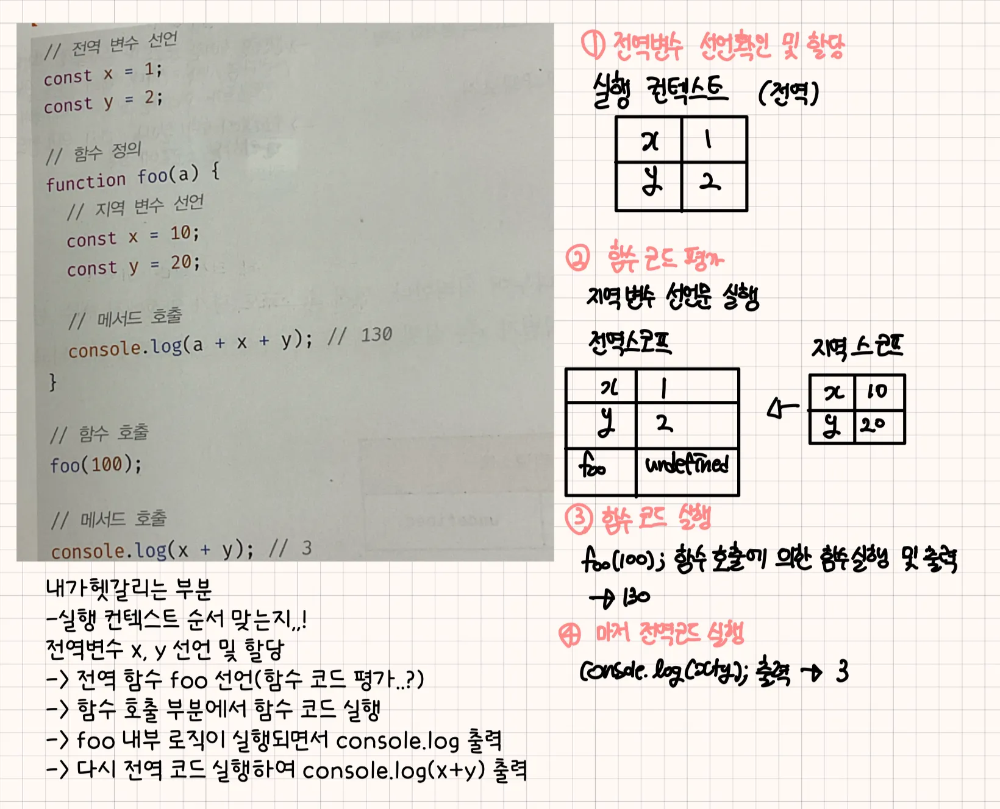
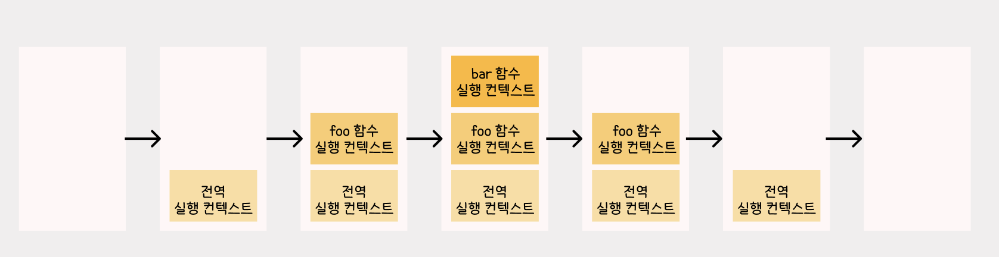

# 20Ch-strict mode

## strict mode란

**strict mode는** ES5부터 추가된 기능으로, **자바스크립트 언어의 문법을 좀 더 엄격히 적용**한다. 오류를 발생시킬 가능성이 높거나 **자바스크립트 엔진의 최적화 작업에 문제를 일으킬 수 있는 코드**에 대해 **명시적인 에러를 발생**시킴

## strict mode 적용

전역의 선두 또는 함수 몸체의 선두에 `'use strict';`를 추가 → 스크립트 전체에 적용됨

- 자바스크립트 언어의 문법을 좀 더 엄격히 적용하여 오류를 발생시킬 가능성이 높거나 JS 엔진의 최적화 작업에 문제를 일으킬 수 있는 코드에 대해 명시적인 에러를 발생시킴
  → 오류를 발생시킬 가능성이 높은 코드나 동작에 대해 명시적인 에러를 발생시킴
  → 변수 선언 없이 사용하는 코드나, 읽기 전용 속성 수정, 중복된 함수 매개변수 등은 실행 중 오류가 발생함
  → JS 엔진이 최적화할 수 없는 코드를 방지하는데 도움을 줌

  즉, JS의 strict mode는 주로 문법 오류 방지와 엔진 최적화를 위해 사용되며, 코드의 안정성과 성능을 높여주는 역할을 담당

  cf) 리액트 문서에서의 `<StrictMode>`는 개발 중 컴포넌트에서 일반적인 버그를 빠르게 찾을 수 있도록 함
  → 순수하지 않은 렌더링으로 인해 발생하는 버그를 찾기 위해 컴포넌트가 추가로 다시 렌더링됨
  → Effect 클린업이 누락되어 발생하는 버그를 찾기 위해 컴포넌트가 추가로 Effect를 다시 실행함
  → 더 이상 사용되지 않는 API의 사용 여부를 확인하기 위해 컴포넌트를 검사함
  → 리액트의 Strict Mode는 개발 환경에서만 동작하고 실제 배포 시에는 영향이 없음

  즉, 컴포넌트의 렌더링 문제, 부적절한 API 사용, 비동기 작업 클린업 등을 확인하여 개발 중 버그를 빠르게 잡는 도구의 역할을 담당

## 사용시 피해야하는 점

- 전역에 strict mode 적용 피하기
  - 스크립트 단위로 적용이 되면서 다른 스크립트에 영향을 주지 않고 일부 스크립트에 한정되어 적용이 될 수 있음
    → 외부 서드파티 라이브러리를 사용하는 경우 라이브러리가 non-strict mode인 경우도 있기에 바람직하지 않음
  - 즉, 외부 라이브러리를 사용하고 있는 경우 해당 라이브러리가 Strict Mode를 지원하지 않는 코드로 작성되어 있을 수 있음
    → 원치 않는 동작을 할 가능성이 높아짐
- 함수 단위로 strict mode 적용 피하기
  - strict mode가 적용된 함수가 참조할 함수 외부의 컨텍스트에 strict mode를 적용하지 않는다면 마찬가지로 문제가 발생할 수 있음
  - 특정 함수 안에서만 `'use strict';`를 선언해서 부분적으로 Strict Mode를 사용하는 경우 함수 외부의 컨텍스트와 일관성이 떨어져서 문제가 생길 수 있음

## strict mode가 발생시키는 에러

- 암묵적 전역
  - 선언하지 않은 변수를 참조하면 ReferenceError가 발생함
- 변수, 함수, 매개변수의 삭제
  - delete 연산자로 변수, 함수, 매개변수를 삭제하면 SyntaxError가 발생함
- 매개변수 이름의 중복
  - 중복된 매개변수 이름 사용시 SyntaxError 발생
- with 문의 사용
  - with 문은 동일한 객체의 프로퍼티를 반복해서 사용할 때 객체 이름을 생략할 수 있어서 코드가 간단해지는 효과가 있지만 성능과 가독성이 나빠지는 문제가 있음

## strict mode 적용에 의한 변화

- 일반 함수의 this
  - 함수를 일반 함수로서 호출하면 this에 undefined가 바인딩 됨. 일반 함수 내부에서는 this를 사용할 필요가 없으며, 에러가 발생하지 않음
- arguments 객체
  - 매개변수에 전달된 인수를 재할당하여 변경해도 arguments 객체에 반영되지 않음

# 21Ch-빌트인 객체

## 자바스크립트 객체의 분류

- `표준 빌트인 객체`
  - 애플리케이션 전역의 공통 기능을 제공함
  - 자바스크립트 실행 환경과 관계없이 언제나 사용 가능
  - 전역 객체의 프로퍼티로서 제공됨
  - 별도의 선언 없이 전역 변수처럼 언제나 참조 가능
  - 즉, JS 엔진 자체에서 제공하는 기본 객체들로 기본 기능을 수행함. JS가 실행되는 모든 환경(브라우저, Node.js 등)에서 사용할 수 있음
- `호스트 객체`
  - 자바스크립트 실행 환경에서 추가로 제공하는 객체를 의미
- `사용자 정의 객체`
  - 기본 제공되는 객체가 아닌 사용자가 직접 정의한 객체를 의미

## 표준 빌트인 객체

- Object, String, Number, Boolean, Symbol, Date, Math, RegExp, Array, Map/Set, WeakMap/WeakSet, Function, Promise, Reflect, Proxy, JSON, Error 등 40여 개의 표준 빌트인 객체를 제공
- Math, Reflect, JSON을 제외한 표준 빌트인 객체는 모두 인스턴스를 생성할 수 있는 생성자 함수 객체에 해당함
- 표준 빌트인 객체의 prototype 프로퍼티에 바인딩된 객체(ex. String.prototype)는 다양한 기능의 빌트인 프로토타입 메서드를 제공
- 생성자 함수 객체인 표준 빌트인 객체는 모두 인스턴스를 생성할 수 있는 생성자 함수 객체로, 프로토타입 메서드와 정적 메서드를 제공하며 생성자 함수 객체가 아닌 표준 빌트인 객체는 정적 메서드만 제공

## 원시값과 래퍼 객체

- 원시값은 객체가 아니므로 프로퍼티나 메서드를 가질 수 없는데도 원시값인 문자열이 마치 객체처럼 동작함
  - 원시값인 문자열, 숫자, 불리언 값의 경우 이들 원시값에 대해 마치 객체처럼 마침표 표기법으로 접근하면 자바스크립트 엔진이 일시적으로 원시값을 연관된 객체로 변환해주기 때문임
  - 즉, 원시값을 객체처럼 사용하면 자바스크립트 엔진은 암묵적으로 연관된 객체를 생성하여 생성된 객체로 프로퍼티에 접근하거나 메서드를 호출하고 다시 원시값으로 되돌림

  ```javascript
  const str = 'hello';

  // 원시 타입인 문자열이 프로퍼티와 메서드를 갖고 있는 객체처럼 동작함
  console.log(str.length); // 5
  console.log(str.toUpperCase()); // HELLO
  ```

- **`래퍼 객체`**: 문자열, 숫자, 불리언 값에 대해 객체처럼 접근하면 생성되는 임시 객체
- 문자열, 숫자, 불리언, 심벌은 암묵적으로 생성되는 래퍼 객체에 의해 마치 객체처럼 사용이 가능하며, 표준 빌트인 객체인 String, Number, Boolean, Symbol의 프로토타입 메서드 또는 프로퍼티를 참조할 수 있음
  → String, Number, Boolean 생성자 함수를 new 연산자와 함께 호출하여 문자열, 숫자, 불리언 인스턴스를 생성할 필요가 없으며 권장하지 않음
- 따라서 문자열, 숫자, 불리언, 심벌 이외의 원시값, 즉 null과 undefined는 래퍼 객체를 생성하지 않음

## 전역 객체

코드가 실행되기 이전 단계에 자바스크립트 엔진에 의해 어떤 객체보다도 먼저 생성되는 특수한 객체로, 어떤 객체에도 속하지 않은 최상위 객체를 의미

- 전역 객체는 표준 빌트인 객체와 환경에 따른 호스트 객체, 그리고 var 키워드로 선언한 전역 변수와 전역 함수를 프로퍼티로 가짐
- 계층적 구조상 어떤 객체에도 속하지 않은 모든 빌트인 객체의 최상위 객체를 의미
  = 객체의 계층적 구조상 표준 빌트인 객체와 호스트 객체를 프로퍼티로 소유하는 것을 의미
- 전역 객체의 특징
  - 전역 객체는 개발자가 의도적으로 생성할 수 없음. 즉, 전역 객체를 생성할 수 있는 생성자 함수가 제공되지 않음
  - 전역 객체의 프로퍼티를 참조할 때 window(또는 노드 환경에서는 global) 생략이 가능
- `빌트인 전역 프로퍼티`: 전역 객체의 프로퍼티를 의미하며, 주로 애플리케이션 전역에서 사용하는 값을 제공
  - Infinity 프로퍼티: 무한대를 나타내는 숫자값 Infinity를 가짐
  - NaN 프로퍼티: 숫자가 아님을 나타내는 숫자값 NaN을 가지며, Number.NaN 프로퍼티와 같음
  - undefined 프로퍼티: 원시타입 undefined를 값으로 가짐
- `빌트인 전역 함수`: 애플리케이션 전역에서 호출할 수 있는 빌트인 함수로서 전역 객체의 메서드
  - eval: 자바스크립트 코드를 나타내는 문자열 인수로 전달받으며, 전달받은 문자열 코드가 표현식이라면 eval 함수는 문자열 코드를 런타임에 평가하여 값을 생성하고, 전달받은 인수가 표현식이 아닌 문이라면 문자열 코드를 런타임에 실행함
    - eval 함수는 기존의 스코프를 런타임에 동적으로 수정함
  - isFinite: 전달받은 인수가 정상적인 유한수인지 검사하여 유한수이면 true를, 무한수이면 false를 반환함
    - 전달받은 인수의 타입이 숫자가 아닌 경우 숫자 타입을 변환한 후 검사를 수행하며, 인수가 NaN으로 평가되는 값이라면 false를 반환
  - isNaN: 전달받은 인수가 NaN인지 검사하여 그 결과를 불리언 타입으로 반환함. 전달받은 인수의 타입이 숫자가 아닌 경우 숫자로 타입을 변환한 후 검사를 수행함
  - parseFloat: 전달받은 문자열 인수를 부동 소수점 숫자, 즉 실수로 해석하여 반환함
  - parseInt: 전달받은 문자열 인수를 정수로 해석하여 반환함
- 암묵적 전역: 선언하지 않은 식별자가 마치 선언된 전역변수처럼 동작하는데, 이는 선언하지 않은 식별자에 값을 할당하면 전역 객체의 프로퍼티가 되기 때문임

# 22Ch-this

## this 키워드

- 메서드는 자신이 속한 객체의 프로퍼티를 참조하기 위해 자신이 속한 객체를 가리키는 식별자를 참조할 수 있어야함
- 생성자 함수로 인스턴스를 생성하려면 우선적으로 생성자 함수가 존재해야함
- `this`는 자신이 속한 객체 또는 자신이 생성할 인스턴스를 가리키는 자기 참조 변수를 의미하며, `this`를 통해 자신이 속한 객체 또는 자신이 생성할 인스턴스의 프로퍼티나 메서드를 참조할 수 있음
  ⇒ 즉, 어떤 객체의 속성이나 메서드를 참조하기 위해 객체 내부에서 사용되는 것

  ```javascript
  const person = {
    name: '혜인',
    sayHello: function() {
      console.log(`Hello, my name is ${this.name}`);
    }
  };

  person.sayHello();  // "Hello, my name is 혜인"
  ```

  - 해당 코드에서 this는 메서드를 호출한 객체(person), this.name은 person 객체의 name 속성을 참조함

- this는 JS 엔진에 의해 암묵적으로 생성되며, 코드 어디서든 참조할 수 있음
- 함수 호출시 arguments 객체와 this가 암묵적으로 함수 내부에 전달됨
- 즉, **this 바인딩은 함수 호출 방식에 의해 동적으로 결정됨**
- **JS의 this는 함수가 호출되는 방식에 따라 this에 바인딩 될 값, 즉 this 바인딩이 동적으로 결정**됨

  > 💡 **렉시컬 스코프와 this 바인딩은 결정 시기가 다름**
  >
  > 함수의 상위 스코프를 결정하는 방식인 렉시컬 스코프는 함수 정의가 평가되어 함수 객체가 생성되는 시점에 상위 스코프를 결정하지만, this 바인딩은 함수 호출 시점에 결정됨

- strict mode 역시 this 바인딩에 영향을 줌
- this는 코드 어디에서든 참조 가능하며, 전역에서도 함수 내부에서도 참조할 수 있음
- this는 객체의 프로퍼티나 메서드를 참조하기 위한 자기 참조 변수이므로 객체의 메서드 또는 생성자 함수 내부에서만 의미가 있음
  ⇒ strict mode가 적용된 일반 함수 내부의 this에는 `undefined`가 바인딩됨

## 함수 호출 방식과 this 바인딩

함수를 호출하는 방식은 하기와 같이 다양함

1. 일반 함수 호출
2. 메서드 호출
3. 생성자 함수 호출
4. Function.prototype.apply/call/bind 메서드에 의한 간접 호출

```javascript
// this 바인딩은 함수 호출 방식에 따라 동적으로 결정됨
const foo = function () {
	console.dir(this);
}

// 동일한 함수도 다양한 방식으로 호출할 수 있음

// 1. 일반 함수 호출
// foo 함수를 일반적인 방식으로 호출
// foo 함수 내부의 this는 전역 객체 window를 가리킴
foo(); // window

// 2. 메서드 호출
// foo 함수를 프로퍼티 값으로 할당하여 호출
// foo 함수 내부의 this는 메서드를 호출한 객체 obj를 가리킴
const obj = { foo };
obj.foo(); // obj

// 3. 생성자 함수 호출
// foo 함수를 new 연산자와 함께 생성자 함수로 호출
// foo 함수 내부의 this는 생성자 함수가 생성한 인스턴스를 가리킴
new foo(); // foo {}
```

### 일반 함수 호출

기본적으로 this에는 전역 객체가 바인딩됨

```javascript
function foo() {
	console.log("foo's this: ", this); // window
	function bar() {
		console.log("bar's this: ", this); // window
	}
	bar();
}
foo();
```

- 위 예제처럼 전역 함수는 물론이고 중첩 함수를 **일반 함수로 호출하면 함수 내부의 this에는 전역 객체가 바인딩됨**
- 콜백 함수가 일반 함수로 호출된다면 콜백 함수 내부의 this에도 전역 객체가 바인딩되며, 어떠한 함수라도 일반 함수로 호출되면 this에 전역 객체가 바인딩됨
- 메서드 내에서 정의한 중첩 함수도 일반 함수로 호출되면 중첩 함수 내부의 this에는 전역 객체가 바인딩됨
- **이처럼 일반 함수로 호출된 모든 함수 내부의 this에는 전역 객체가 바인딩 됨**

### 메서드에 호출

- 메서드 내부의 this에는 메서드를 호출한 객체, 즉 메서드를 호출할 때 메서드 이름 앞의 마침표(.) 연산자 앞에 기술한 객체가 바인딩 됨. 이때, 메서드 내부의 this는 메서드를 소유한 객체가 아닌 메서드를 호출한 객체에 바인딩 됨
- this는 객체 자체인 car

```javascript
const car = {
  brand: 'Tesla',
  model: 'Model 3',
  getDetails: function() {
    console.log(`This car is a ${this.brand} ${this.model}`);
  }
};

// 메서드를 호출한 객체는 'car' -> this는 'car'를 가리키게 됨
car.getDetails();
// 출력 결과: "This car is a Tesla Model 3"
```

### 생성자 함수 호출

- 생성자 함수 내부의 this는 새로 생성된 객체(인스턴스)를 가리킴

```javascript
function Car(brand, model) {
  this.brand = brand;
  this.model = model;
  this.getDetails = function() {
    console.log(`This car is a ${this.brand} ${this.model}`);
  };
}

// 새로운 객체 생성
const car1 = new Car('Tesla', 'Model 3');
const car2 = new Car('BMW', 'X5');

// 생성된 객체의 메서드 호출
car1.getDetails();
// 출력 결과: "This car is a Tesla Model 3"

car2.getDetails();
// 출력 결과: "This car is a BMW X5"
```

⇒ 즉, 메서드에서의 this는 해당 객체를, 생성자 함수에서의 this는 새로 생성된 객체를 가리킴

this 바인딩(this에 바인딩될 값)은 함수 호출 방식, 즉 함수가 어떻게 호출되었는지에 따라 동적으로 결정됨

- 객체의 메서드로 호출된 경우 → this는 해당 객체를 가리킴

  ```javascript
  const dessert = {
    brand: 'Grains',
    order() {
      console.log(this.brand);
    }
  };

  dessert.order();  // "Grains"
  // 현재의 코드에서 this는 dessert 객체를 가리킴
  ```

- 전역에서 사용된 경우(strict mode 없이)
  - 전역에서 함수가 호출되면 this는 window와 같은 전역 객체를 가리킴

  ```javascript
  function showThis() {
    console.log(this);  // window 객체를 나타냄
  }

  showThis();
  ```

- strict mode에서 함수 호출
  - 전역 객체를 가리키지 않고 `undefined`를 가리킴
- 생성자 함수에서 사용된 경우
  - this는 새로 생성되는 객체(person1)를 가리킴

  ```javascript
  function Person(name) {
  	this.name = name;
  }

  const person1 = new Person('혜인');
  console.log(person1.name); // '혜인'
  ```

> 💡 즉, this는 메서드가 속한 객체를 참조하는 것이 아니라 메서드를 호출한 객체를 참조함
> JS에서 this는 실행 컨텍스트에 따라 가리키는 대상이 달라질 수 있음
>
> - 메서드에서의 `this`는 **메서드를 호출한 객체**를 참조하고, 그 객체의 속성에 접근할 수 있게 함
> - 생성자 함수에서의 `this`는 **새롭게 생성된 객체**를 참조하고, 그 객체의 속성을 초기화하거나 메서드를 정의하는 데 사용됨

# 23Ch-실행 컨텍스트

- 자바스크립트의 동작 원리를 담고 있는 핵심 개념
- 식별자, 식별자에 바인딩된 값, 호이스팅이 발생하는 이유, 클로저의 동작 방식, 이벤트 핸들러와 비동기 처리의 동작 방식을 이해할 수 있음

## 소스코드의 타입

- 소스코드의 타입에 따라서 실행 컨텍스트를 생성하는 과정과 관리 내용이 다름

| 소스코드의 타입 | 설명 |
| --- | --- |
| 전역 코드 | 전역에 존재하는 소스코드를 의미. 전역에 정의된 함수, 클래스 등의 내부 코드는 포함되지 않음 |
| 함수 코드 | 함수 내부에 존재하는 소스코드를 의미. 함수 내부에 중첩된 함수, 클래스 등의 내부 코드는 포함되지 않음 |
| eval 코드 | 빌트인 전역 함수인 eval 함수에 인수로 전달되어 실행되는 소스코드 |
| 모듈 코드 | 모듈 내부에 존재하는 소스코드를 의미. 모듈 내부의 함수, 클래스 등의 내부 코드는 포함되지 않음 |

- 전역 코드 (↔ 전역 실행 컨텍스트)
  - 전역 변수를 관리하기 위해 최상위 스코프인 전역 스코프를 생성해야함
  - var 키워드로 선언된 전역 변수와 함수 선언문으로 정의된 전역 함수를 전역 객체의 프로퍼티와 메서드로 바인딩하고 참조하기 위해 전역 객체와 연결되어야함
  - 전역 코드가 평가되면 전역 실행 컨텍스트가 생성됨
- 함수 코드 (↔ 함수 실행 컨텍스트)
  - 지역 스코프를 생성하고 지역 변수, 매개변수, arguments 객체를 관리해야함
  - 지역 스코프를 전역 스코프에서 시작하는 스코프 체인의 일원으로 연결해야함
  - 함수 코드가 평가되면 함수 실행 컨텍스트가 생성됨
- eval 코드 (↔ eval 실행 컨텍스트)
  - strict mode에서 자신만의 독자적인 스코프를 생성
- 모듈 코드 (↔ 모듈 실행 컨텍스트)
  - 모듈별로 독립적인 모듈 스코프를 생성함
  - 모듈 코드가 평가되면 모듈 실행 컨텍스트가 생성됨

## 소스코드의 평가와 실행

- 자바스크립트 엔진은 소스코드를 `소스코드의 평가`와 `소스코드의 실행 과정`으로 나누어 처리
  - 소스코드 평가 과정: 실행 컨텍스트를 생성하고 변수, 함수 등의 선언문만 먼저 실행하여 생성된 변수나 함수 식별자를 키로 실행 컨텍스트가 관리하는 스코프(렉시컬 환경의 환경 레코드)에 등록
  - 소스코드 실행 과정: 런타임이 시작되며, 변수나 함수의 참조를 실행 컨텍스트가 관리하는 스코프에서 검색해서 취득함. 그리고 변수 값의 변경 등 소스코드의 실행 결과는 다시 실행 컨텍스트가 관리하는 스코프에 등록됨


- 소스코드 평가 과정이 끝나면 비로소 소스코드 실행 과정이 시작됨

## 실행 컨텍스트의 역할

- 자바스크립트 엔진이 아래 예시를 어떻게 평가하고 실행하는지에 대해 살펴보자

```javascript
// 전역 변수 선언
const x = 1;
const y = 2;

// 함수 정의
function foo(a) {
	// 지역 변수 선언
	const x = 10;
	const y = 20;

	// 메서드 호출
	console.log(a + x + y); // 130
}

// 함수 호출
foo(100);

// 메서드 호출
console.log(x + y); // 3
```



- **`1. 전역 코드 평가 → 2. 전역 코드 실행 → 3. 함수 코드 평가 → 4. 함수 코드 실행`** 과 같은 순서로 진행됨
  1. 전역 코드 평가
     - 전역 코드를 실행하기에 앞서 먼저 전역 코드 평가 과정을 거치며 전역 코드를 실행하기 위한 준비를 진행함
     - 전역 코드의 변수 선언문과 함수 선언문이 먼저 실행되고, 그 결과 생성된 전역 변수와 전역 함수가 실행 컨텍스트가 관리하는 전역 스코프에 등록됨
     - 이때 var 키워드로 선언된 전역 변수와 함수 선언문으로 정의된 전역 함수는 전역 객체의 프로퍼티 메서드가 됨
  2. 전역 코드 실행
     - 전역 코드 평가 과정이 끝나면 런타임이 시작되어 전역 코드가 순차적으로 실행되기 시작함
     - 이때, 전역 변수에 값이 할당되고 함수가 호출됨
     - 함수가 호출되면 순차적으로 실행되던 전역 코드의 실행을 일시 중단하고 코드 실행 순서를 변경하여 함수 내부로 진입
  3. 함수 코드 평가
     - 함수 내부의 문들을 실행하기에 앞서 함수 코드 평가 과정을 거치며 함수 코드를 실행하기 위한 준비를 함
     - 이때 매개변수와 지역 변수 선언문이 먼저 실행되고, 그 결과 생성된 매개변수와 지역 변수가 실행 컨텍스트가 관리하는 지역 스코프에 등록됨
     - 함수 내부에서 지역 변수처럼 사용할 수 있는 arguments 객체가 생성되어 지역 스코프에 등록되고 this 바인딩도 결정됨
  4. 함수 코드 실행
     - 함수 코드 평가 과정이 끝나면 런타임이 시작되어 함수 코드가 순차적으로 실행되기 시작함
     - 이때 매개변수와 지역 변수에 값이 할당되고 console.log 메서드가 호출됨
     - console 식별자는 스코프 체인에 등록되어 있지 않고 전역 객체에 프로퍼티로 존재함
- 코드가 실행되려면 아래와 같이 스코프, 식별자, 코드 실행 순서 등의 관리가 필요함
  1. 선언에 의해 생성된 모든 식별자(변수, 함수, 클래스 등)를 스코프를 구분하여 등록하고 상태 변화(식별자에 바인딩된 값의 변화)를 지속적으로 관리할 수 있어야함
  2. 스코프는 중첩 관계에 의해 스코프 체인을 형성해야함. 즉, 스코프 체인을 통해 상위 스코프로 이동하며 식별자를 검색할 수 있어야함
  3. 현재 실행 중인 코드의 실행 순서를 변경(예를 들어, 함수 호출에 의한 실행 순서 변경)할 수 있어야 하며 다시 되돌아갈 수도 있어야함
- 실행 컨텍스트는 소스코드를 실행하는 데 필요한 환경을 제공하고 코드의 실행 결과를 실제로 관리하는 영역임. 즉, 이 모든 것을 관리하는 것이 바로 `실행 컨텍스트`

  > 💡 **실행 컨텍스트**
  >
  > 소스코드를 실행하는 데 필요한 환경을 제공하고 코드의 실행 결과를 실제로 관리하는 영역
  > 즉, 실행 컨텍스트는 식별자(변수, 함수, 클래스 등의 이름)를 등록하고 관리하는 스코프와 코드 실행 순서 관리를 구현한 내부 메커니즘으로, 모든 코드는 실행 컨텍스트를 통해 실행되고 관리됨

## 실행 컨텍스트 스택

아래의 예시는 소스코드의 타입으로 분류시 전역 코드와 함수 코드로 이루어져 있음

```javascript
const x = 1;

function foo () {
	const y = 2;

	function bar () {
		const z = 3;
		console.log(x + y + z);
	}
	bar();
}

foo(); // 6
```

- 자바스크립트 엔진은 먼저 전역 코드를 평가하여 전역 실행 컨텍스트를 생성 → 함수가 호출되면 함수 코드를 평가하여 함수 실행 컨텍스트를 생성
- 이때, 생성된 실행 컨텍스트는 `스택` 자료구조로 관리되며, 이를 `실행 컨텍스트 스택`이라 함



1. 전역 코드의 평가와 실행
   - JS 엔진은 먼저 **전역 코드를 평가**하여 전역 **실행 컨텍스트를 생성**하고 **실행 컨텍스트 스택에 푸시**함
   - 이때, 전역 변수 x와 전역 함수 foo는 전역 실행 컨텍스트에 등록됨
   - 이후 전역 코드가 실행되며 전역 변수 x에 값이 할당되고 전역 함수 foo가 호출됨
2. foo 함수 코드의 평가와 실행
   - 전역 함수 foo가 호출되면 전역 코드 실행은 일시 중단되고 코드의 제어권이 foo 함수 내부로 이동
   - foo 함수 내부의 함수 코드를 평가하여 foo 함수 실행 컨텍스트를 생성하고 실행 컨텍스트 스택에 푸시함
   - 지역 변수 y와 중첩 함수 bar가 foo 함수 실행 컨텍스트에 등록됨
   - 이후 foo 함수 코드가 실행되기 시작하여 지역 변수 y에 값이 할당되고 중첩 함수 bar가 호출됨
3. bar 함수 코드의 평가와 실행
   - 중첩 함수 bar가 호출되면 foo 함수 코드의 실행은 일시 중단되고 코드의 제어권이 bar 함수 내부로 이동함
   - bar 함수 내부의 코드를 평가하여 bar 함수 실행 컨텍스트를 생성하고 실행 컨텍스트 스택에 푸시함
   - 이때, bar 함수의 지역 변수 z가 bar 함수 실행 컨텍스트에 등록됨
   - 이후, bar 함수 코드가 실행되기 시작하여 지역 변수 z에 값이 할당되고 console.log 메서드 호출 이후 bar 함수가 종료됨
4. foo 함수 코드로 복귀
   - bar 함수가 종료되면 코드의 제어권은 다시 foo 함수로 이동함
   - bar 함수 실행 컨텍스트를 실행 컨텍스트 스택에서 팝하여 제거
   - foo 함수는 더 이상 실행할 코드가 없으므로 종료됨
5. 전역 코드로 복귀
   - foo 함수가 종료되면 코드의 제어권은 다시 전역 코드로 이동함
   - foo 함수 실행 컨텍스트를 실행 컨텍스트 스택에서 팝하여 제거함
   - 더 이상 실행할 전역 코드가 남아 있지 않으므로 전역 실행 컨텍스트도 실행 컨텍스트 스택에서 팝되어 실행 컨텍스트 스택에는 아무것도 남지않음

- 이처럼 실행 컨텍스트 스택은 코드의 `실행 순서`를 관리함
- 소스코드가 평가되면 실행 컨텍스트가 생성되고 실행 컨텍스트 스택의 최상위에 쌓임
- 실행 컨텍스트 스택의 최상위에 존재하는 실행 컨텍스트는 언제나 현재 실행 중인 코드의 실행 컨텍스트이며, 이를 **실행 중인 실행 컨텍스트**라고 부름

## 렉시컬 환경

식별자와 식별자에 바인딩된 값, 그리고 상위 스코프에 대한 참조를 기록하는 자료구조로 실행 컨텍스트를 구성하는 컴포넌트를 의미

- 실행 컨텍스트 스택이 코드의 실행 순서를 관리한다면 **렉시컬 환경**은 `스코프와 식별자를 관리`함
- 렉시컬 환경은 키와 값을 갖는 객체 형태의 스코프(전역, 함수, 블록 스코프)를 생성하여 식별자를 키로 등록하고 식별자에 바인딩된 값을 관리함
- 즉, 스코프를 구분하여 식별자를 등록하고 관리하는 저장소 역할을 하는 렉시컬 스코프의 실체임
- 실행 컨텍스트는 LexicalEnvironment 컴포넌트와 VariableEnvironment 컴포넌트로 구성됨
- 생성 초기에 LexicalEnvironment 컴포넌트와 VariableEnvironment 컴포넌트는 하나의 동일한 렉시컬 환경을 참조 → 이후 몇 가지 상황을 만나면 VariableEnvironment 컴포넌트를 위한 새로운 렉시컬 환경을 생성

## 실행 컨텍스트의 생성과 식별자 검색 과정

아래 예시를 통해 실행 컨텍스트가 생성되고 코드 실행 결과가 관리되는지, 어떻게 실행 컨텍스트를 통해 식별자를 검색하는지 살펴보자

```javascript
var x = 1;
const y = 2;

function foo (a) {
	var x = 3;
	const y = 4;

	function bar (b) {
		const z = 5;
		console.log(a + b + x + y + z);
	}
	bar(10);
}

foo(20); // 42
```

### 1. 전역 객체 생성

- 전역 객체는 전역 코드가 평가되기 이전에 생성됨
- 전역 객체에는 동작 환경에 따라 클라이언트 사이드 Web API 또는 특정 환경을 위한 호스트 객체를 포함함
- 전역 객체도 프로토타입 체인의 일원임

### 2. 전역 코드 평가

소스코드가 로드되면 JS 엔진은 전역 코드를 평가함

1. 전역 실행 컨텍스트 생성
   - 실행 중인 컨텍스트에 해당함
2. 전역 렉시컬 환경 생성
   1. 전역 환경 레코드 생성
      - 전역 환경 레코드는 전역 변수를 관리하는 전역 스코프, 전역 객체의 빌트인 전역 프로퍼티와 빌트인 전역 함수, 표준 빌트인 객체를 제공
      1. 객체 환경 레코드 생성
         - 객체 환경 레코드는 기존의 전역 객체가 관리하던 var 키워드로 선언한 전역 변수와 함수 선언문으로 정의한 전역 함수, 빌트인 전역 프로퍼티와 빌트인 전역 함수, 표준 빌트인 객체를 관리
      2. 선언적 환경 레코드 생성
         - 선언적 환경 레코드는 let, const 키워드로 선언한 전역 변수를 관리함
   2. this 바인딩
      - `[[GlobalThisValue]]` 내부 슬롯에 this가 바인딩됨
      - 전역 코드에서 this는 전역 객체를 가리키므로 전역 환경 레코드의 `[[GlobalThisValue]]` 내부 슬롯에는 전역 객체가 바인딩됨
      - 참고로 전역 환경 레코드를 구성하는 객체 환경 레코드와 선언적 환경 레코드에는 this 바인딩이 없음
      - this 바인딩은 전역 환경 레코드와 함수 환경 레코드에만 존재함
   3. 외부 렉시컬 환경에 대한 참조 결정
      - 현재 평가 중인 소스코드를 포함하는 외부 소스코드의 렉시컬 환경, 즉 상위 스코프를 가리킴
      - 단방향 링크드 리스트인 스코프 체인을 구현함

### 3. 전역 코드 실행

- 변수 할당문 또는 함수 호출문을 실행하려면 먼저 변수 또는 함수 이름이 선언된 식별자인지 확인해야함
- 식별자는 스코프가 다르면 같은 이름을 가질 수 있는데, 어느 스코프의 식별자를 참조하면 되는지 결정해야하는 `식별자 결정`을 필요로 함
- **식별자 결정을 위해 식별자를 검색할 때는 실행 중인 실행 컨텍스트에서 식별자를 검색하기 시작함**
- 실행 중인 실행 컨텍스트의 렉시컬 환경에서 식별자를 검색할 수 없으면 외부 렉시컬 환경에 대한 참조가 가리키는 렉시컬 환경, 즉 상위 스코프로 이동하여 식별자를 검색함
- 실행 컨텍스트는 소스코드를 실행하기 위해 필요한 환경을 제공하고 코드의 실행 결과를 실제로 관리하는 영역

### 4. foo 함수 코드 평가

- foo 함수가 호출되면 전역 코드의 실행을 일시 중단하고 foo 함수 내부로 코드의 제어권이 이동함
- 함수 코드 평가는 아래 순서로 진행됨
  1. 함수 실행 컨텍스트 생성
     - foo 함수 실행 컨텍스트를 생성
     - 렉시컬 환경이 완성된 다음 실행 컨텍스트 스택에 푸시됨
  2. 함수 렉시컬 환경 생성
     - foo 함수 렉시컬 환경을 생성하고 foo 함수 실행 컨텍스트에 바인딩함
     1. 함수 환경 레코드 생성
        - 매개변수, arguments 객체, 함수 내부에서 선언한 지역 변수와 중첩 함수를 등록하고 관리함
     2. this 바인딩
        - 함수 호출 방식에 따라 결정됨
        - foo 함수는 일반 함수로 호출되었으므로 this는 전역 객체를 가리킴
     3. 외부 렉시컬 환경에 대한 참조 결정
        - foo 함수 정의가 평가된 시점에 실행 중인 실행 컨텍스트의 렉시컬 환경의 참조가 할당됨

### 5. foo 함수 코드 실행

- 런타임이 시작되어 foo 함수의 소스코드가 순차적으로 실행되기 시작함
- 매개변수에 인수가 할당되고, 변수 할당문이 실행되어 지역 변수 x, y에 값이 할당되며, 함수 bar가 호출됨
- 이때, 식별자 결정을 위해 실행 중인 실행 컨텍스트의 렉시컬 환경에서 식별자를 검색하기 시작

### 6. bar 함수 코드 평가

- bar 함수가 호출되면 bar 함수 내부로 코드의 제어권이 이동함
- bar 함수 코드를 평가하기 시작

### 7. bar 함수 코드 실행

- 런타임이 시작되어 bar 함수의 소스코드가 순차적으로 실행되기 시작함
- 매개변수에 인수가 할당되고, 변수 할당문이 실행되어 지역 변수 z에 값이 할당됨

### 8. bar 함수 코드 실행 종료

- 더는 실행할 코드가 없으므로 실행 컨텍스트 스택에서 bar 함수 실행 컨텍스트가 팝되어 제거되고 foo 실행 컨텍스트가 실행 중인 실행 컨텍스트가 됨

### 9. foo 함수 코드 실행 종료

- 더 이상 실행할 코드가 없으므로 foo 함수 코드의 실행이 종료되며, 실행 컨텍스트 스택에서 foo 함수 실행 컨텍스트가 팝되어 제거되고 전역 실행 컨텍스트가 실행 중인 실행 컨텍스트가 됨

### 10. 전역 코드 실행 종료

- 더 이상 실행할 전역 코드가 없으므로 전역 코드의 실행이 종료되고 전역 실행 컨텍스트도 실행 컨텍스트 스택에서 팝되어 실행 컨텍스트 스택에는 아무것도 남아있지 않게 됨
