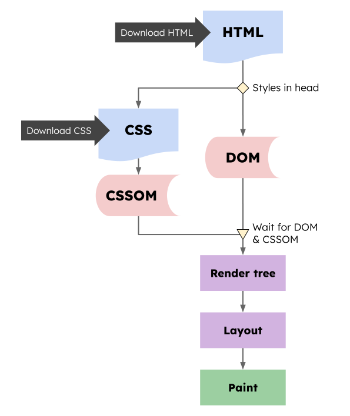
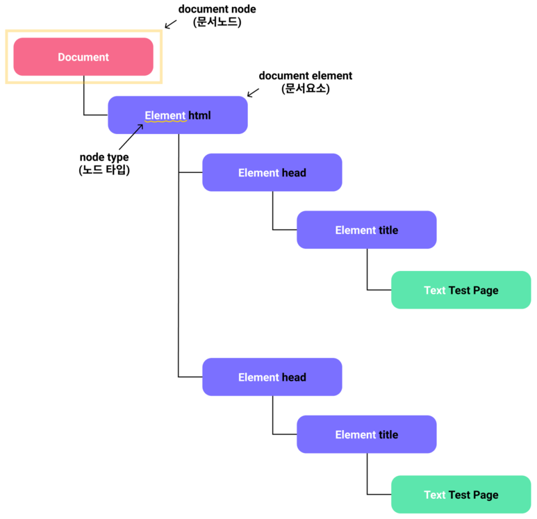
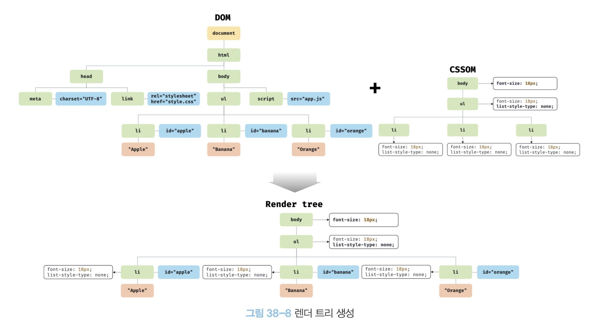
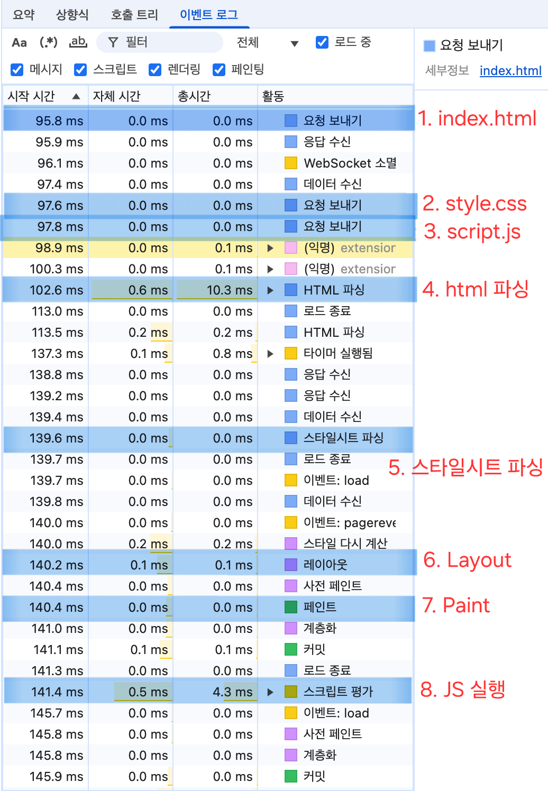
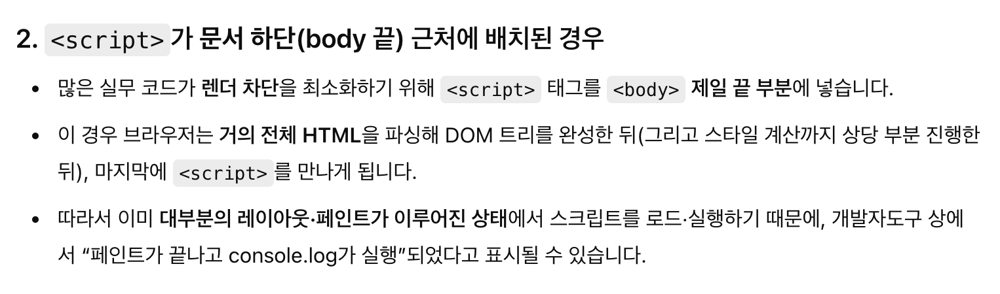

# 모던 자바스크립트 Deep Dive 35~38장 정리

## 35장. 스프레드 문법

### 스프레드 문법이란?

스프레드 문법 `...`은 이터러블을 펼쳐 **개별 값의 목록**으로 만든다.   
배열, 문자열, Set, Map 등은 이터러블이므로 펼칠 수 있다.  

```js
console.log(...[1, 2, 3]); // 1 2 3
console.log(...'ABC');     // A B C
console.log(...new Set([1, 2, 2])); // 1 2
```

스프레드 문법의 결과는 독립적인 값이 아니다. 함수 호출의 인수 목록, 배열 리터럴의 요소 목록처럼 **여러 값을 받는 자리**에서 사용한다.

```js
const numbers = [10, 20, 30];

Math.max(...numbers); // Math.max(10, 20, 30)과 같다

// const values = ...numbers; // SyntaxError: 펼친 결과를 변수 하나에 담을 수 없음
```

8주차에서 다룬 Rest 파라미터도 `...`을 쓰지만 방향이 반대다.

```js
function sum(...numbers) { // Rest: 여러 인수를 배열 하나로 모음
  return numbers.reduce((total, number) => total + number, 0);
}

sum(...[1, 2, 3]); // Spread: 배열을 개별 인수로 펼침 → 6
```

| 문법 | 사용 위치 | 동작 |
| --- | --- | --- |
| Rest 파라미터 | 함수 정의 | 여러 인수를 배열로 모음 |
| 스프레드 문법 | 함수 호출, 배열·객체 리터럴 | 값을 펼침 |

### 배열에서의 활용

배열을 펼치면 `concat`이나 `splice`로 하던 일을 간결하게 표현할 수 있다.

```js
const front = [1, 2];
const back = [3, 4];

const combined = [...front, ...back]; // [1, 2, 3, 4]
const inserted = [0, ...front, 3];    // [0, 1, 2, 3]
```

이터러블이 아닌 유사 배열 객체는 배열 안에서 바로 펼칠 수 없다. 이때는 `Array.from`으로 배열을 만든다.

```js
const arrayLike = { 0: 'a', 1: 'b', length: 2 };

// [...arrayLike];       // TypeError: 이터러블이 아님
Array.from(arrayLike);   // ['a', 'b']
```

### 객체에서의 활용

객체 리터럴 안에서는 객체의 **자신이 가진 열거 가능한 프로퍼티**를 새 객체로 복사할 수 있다.  
일반 객체가 이터러블이 아니어도 객체 리터럴의 스프레드는 사용할 수 있다.

```js
const user = { name: 'Kim', role: 'user' };
const copy = { ...user };

console.log(copy);          // { name: 'Kim', role: 'user' }
console.log(copy === user); // false

// [...user]; // TypeError: 일반 객체는 이터러블이 아님
```

여러 객체를 펼칠 때 같은 프로퍼티가 있으면 **뒤에 나온 값이 앞의 값을 덮는다**.

```js
const base = { name: 'Kim', role: 'user' };

const admin = { ...base, role: 'admin' };
// { name: 'Kim', role: 'admin' }

const stillUser = { role: 'admin', ...base };
// { role: 'user', name: 'Kim' }
```

따라서 기본 설정을 만들고 사용자 설정으로 덮을 때는 순서가 중요하다.

```js
const defaults = { theme: 'light', pageSize: 20 };
const options = { pageSize: 50 };

const settings = { ...defaults, ...options };
// { theme: 'light', pageSize: 50 }
```

### 주의할 점

스프레드로 만든 배열과 객체는 **얕은 복사**다. 바깥 컨테이너는 새로 만들어지지만, 안에 들어 있던 객체는 같은 객체를 참조한다.

```js
const original = [{ name: 'Kim' }];
const copy = [...original];

copy[0].name = 'Lee';
console.log(original[0].name); // 'Lee'
console.log(copy === original);    // false
console.log(copy[0] === original[0]); // true
```

객체 스프레드도 중첩 객체까지 자동으로 복사하지 않는다.

```js
const user = { profile: { city: 'Seoul' } };
const copiedUser = { ...user };

copiedUser.profile.city = 'Busan';
console.log(user.profile.city); // 'Busan'
```

## 36장. 디스트럭처링 할당

디스트럭처링 할당은 배열이나 객체의 값을 꺼내 여러 변수에 나누어 담는 문법이다.  
값을 꺼내는 쪽의 구조에 맞춰 변수를 선언한다.  

### 배열 디스트럭처링

배열은 **위치**를 기준으로 할당한다. 왼쪽 변수의 수와 오른쪽 요소의 수가 같을 필요는 없다.

```js
const colors = ['red', 'green', 'blue'];
const [first, second] = colors;

console.log(first);  // 'red'
console.log(second); // 'green'

const [a, , c] = colors;
console.log(a, c);   // 'red' 'blue'
```

나머지 요소를 모으는 Rest 요소는 반드시 마지막에 둔다.

```js
const [head, ...tail] = [1, 2, 3, 4];

console.log(head); // 1
console.log(tail); // [2, 3, 4]
```

배열 디스트럭처링의 오른쪽 값은 배열에 한정되지 않고 **이터러블**이면 된다.

```js
const [firstChar, secondChar] = 'JS';
console.log(firstChar, secondChar); // 'J' 'S'

const [firstNumber] = new Set([3, 1, 2]);
console.log(firstNumber); // 3
```

변수 교환이나 함수의 여러 반환값을 받는 데도 사용할 수 있다.

```js
let left = 1;
let right = 2;
[left, right] = [right, left];
console.log(left, right); // 2 1

function getCoordinates() {
  return [127.0, 37.5];
}

const [longitude, latitude] = getCoordinates();
```

### 객체 디스트럭처링

객체는 배열과 달리 **프로퍼티 이름**을 기준으로 할당한다. 작성 순서는 중요하지 않다.

```js
const user = { name: 'Kim', age: 28 };
const { age, name } = user;

console.log(name, age); // 'Kim' 28
```

여기서 `name`이라는 변수가 선언되는 것이 아니다. `name`은 찾을 프로퍼티이고, 실제로 선언되는 변수는 `displayName`이다.

없는 프로퍼티의 값은 `undefined`가 된다. 기본값은 배열과 마찬가지로 값이 `undefined`일 때 적용된다.

```js
const { title = '제목 없음' } = { title: undefined };
console.log(title); // '제목 없음'

const { content = '내용 없음' } = { content: null };
console.log(content); // null
```

나머지 프로퍼티는 새 객체로 모을 수 있다.

```js
const { id, ...details } = { id: 1, name: 'Kim', age: 28 };

console.log(id);      // 1
console.log(details); // { name: 'Kim', age: 28 }
```

### 중첩 구조와 함수 매개변수

중첩된 객체에서는 어느 단계의 프로퍼티를 꺼내는지 구조를 그대로 적는다.

```js
const user = {
  name: 'Kim',
  address: { city: 'Seoul', zipCode: '03000' }
};

const {
  name,
  address: { city }
} = user;

console.log(name, city); // 'Kim' 'Seoul'
```

함수 매개변수에 적용하면 필요한 프로퍼티만 이름으로 받을 수 있다.

```js
function printUser({ name, role = 'guest' }) {
  console.log(`${name}: ${role}`);
}

printUser({ name: 'Kim', role: 'admin' }); // 'Kim: admin'
printUser({ name: 'Lee' });                // 'Lee: guest'
```

객체 자체를 전달하지 않거나 중첩 객체가 빠질 수 있다면 기본값을 적어야 한다.

```js
function getCity({ address: { city } = {} } = {}) {
  return city;
}

getCity({ address: { city: 'Seoul' } }); // 'Seoul'
getCity({});                             // undefined
getCity();                               // undefined
```

## 37장. Set과 Map

`Set`은 **값만** 저장하는 중복 없는 모음이고, `Map`은 **키와 값의 쌍**을 저장한다.

### 앞서 이해하면 좋은 내용

숫자나 문자열 같은 원시 값은 값으로 비교한다. 하지만 객체는 프로퍼티가 똑같아도 **서로 따로 만든 객체라면 다른 값**으로 취급한다.

```js
console.log(1 === 1); // true

const a = { id: 1 };
const b = { id: 1 };
const sameAsA = a;

console.log(a === b);       // false: 내용은 같아도 다른 객체
console.log(a === sameAsA); // true: 같은 객체를 가리킴
```

이를 메모리 관점에서 개념적으로 그리면 다음과 같다.

```text
a       ──────→ 객체 A { id: 1 }
sameAsA ──────↗

b       ──────→ 객체 B { id: 1 }
```

`a`와 `sameAsA`는 같은 객체를 가리키고, `b`는 별도로 만들어진 객체를 가리킨다.

객체를 복사하는 것과 같은 객체를 다른 변수에 담는 것도 구분해야 한다.

```js
const original = { id: 1 };
const alias = original;
const copy = { ...original };

console.log(original === alias); // true
console.log(original === copy);  // false
```

앞에서 배운 스프레드로 만든 `copy`는 내용이 같아도 **새 객체**다. 이 차이가 Set의 중복 판단과 Map의 키 검색에 그대로 적용된다.

### Set

#### Set은 언제 사용하는가?

Set은 같은 값을 한 번만 저장한다. 이미 처리한 사용자 ID처럼 **존재 여부만** 알아야 할 때 알맞다.

```js
const processedIds = new Set([101, 102, 101]);

console.log(processedIds.size);     // 2
console.log(processedIds.has(101)); // true
```

#### 값의 중복 판단

원시 값은 같은 값을 다시 넣으면 중복으로 처리한다. 객체는 **같은 객체를 다시 넣을 때만** 중복이다.

```js
const a = { id: 1 };
const b = { id: 1 };
const set = new Set([a, b, a]);

console.log(set.size);           // 2: a와 b는 서로 다른 객체
console.log(set.has(a));         // true
console.log(set.has({ id: 1 })); // false: 여기서 새로 만든 객체
```

Set은 값 비교에 `SameValueZero` 방식의 동일성 판단을 사용한다. 일반적인 `===`와 거의 같지만 `NaN`을 자기 자신과 같은 값으로 취급한다. `+0`과 `-0`도 하나로 취급한다.

```js
console.log(NaN === NaN); // false

const set = new Set([NaN, NaN, +0, -0]);
console.log(set.size); // 2: NaN 하나, 0 하나
```

#### 주요 메서드와 반환값

| 사용법 | 역할 | 반환값 |
| --- | --- | --- |
| `set.size` | 값의 개수 확인 | 숫자 |
| `set.add(value)` | 값 추가 | Set 자신 |
| `set.has(value)` | 값의 존재 확인 | 불리언 |
| `set.delete(value)` | 값 삭제 | 삭제 성공 여부를 나타내는 불리언 |
| `set.clear()` | 모든 값 삭제 | `undefined` |

```js
const set = new Set([1, 2]);

set.add(3).add(3);    // add는 Set을 반환하므로 연결 가능
set.delete(2);        // true
set.delete(9);        // false: 없는 값
console.log([...set]); // [1, 3]
```

`delete`는 Set을 반환하지 않으므로 `set.delete(1).delete(3)`처럼 연결할 수 없다.

#### 순회와 집합 연산

Set은 삽입한 순서대로 순회할 수 있고, 스프레드 문법으로 배열로 바꿀 수 있다.

```js
const set = new Set(['kim', 'lee', 'kim']);

for (const name of set) {
  console.log(name); // 'kim', 'lee' 순서
}

console.log([...set]); // ['kim', 'lee']
```

두 집합을 비교할 때는 `has`로 공통 요소를 확인하는 방식이 기본이다.

```js
const a = new Set([1, 2, 3]);
const b = new Set([2, 3, 4]);

const common = new Set([...a].filter(value => b.has(value)));
console.log([...common]); // [2, 3]
```

### Map

#### Map은 언제 사용하는가?

Map은 키마다 값을 연결해 저장한다. 사용자 ID별 마지막 처리 시간처럼 **키와 그에 대응하는 값**이 필요할 때 사용한다.

```js
const lastProcessedAt = new Map();

lastProcessedAt.set(101, '10:30');
lastProcessedAt.set(101, '11:00');

console.log(lastProcessedAt.size);     // 1
console.log(lastProcessedAt.get(101)); // '11:00'
```

일반 객체의 프로퍼티 키는 문자열이나 Symbol이다. Map은 숫자, 객체, 함수 등 **어떤 값이든 키**로 사용할 수 있다.

```js
const object = { 1: 'one' };
console.log(Object.keys(object)); // ['1']: 숫자 키가 문자열이 됨

const map = new Map([[1, 'one']]);
console.log(map.has(1));   // true
console.log(map.has('1')); // false: 숫자 1과 문자열 '1'은 다른 키
```

#### 키의 동일성

객체를 키로 쓸 때도 Set과 같은 규칙이 적용된다. **같은 객체로 `set`하면 값을 덮고, 새 객체로 `set`하면 새 항목이 생긴다.**

```js
const key = { id: 1 };
const map = new Map();

map.set(key, 'A');
map.set(key, 'B');        // 같은 객체이므로 'A'를 덮음
map.set({ id: 1 }, 'C');  // 모양만 같은 새 객체이므로 별도 항목

console.log(map.size);           // 2
console.log(map.get(key));       // 'B'
console.log(map.get({ id: 1 })); // undefined: 다시 새 객체를 만듦
```

객체의 프로퍼티를 바꿔도 그 객체 자체는 그대로다. 따라서 원래 객체를 변수로 갖고 있으면 키를 계속 찾을 수 있다.

```js
const user = { id: 1 };
const map = new Map([[user, '방문함']]);

user.id = 2;

console.log(map.get(user));      // '방문함': 여전히 같은 객체
console.log(map.get({ id: 2 })); // undefined: 모양만 같은 새 객체
```

객체를 키로 사용하려면 **나중에도 같은 객체를 참조할 수 있는지** 생각해야 한다. 내용만 가지고 다시 조회해야 한다면 `user.id` 같은 안정적인 원시 값을 키로 쓰는 편이 간단하다.

#### 주요 메서드와 반환값

| 사용법 | 역할 | 반환값 |
| --- | --- | --- |
| `map.size` | 항목 개수 확인 | 숫자 |
| `map.set(key, value)` | 추가 또는 기존 키의 값 변경 | Map 자신 |
| `map.get(key)` | 키에 대응하는 값 조회 | 저장된 값, 없으면 `undefined` |
| `map.has(key)` | 키의 존재 확인 | 불리언 |
| `map.delete(key)` | 키와 값 삭제 | 삭제 성공 여부를 나타내는 불리언 |
| `map.clear()` | 모든 항목 삭제 | `undefined` |

`get` 결과가 `undefined`여도 키가 없는 것은 아닐 수 있다. 값으로 `undefined`를 저장했을 수도 있으므로 **존재 여부는 `has`로 확인한다.**

```js
const map = new Map([['a', undefined]]);

console.log(map.get('a')); // undefined: 키는 있음
console.log(map.get('b')); // undefined: 키가 없음
console.log(map.has('a')); // true
console.log(map.has('b')); // false
```

#### 순회

Map을 순회하면 삽입 순서대로 `[키, 값]` 쌍을 얻는다. 기존 키의 값을 바꿔도 그 키의 순서는 바뀌지 않는다.

```js
const map = new Map([['a', 1], ['b', 2]]);
map.set('a', 3);

console.log([...map]); // [['a', 3], ['b', 2]]

for (const [key, value] of map) {
  console.log(key, value); // 'a' 3, 'b' 2
}
```

키나 값만 필요하면 `map.keys()` 또는 `map.values()`를 사용한다. `map.entries()`는 `[키, 값]` 쌍을 반환하며 Map 자체를 순회할 때와 같은 형태다.

### Set과 Map 선택 기준

| 필요한 정보 | 선택 | 예시 |
| --- | --- | --- |
| 값이 있는지 여부 | Set | 처리한 사용자 ID 목록 |
| 키에 대응하는 값 | Map | 사용자 ID별 마지막 처리 시간 |

둘 다 객체를 저장하거나 키로 쓸 수 있다.  
이때 가장 중요한 질문은 **내용이 같은 새 객체인가, 이전과 동일한 객체인가?**이다.

## 38장. 브라우저의 렌더링 과정

React DevTools에서 컴포넌트가 하이라이트되어도 브라우저가 그 부분을 다시 그렸다는 뜻은 아니다. React의 렌더 함수 실행, DOM 변경, 브라우저의 레이아웃과 페인트는 각각 다른 단계다. 이 차이를 이해하기 위해 브라우저가 HTML, CSS, JavaScript를 화면에 표시하는 과정을 살펴보자.

### 브라우저가 화면을 그리는 순서

브라우저는 HTML로 DOM을, CSS로 CSSOM을 만든다. 두 정보를 합쳐 화면에 필요한 렌더 트리를 구성하고, 요소의 크기와 위치를 계산한 뒤 픽셀을 그린다. 이 흐름을 **중요 렌더링 경로(Critical Rendering Path)**라고 한다.



*중요 렌더링 경로. 그림 출처: [sia.codes](https://sia.codes/).*

```text
HTML → DOM ────┐
               ├→ 렌더 트리 → 레이아웃 → 페인트 → 합성 → 화면
CSS  → CSSOM ──┘
```

실제로는 HTML을 받는 동안 CSS, JavaScript, 이미지를 요청하므로 모든 단계가 위 순서대로 한 번씩만 실행되는 것은 아니다.

### HTML 파싱과 DOM 생성

브라우저는 서버에서 HTML 응답을 받으면 바이트를 문자로 바꾸고, 태그를 토큰으로 나눈 다음 DOM 노드를 만든다. DOM은 HTML 문자열이 아니라 문서의 구조를 표현하는 **객체 트리**다.

```text
응답 바이트 → 문자 → HTML 토큰 → DOM 노드 → DOM 트리
```



HTML은 내용이 도착하는 대로 점진적으로 파싱된다. 파서가 `<link>`, `<script>`, ``를 만나면 해당 자원도 요청한다.

### 외부 자원은 파싱에 어떻게 영향을 줄까?

| 자원 | HTML 파싱과의 관계 | 화면 표시와의 관계 |
| --- | --- | --- |
| CSS 스타일시트 | 다운로드하는 동안에도 대체로 파싱을 계속함 | 스타일 계산에 필요하므로 렌더링을 지연시킬 수 있음 |
| 일반 `<script>` | 다운로드와 실행이 끝날 때까지 파싱을 멈춤 | 스크립트가 DOM과 스타일을 바꿀 수 있음 |
| 이미지 `` | 요청한 뒤에도 파싱을 계속함 | 이미지가 로드되면 화면에 표시됨 |

CSS를 요청한다고 DOM 생성이 곧바로 멈추는 것은 아니다. CSS는 주로 **렌더링을 차단**한다. 다만 아직 로드되지 않은 스타일시트를 뒤따르는 일반 스크립트가 기다리는 동안에는 HTML 파싱도 함께 멈출 수 있다.

스크립트의 다운로드와 실행 시점은 `async`, `defer`에 따라 달라진다.

```html
<script src="normal.js"></script>
<script async src="independent.js"></script>
<script defer src="app.js"></script>
```

| 방식 | 실행 시점 | 특징 |
| --- | --- | --- |
| 일반 스크립트 | 파서가 만난 위치에서 실행 | 실행을 마칠 때까지 HTML 파싱 중단 |
| `async` | 다운로드가 끝나는 대로 실행 | DOM 완성 전에도 실행될 수 있고, 스크립트 간 순서를 보장하지 않음 |
| `defer` | HTML 파싱을 마친 뒤 실행 | 문서에 적힌 순서대로 실행하고 `DOMContentLoaded` 전에 완료 |

`async`와 `defer` 모두 다운로드 중에는 HTML 파싱을 계속할 수 있지만, **실행 시점은 다르다**. DOM이 준비된 뒤 실행해야 하는 코드는 `defer`가 알맞다.

### CSSOM과 렌더 트리

CSSOM은 CSS 규칙을 브라우저가 계산에 사용할 수 있도록 표현한 구조다. DOM이 **무엇이 있는지**를 나타낸다면 CSSOM은 **어떻게 보여야 하는지**를 결정하는 데 쓰인다.

브라우저는 DOM과 CSSOM을 바탕으로 화면에 표시할 노드와 계산된 스타일을 담은 렌더 트리를 만든다. `<head>`나 `display: none`이 적용된 요소는 렌더 트리에 포함되지 않는다. `visibility: hidden`은 보이지 않아도 공간을 차지하므로 레이아웃 대상이다.



*『모던 자바스크립트 Deep Dive』의 렌더 트리 그림 38-8.*

### 레이아웃, 페인트, 합성

**레이아웃(Layout)**은 렌더 트리의 각 요소가 차지할 크기와 위치를 계산한다. DOM에 요소를 추가하거나 `width`, `height`처럼 배치에 영향을 주는 속성을 바꾸면 영향을 받는 영역의 레이아웃을 다시 계산할 수 있다. 이를 **리플로우(Reflow)**라고 부른다.

**페인트(Paint)**는 계산된 위치에 글자, 색상, 배경, 그림자 등을 그린다. 크기나 위치를 바꾸지 않고 `background-color`처럼 시각적 속성만 바꿀 때는 레이아웃 없이 필요한 부분을 다시 그릴 수 있다. 이를 **리페인트(Repaint)**라고 부른다.

**합성(Composite)**은 그려진 레이어들을 최종 화면으로 합친다. `transform`이나 `opacity`의 변경은 상황에 따라 레이아웃과 페인트 없이 합성만으로 처리될 수 있다.

| 변경 예시 | 일반적으로 필요한 작업 |
| --- | --- |
| 요소 추가, 크기·위치 변경 | 레이아웃 → 페인트 → 합성 |
| 배경색·글자색 변경 | 페인트 → 합성 |
| 합성 레이어의 `transform`·`opacity` 변경 | 합성 |

레이아웃이나 페인트가 오래 걸려 화면 갱신이 늦어지면 버벅임(jank)이 보인다. 다만 속성만 보고 항상 같은 단계가 실행된다고 단정할 수는 없으므로 실제 작업은 개발자 도구로 확인한다.

### 개발자 도구로 확인하기

간단한 페이지를 실행하고 Chrome DevTools의 **Performance → Event Log**를 보면 요청, HTML 파싱, 스타일 계산, 레이아웃, 페인트, 스크립트 실행을 확인할 수 있다.



이 기록에서는 스크립트 요청이 먼저 보이고, 스크립트 실행은 첫 페인트 뒤에 나타난다. **요청 시점과 실행 시점은 다르다.** 이 순서는 당시 페이지와 실행 조건의 결과이지, 모든 페이지에서 스크립트가 페인트 뒤에 실행된다는 뜻은 아니다.

당시 이 현상을 이해하려고 받은 답변도 함께 남긴다.



`<script>`를 본문 끝에 두면 그 앞의 HTML은 이미 파싱됐지만, 스크립트가 항상 페인트 뒤에 실행되는 것은 아니다. 정확한 실행 순서는 스크립트의 위치와 속성, 네트워크와 메인 스레드 작업에 따라 달라진다.

React의 렌더 함수가 실행됐다는 사실만으로 리플로우나 리페인트가 일어났다고 판단하지 말자. 실제 DOM·스타일 변경과 브라우저의 Performance 기록을 함께 확인해야 한다.