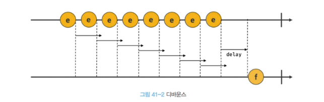
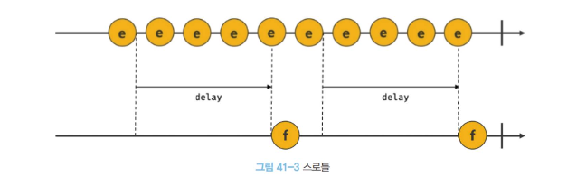
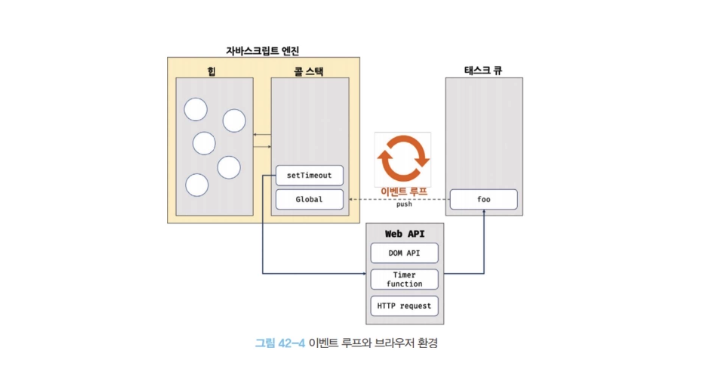
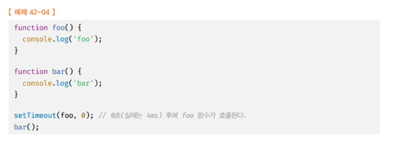

# 모던 자바스크립트 Deep Dive 41 ~ 44장 정리

> 41장 타이머 · 42장 비동기 프로그래밍 · 43장 Ajax · 44장 REST API

## 41장 타이머

### 호출 스케줄링

- 일정 시간이 경과된 이후 함수를 호출하려면 **타이머 함수**를 사용 ⇒ **호출 스케줄링**
- 타이머 함수는 ECMAScript 사양의 빌트인 함수가 아님. 브라우저 환경과 Node.js 환경이 제공하는 **호스트 객체**
- 타이머 함수는 **비동기 처리 방식**으로 동작. 자바스크립트 엔진은 실행 컨텍스트 스택이 하나인 싱글 스레드로 동작하기 때문

```js
// 타이머 함수 자체는 함수를 등록만 하고 바로 끝난다
setTimeout(() => console.log('2'), 0);
console.log('1');
// 1 → 2 ← delay가 0이어도 바로 실행되지 않는다
```

### 타이머 함수

**① `setTimeout` / `clearTimeout`** — `delay` 이후 콜백을 **단 한 번** 호출

```js
// setTimeout(func, delay, ...args)
// - delay 생략 시 기본값 0. 단 브라우저는 최소 지연 시간이 있다 (HTML 표준상 5단계 이상 중첩 호출부터 4ms)
// - 세 번째 인수부터는 콜백 함수에 전달할 인수
const timerId = setTimeout((name) => console.log(`Hi! ${name}.`), 1000, 'Lee');

// 반환값은 타이머를 식별하는 고유 id (브라우저: 숫자, Node.js: 객체)
// 타이머 취소 → 콜백 호출 X
clearTimeout(timerId);
```

**② `setInterval` / `clearInterval`** — `delay`마다 콜백을 **반복** 호출. 타이머를 취소할 때까지 계속

```js
let count = 1;

const timerId = setInterval(() => {
  console.log(count); // 1 2 3 4 5
  if (count++ === 5) clearInterval(timerId); // 5번 실행 후 취소
}, 1000);
```

⇒ `delay`는 "정확히 그 시간 뒤 실행"이 아니라 **"최소 그 시간 뒤에 태스크 큐에 들어간다"** 는 뜻. 실제 실행은 콜 스택이 비어야 한다. (42장 이벤트 루프)

### 디바운스와 스로틀

- 짧은 시간 연속으로 발생하는 이벤트(`scroll`, `resize`, `input`, `mousemove` 등)를 **그룹화**해서 과도한 이벤트 핸들러 호출을 방지하는 프로그래밍 기법
- 둘 다 **타이머 함수로 구현**한다.

#### 디바운스



- 짧은 시간 간격으로 이벤트가 연속해서 발생하면 핸들러를 호출하지 않다가, **마지막 이벤트 이후 일정 시간이 경과하면 한 번만** 호출하는 기법
- ⇒ `resize` 이벤트 처리, `input` 요소 입력에 따른 자동 완성 UI(API 요청), 버튼 중복 클릭 방지 등에서 활용

```js
const debounce = (callback, delay) => {
  let timerId;
  // 클로저로 timerId를 기억한다 (24장)
  return (...args) => {
    // delay가 지나기 전에 또 호출되면 이전 타이머를 취소하고 새로 건다
    if (timerId) clearTimeout(timerId);
    timerId = setTimeout(callback, delay, ...args);
  };
};

const $input = document.querySelector('input');

// 입력이 멈추고 300ms가 지나야 한 번 요청
$input.oninput = debounce((e) => {
  console.log('검색 요청:', e.target.value);
}, 300);
```

#### 스로틀



- 짧은 시간 간격으로 이벤트가 연속해서 발생하더라도, **일정 시간 간격으로 최대 한 번만** 호출하는 기법
- ⇒ `scroll` 이벤트 처리, 무한 스크롤 UI 구현 등에서 활용

```js
const throttle = (callback, delay) => {
  let timerId;
  return (...args) => {
    // 이미 타이머가 걸려 있으면(delay 안이면) 무시한다
    if (timerId) return;
    timerId = setTimeout(() => {
      callback(...args);
      timerId = null; // delay가 지나면 다시 호출 가능
    }, delay);
  };
};

// 스크롤 중에도 100ms마다 최대 한 번
window.addEventListener('scroll', throttle(() => {
  console.log('scroll!');
}, 100));
```

| | 디바운스 | 스로틀 |
| --- | --- | --- |
| 호출 시점 | 이벤트가 **멈춘 뒤** 한 번 | 이벤트가 이어지는 **동안 주기적으로** |
| 타이머 처리 | 호출될 때마다 **취소하고 다시 건다** | 타이머가 있으면 **무시한다** |
| 대표 사례 | 검색어 자동 완성, resize | 스크롤, 무한 스크롤 |

#### 의문 — 라이브러리마다 구현 방식이 어떻게 다를까?

실무에서는 직접 구현하기보다 Underscore, Lodash, es-toolkit을 쓰는 것을 권장한다. 근데 셋 다 같은 방식일까? → **아니다.** "타이머를 매번 새로 거느냐, 하나를 재활용하느냐", "스로틀을 따로 구현하느냐, 디바운스 위에 얹느냐"가 다르다.

| | Underscore | Lodash | es-toolkit |
| --- | --- | --- | --- |
| 디바운스 타이머 | 하나를 **재활용**. 만료 시 남은 시간만큼 다시 건다 | 하나를 **재활용**. 만료 시 남은 시간만큼 다시 건다 | 호출마다 **`clearTimeout` 후 새로 건다** (책 구현과 동일) |
| 스로틀 구현 | **별도 구현** (타임스탬프 비교) | **디바운스 + `maxWait`** | **디바운스 + 타임스탬프 비교** |
| 옵션 | `immediate` (boolean) | `leading`, `trailing`, `maxWait` | `edges: ['leading', 'trailing']`, `signal` (AbortSignal) |
| 추가 메서드 | `cancel` | `cancel`, `flush` | `cancel`, `flush`, `schedule` |

**① Underscore — 타이머를 다시 걸지 않고 "마지막 호출 시각"만 갱신**

```js
// jashkenas/underscore — modules/debounce.js (핵심만)
var later = function () {
  var passed = now() - previous; // 마지막 호출 이후 지난 시간
  if (wait > passed) {
    timeout = setTimeout(later, wait - passed); // 아직이면 남은 시간만큼 다시
  } else {
    timeout = null;
    if (!immediate) result = func.apply(context, args);
  }
};

var debounced = function (..._args) {
  previous = now(); // 호출될 때마다 시각만 기록
  if (!timeout) timeout = setTimeout(later, wait); // 타이머는 없을 때만 건다
};
```

**② Lodash — 스로틀은 사실 `maxWait`가 붙은 디바운스**

```js
// lodash/lodash — throttle.js (핵심만)
function throttle(func, wait, options) {
  return debounce(func, wait, {
    leading: true,
    maxWait: wait, // "아무리 이벤트가 이어져도 wait마다는 한 번 실행해라"
    trailing: true,
  });
}
```

**③ es-toolkit — 호출마다 타이머를 새로 걸고, `AbortSignal`로 취소**

```ts
// toss/es-toolkit — src/function/debounce.ts (핵심만)
const schedule = () => {
  if (timeoutId != null) clearTimeout(timeoutId); // 매번 취소하고
  timeoutId = setTimeout(() => { timeoutId = null; onTimerEnd(); }, debounceMs); // 새로 건다
};

signal?.addEventListener('abort', cancel, { once: true }); // AbortController로 취소 가능
```

⇒ 정리하면 **Underscore/Lodash는 `setTimeout` 호출 횟수를 줄이는 쪽**, **es-toolkit은 코드를 단순하게 + 모던 API(`AbortSignal`)** 쪽. Lodash의 `maxWait`는 "디바운스와 스로틀은 사실 하나의 개념"이라는 걸 보여준다.

> 참고) es-toolkit은 Lodash와 옵션 형태가 다르다. Lodash와 똑같이 쓰려면 `es-toolkit/compat`의 `debounce`를 쓴다.

- 소스 링크
  - Underscore: [debounce.js](https://github.com/jashkenas/underscore/blob/master/modules/debounce.js) · [throttle.js](https://github.com/jashkenas/underscore/blob/master/modules/throttle.js)
  - Lodash: [debounce.js](https://github.com/lodash/lodash/blob/4.18.1-npm/debounce.js) · [throttle.js](https://github.com/lodash/lodash/blob/4.18.1-npm/throttle.js)
  - es-toolkit: [debounce.ts](https://github.com/toss/es-toolkit/blob/main/src/function/debounce.ts) · [throttle.ts](https://github.com/toss/es-toolkit/blob/main/src/function/throttle.ts)

## 42장 비동기 프로그래밍

### 동기 처리와 비동기 처리

- **자바스크립트 엔진은 단 하나의 실행 컨텍스트 스택을 갖는다** = 함수를 실행할 수 있는 창구가 하나
  - 실행 중인 실행 컨텍스트를 제외한 모든 실행 컨텍스트는 **대기 중인 태스크**
  - ⇒ 앞선 동기 작업이 오래 걸리면 그게 **블로킹**이 되어 다음 작업에 영향을 준다.
- **동기 처리**: 현재 태스크가 끝날 때까지 다음 태스크가 대기. 실행 순서는 보장 but 블로킹
- **비동기 처리**: 현재 태스크가 끝나지 않아도 다음 태스크를 바로 실행. 블로킹 X but 실행 순서 보장 X

```js
// 동기 — sleep이 끝날 때까지 bar는 기다린다 (블로킹)
function sleep(func, delay) {
  const delayUntil = Date.now() + delay;
  while (Date.now() < delayUntil); // 아무것도 안 하고 시간만 보낸다
  func();
}

function foo() { console.log('foo'); }
function bar() { console.log('bar'); }

sleep(foo, 3 * 1000);
bar(); // (3초 후) foo → bar
```

```js
// 비동기 — setTimeout은 foo를 맡겨두고 바로 끝난다
setTimeout(foo, 3 * 1000);
bar(); // bar → (3초 후) foo
```

⇒ 타이머 함수, HTTP 요청, 이벤트 핸들러처럼 **비동기 처리 방식으로 동작하는 것들은 이벤트 루프와 태스크 큐**와 연관이 깊다.

### 이벤트 루프와 태스크 큐

- 그런데 싱글 스레드인데 왜 여러 일이 동시에 처리되는 것처럼 느껴질까? → **자바스크립트 실행 환경이 자바스크립트 엔진에 국한되지 않기 때문**



- **콜 스택**: 실행 컨텍스트가 추가되고 제거되는 스택 자료구조 = 실행 컨텍스트 스택
  - 함수가 호출되면 함수 실행 컨텍스트가 콜 스택에 푸시되어 순차적으로 실행
- **힙**: 객체가 저장되는 메모리 공간. 콜 스택의 실행 컨텍스트는 힙에 저장된 객체를 참조
  - 객체는 원시값과 달리 크기가 정해져 있지 않아 메모리를 동적 할당해야 함 ⇒ 힙은 구조화되어 있지 않다

엔진은 콜 스택에서 태스크를 순차적으로 실행할 뿐이다. **비동기 처리에서 소스코드의 평가와 실행을 제외한 모든 처리**(타이머 관리, HTTP 요청, 콜백 등록)는 엔진을 구동하는 환경인 **브라우저 또는 Node.js**가 담당한다.

- **태스크 큐**: 비동기 함수의 콜백 함수나 이벤트 핸들러가 일시적으로 **보관**되는 영역 (태스크 큐와 별도로 프로미스 후속 처리 메서드의 콜백이 보관되는 **마이크로태스크 큐**도 있다 → 45장)
- **이벤트 루프**: 콜 스택에 실행 중인 실행 컨텍스트가 있는지, 태스크 큐에 대기 중인 함수가 있는지 **반복해서 확인**. 콜 스택이 비어 있고 태스크 큐에 대기 중인 함수가 있으면, 태스크 큐의 함수를 콜 스택으로 이동시키는 메커니즘



```js
function foo() {
  console.log('foo');
}

function bar() {
  console.log('bar');
}

setTimeout(foo, 0); // 0초(실제는 4ms) 후에 foo 함수가 호출된다
bar();
// bar → foo
```

1. 전역 코드 평가 → 전역 실행 컨텍스트가 생성되어 콜 스택에 푸시
2. 전역 코드 실행 중 `setTimeout` 호출 → `setTimeout`의 함수 실행 컨텍스트가 생성되어 콜 스택에 푸시
3. `setTimeout`이 콜백 함수 `foo`를 호출 스케줄링하고 종료 → 콜 스택에서 팝
   - 이때 **타이머 설정과, 만료 시 콜백을 태스크 큐에 푸시하는 것은 브라우저의 역할**
4. 브라우저가 타이머 만료를 기다리고, 만료되면 `foo`를 태스크 큐에 푸시 (4ms 후)
5. 그동안 `bar`가 호출되어 콜 스택에 푸시 → 실행 → 팝. `foo`는 아직 태스크 큐에서 대기
   - 4번과 5번은 **동시에** 진행된다. 브라우저와 엔진이 각자 일하기 때문
6. 전역 코드 실행이 끝나고 전역 실행 컨텍스트도 팝 → 콜 스택이 완전히 빈다
7. 이벤트 루프가 콜 스택이 비었음을 감지 → 태스크 큐의 `foo`를 콜 스택으로 푸시해서 실행

⇒ 그래서 `setTimeout(foo, 0)`이어도 `foo`는 **전역 코드가 다 끝난 뒤에야** 실행된다. `delay`는 실행 시점이 아니라 태스크 큐에 들어가는 시점이다.

```text
           자바스크립트 엔진 (싱글 스레드)          브라우저 (멀티 스레드)
        ┌──────────────┐  ┌──────┐          ┌───────────────────┐
        │   콜 스택     │  │  힙  │  ──요청──▶ │ Web API           │
        │  bar         │  │      │          │  - Timer          │
        │  Global      │  │      │          │  - HTTP request   │
        └──────▲───────┘  └──────┘          │  - DOM event      │
               │                            └─────────┬─────────┘
               │ 콜 스택이 비면 꺼내서 푸시                │ 완료되면 콜백 푸시
               │                                      ▼
          [ 이벤트 루프 ] ◀──────────────────── [ 태스크 큐: foo ]
```

**자바스크립트가 싱글 스레드라는 건 "자바스크립트 엔진"이 싱글 스레드라는 것.**
**자바스크립트 엔진은 싱글 스레드로 동작하지만, 브라우저는 멀티 스레드로 동작한다.**

> 브라우저 내부의 스레드 구조(Main Thread, Web Worker)와 렌더링의 관계는 [브라우저 렌더링 딥다이브](./browser-rendering.md)에서 이어서 정리

### 이벤트 루프 문제 — 출력 순서는?

> 난이도: ① 동기 vs Task → ② Task 안에서 새 Task 생성 → ③ Microtask까지

**① 초급 — Call Stack과 Task**

```js
console.log('A');

setTimeout(() => {
  console.log('B');
}, 0);

console.log('C');
```

**② 중급 — Task 실행 중 새로운 Task가 생성되는 경우**

```js
console.log('A');

setTimeout(() => {
  console.log('B');

  setTimeout(() => {
    console.log('C');
  }, 0);

  console.log('D');
}, 0);

setTimeout(() => {
  console.log('E');
}, 0);

function foo() {
  console.log('F');
}

foo();

console.log('G');
```

**③ 고급 — Task + Microtask**

```js
Promise.resolve().then(() => {
  console.log('A');

  setTimeout(() => {
    console.log('B');
  }, 0);

  Promise.resolve().then(() => {
    console.log('C');
  });
});

setTimeout(() => {
  console.log('D');

  Promise.resolve().then(() => {
    console.log('E');
  });
}, 0);

console.log('F');
```

## 43장 Ajax

### Ajax란?

- **Ajax**(Asynchronous JavaScript and XML): 자바스크립트로 브라우저가 서버에 **비동기 방식으로 데이터를 요청**하고, 응답받은 데이터로 웹페이지를 **동적으로 갱신**하는 방식
- 브라우저가 제공하는 Web API인 `XMLHttpRequest` 객체 기반 (요즘은 `fetch`)

| | 이전 방식 | Ajax |
| --- | --- | --- |
| 응답 | 매번 **완전한 HTML** | **필요한 데이터만** |
| 화면 갱신 | 페이지 전체 리렌더링 → 깜빡임 | **필요한 부분만** 갱신 |
| 처리 방식 | 동기 → 응답 올 때까지 블로킹 | 비동기 → 블로킹 X |

### JSON

- **JSON**(JavaScript Object Notation): 클라이언트와 서버 간 HTTP 통신을 위한 **텍스트 데이터 포맷**. 키는 반드시 큰따옴표

```js
const obj = { name: 'Lee', age: 20 };

// 직렬화: 객체 → JSON 문자열 (서버로 보낼 때)
const json = JSON.stringify(obj);
console.log(json); // '{"name":"Lee","age":20}'

// 역직렬화: JSON 문자열 → 객체 (서버에서 받을 때)
const parsed = JSON.parse(json);
console.log(parsed); // { name: 'Lee', age: 20 }
```

### XMLHttpRequest

```js
const xhr = new XMLHttpRequest();

// 1. 요청 초기화 (메서드, URL)
xhr.open('GET', 'https://jsonplaceholder.typicode.com/todos/1');

// 2. 요청 전송
xhr.send();

// 3. 응답 처리 — 비동기라 이벤트 핸들러로 받는다
xhr.onload = () => {
  if (xhr.status === 200) {
    console.log(JSON.parse(xhr.response));
    // { userId: 1, id: 1, title: 'delectus aut autem', completed: false }
  } else {
    console.error('Error', xhr.status, xhr.statusText);
  }
};
```

⇒ 응답을 `onload` 콜백으로 받는 이유가 42장 그대로다. 요청은 브라우저가 처리하고, 끝나면 콜백이 태스크 큐 → 이벤트 루프 → 콜 스택으로

## 44장 REST API

### REST API란?

- **REST**(REpresentational State Transfer): HTTP를 기반으로 클라이언트가 서버의 리소스에 접근하는 방식을 규정한 **아키텍처**
- **REST API**: REST를 기반으로 서비스 API를 구현한 것. REST의 설계 원칙을 잘 지키면 **RESTful**하다고 한다.

| 구성 요소 | 내용 | 표현 방법 |
| --- | --- | --- |
| 자원 (resource) | 무엇을 | **URI** |
| 행위 (verb) | 어떻게 | **HTTP 요청 메서드** |
| 표현 (representation) | 구체적인 내용 | **페이로드** (JSON 등) |

### 설계 원칙

**① URI는 리소스를 표현해야 한다** — 동사 X, **명사** O

```text
# bad
GET /getTodos/1
GET /todos/show/1

# good
GET /todos/1
```

**② 리소스에 대한 행위는 HTTP 요청 메서드로 표현한다** — URI에 행위를 넣지 않는다

```text
# bad
GET /todos/delete/1

# good
DELETE /todos/1
```

### HTTP 요청 메서드

| 메서드 | 종류 | 목적 | 페이로드 |
| --- | --- | --- | --- |
| `GET` | index / retrieve | 모든/특정 리소스 취득 | X |
| `POST` | create | 리소스 생성 | O |
| `PUT` | replace | 리소스의 **전체** 교체 | O |
| `PATCH` | modify | 리소스의 **일부** 수정 | O |
| `DELETE` | delete | 모든/특정 리소스 삭제 | X |

```js
// POST /todos — 새 todo 생성
fetch('/todos', {
  method: 'POST',
  headers: { 'content-type': 'application/json' },
  body: JSON.stringify({ id: 4, content: 'Angular', completed: false }),
});

// PATCH /todos/4 — completed만 수정
fetch('/todos/4', {
  method: 'PATCH',
  headers: { 'content-type': 'application/json' },
  body: JSON.stringify({ completed: true }),
});
```

## 핵심 흐름

```text
타이머          → 호출 스케줄링. setTimeout(1번) / setInterval(반복). 호스트 객체가 제공
디바운스        → 이벤트가 멈춘 뒤 1번 (매번 타이머 취소 후 다시)
스로틀          → 일정 간격마다 최대 1번 (타이머 있으면 무시)
동기 / 비동기    → 순서 보장 + 블로킹 / 블로킹 X + 순서 보장 X
이벤트 루프      → 콜 스택이 비면 태스크 큐의 콜백을 콜 스택으로
싱글 스레드      → 엔진이 싱글 스레드. 브라우저는 멀티 스레드
Ajax           → 필요한 데이터만 비동기로 받아 필요한 부분만 갱신 (JSON)
REST API       → 자원은 URI, 행위는 HTTP 메서드, 표현은 페이로드
```
