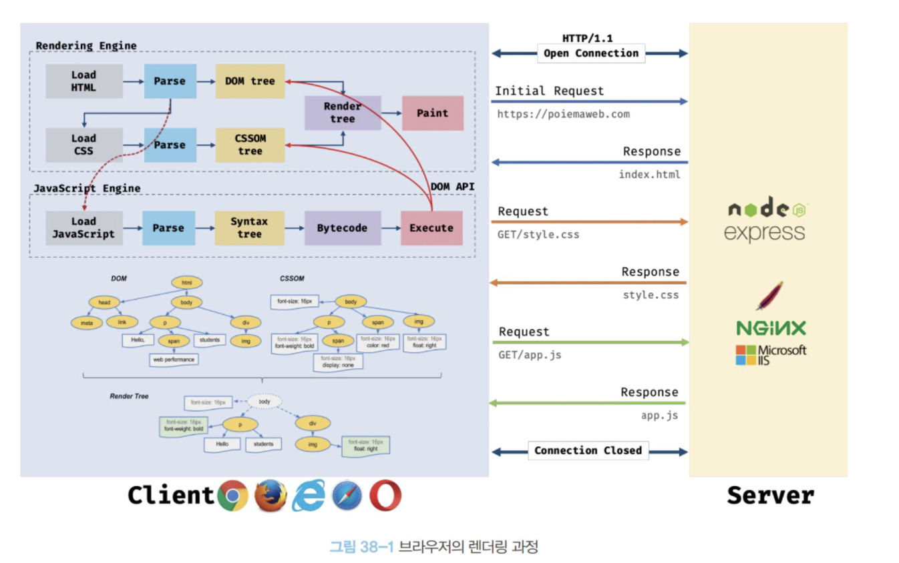
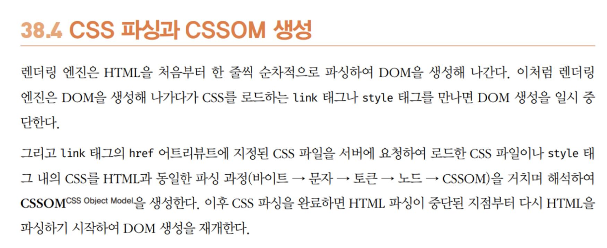
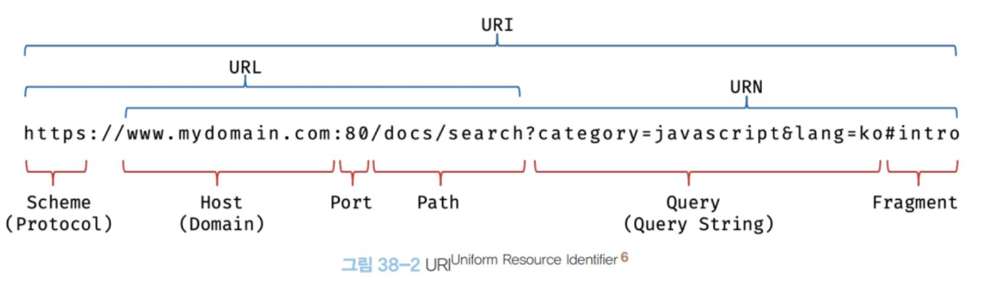
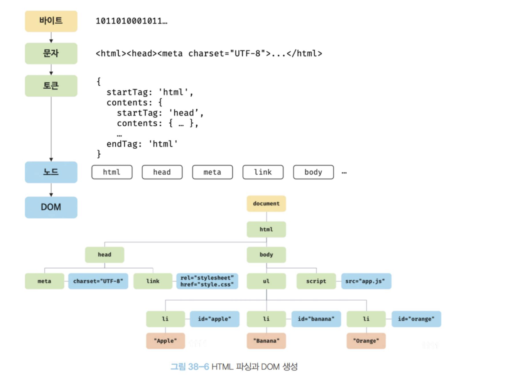
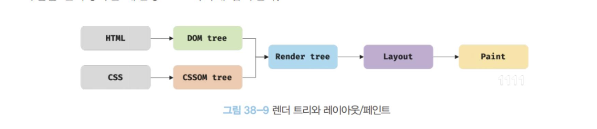
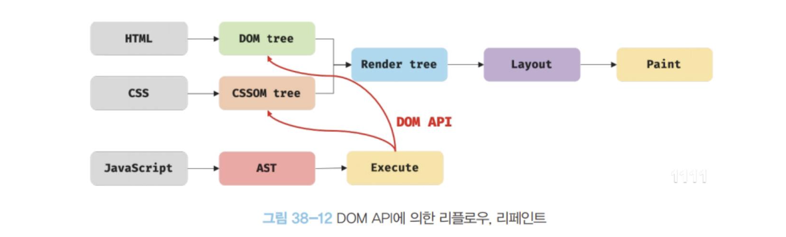
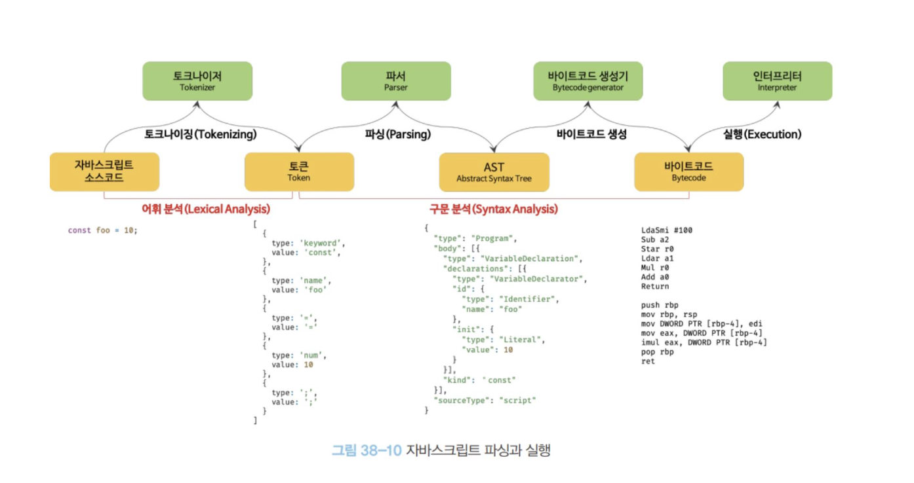
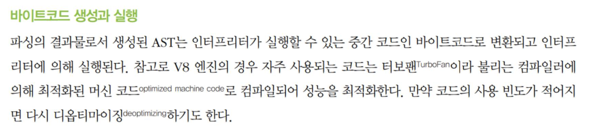
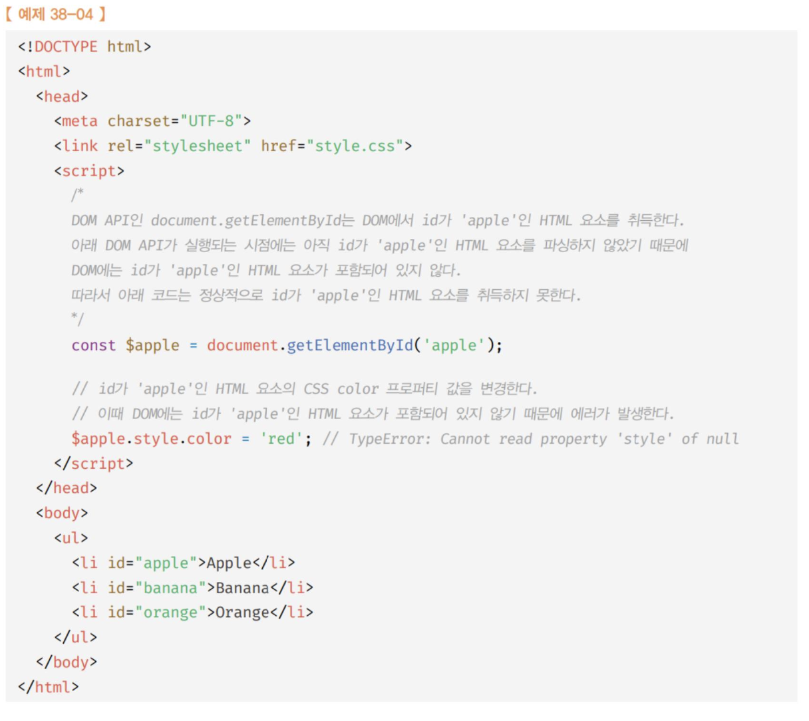
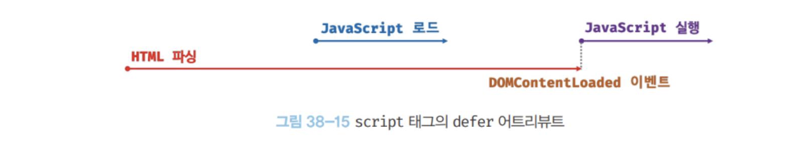

### 브라우저 렌더링 딥다이브!
더 깊이 있게 공부할 수 있는 요소들이 있는지 의문을 계속 가지기.

## 브라우저 렌더링 과정
대부분의 프로그래밍 언어는 OS나 VM 위에서 실행, 웹 앱의 클라이언트 사이드인 JS는 브라우저에서 HTML, CSS와 함께 실행. 브라우저 환경을 고려 => 효율적인 JS 프로그래밍 가능



브라우저 렌더링 과정
1. 브라우저는 HTML, CSS, JS, 이미지, 폰트 등 렌더링 리소스를 서버에게 요청하고 응답
2. 브라우저 렌더링 엔진이 응답된 HTML, CSS를 파싱하여 DOM, CSSOM 생성 후 결합하여 렌더트리 생성
3. 브라우저의 JS엔진은 서버로부터 응답된 JS를 파싱하여 AST 생성 후 바이트 코드로 변환하여 실행. 변경된 DOM, CSSOM은 다시 렌더 트리로 결합
4. 렌더 트리를 기반으로 HTML 요소의 레이아웃 계산 후 브라우저 화면에 HTML 요소 페인팅

상단 이미지를 기반으로 조금 더 자세한 시간 축에 대한 동작은 >> 
```
사용자가 URL 입력
https://example.com
        │
        ▼
┌───────────────────────────────┐
│ 1. 서버와 통신 준비           │
│                               │
│ DNS 조회                      │
│ TCP 연결                      │
│ TLS 연결 (HTTPS)              │
└───────────────┬───────────────┘
                │
                ▼
        Initial Request
        GET /
                │
                ▼
┌───────────────────────────────┐
│           SERVER              │
│                               │
│ index.html 반환               │
└───────────────┬───────────────┘
                │
                │ HTML 데이터가
                │ 스트리밍되어 들어옴
                ▼
══════════════════════════════════════════════════════════

              BROWSER

HTML bytes
   │
   ▼
┌─────────────┐
│ HTML Parser │
└──────┬──────┘
       │
       │ HTML을 위에서 아래로 읽음
       │
       ▼

<html>
<head>
  <link rel="stylesheet" href="style.css">
  <script src="app.js"></script>
</head>
<body>
  
</body>
</html>

       │
       ├──────────────────────────────┐
       │                              │
       ▼                              ▼
 DOM 생성                       외부 Resource 발견
                                       │
                        ┌──────────────┼───────────────┐
                        ▼              ▼               ▼
                   style.css        app.js          cat.png
                        │              │               │
                        ▼              ▼               ▼
                      Request        Request          Request
                        │              │               │
                        ▼              ▼               ▼
                     Server         Server          Server
                        │              │               │
                        ▼              ▼               ▼
                     Response       Response        Response
                        │              │               │
                        ▼              ▼               ▼
                    CSS Parser      JS Engine       Image Decoder
                        │
                        ▼
                      CSSOM

══════════════════════════════════════════════════════════

DOM                                CSSOM
 │                                   │
 │                                   │
 └───────────────┬───────────────────┘
                 ▼
        Style Calculation
                 │
                 ▼
         Render Tree
                 │
                 ▼
             Layout
       위치 / 크기 계산
                 │
                 ▼
              Paint
       픽셀을 그릴 정보 생성
                 │
                 ▼
           Compositing
       레이어를 합쳐 화면 출력
                 │
                 ▼

              화면
```

** 추가
서버와 통신과정 ( 주소창에 https://example.com 입력 )
1. DNS 도메인 네임 시스템에서 해당하는 실제 아이피 조회
2. TCP 연결 ( 내 브라우저 - 서버 간 통신 준비 확인 , ex) 3 Wayhandshake )
3. TLS 연결 ( 데이터 암호화 확인 )
4. HTTP 요청

-> 일반적으로 학습한 내용. 면접 때 암기형식으로 학습한 내용. WHY를 위주로 

**의문1. html 파싱중에 css 만나면, dom 생성이 block? 그러면 일반적으로 cssom이 먼저 생성되나?**
ㄴㄴ html 파싱 중 css 태그를 만나게 된다면, 그걸 기다리지 않음 ( css는 parser-blocker가 아니기 때문 )
1. html parsing중에 css link 마주하게 되면, 다운로드 받고 cssom을 만들지만 dom parsing이 block 되는건 아님 병렬적으로 생성
하지만 css다른점이, 만약에 cssom 없이 화면을 그리면 non-style - cssom complete - style 처럼 화면이 바뀌기 때문에 `render-blocking resource` 라고함.
2. Image도 마찬가지. image 태그 만나면 dom 생성후 그냥 별도로 image 다운로드
3. 단 script는 멈춤.
```
                 HTML Stream
                      │
                      ▼
HTML Parser ─────────────────────────────▶ DOM
       │
       ├── CSS 발견 ──▶ Download ──▶ CSSOM
       │
       ├── Image 발견 ─▶ Download
       │
       └── Script 발견
               │
             STOP
               │
          JS Download
               │
          JS Execute
               │
             RESUME
               │
               └─────────────────────────▶ DOM 계속
```

추가 의문;;; 책이랑 내용이 다름;;

???
여기서 말하는 일시 중단은 script 처럼 중단되는것이 아니라, 순서를 말하기 위한 표현이겠지?
```
<link> / <style> 발견
        ↓
DOM 생성 중단
        ↓
CSSOM 생성 ( 생성 요청 )
        ↓
DOM 생성 재개
```
https://developer.mozilla.org/en-US/docs/Web/Performance/Guides/How_browsers_work
>Parsing can continue when a CSS file is encountered, but `<script>` elements — particularly those without an [`async`](https://developer.mozilla.org/en-US/docs/Web/JavaScript/Reference/Statements/async_function) or `defer` attribute — block rendering, and pause the parsing of HTML

mdn 피셜은 가능하다고합니다.
CSS는 parser-blocking이 아니라 render-blocking 이므로 

### CSS위치와 Script 위치 간 상간관계 => blocking stylesheet
css도 js보다 앞에 있으면 block이 생길 수 있다.
```tsx
// 1
<head>
  <link rel="stylesheet" href="style.css">

  <script src="app.js"></script>
</head>

// 2 
<head>
  <script src="app.js"></script>
  <link rel="stylesheet" href="style.css">
</head>
```

앞에서 이미 발견한 스타일시트가 로딩중이라면, 스크립트가 그 스타일 정보를 필요로 할 가능성이 있어 script가 기다릴 수 있음. 반면에 스크립트 뒤에 오는 스타일 시트는 기다리지 않음. `getComputedStyle()`은 스타일이 없어도 에러를 내지 않고, 넣을 수 있는 스타일을 넣지만, CSS가 나중에 반환하면 StyleCaluclation을 단순 수정하기 때문

**의문2. html 파싱이전에 스크립트가 파싱되고, 그 스크립트가 해당 dom에 접근이 가능하다는건 dom 객체가 생성 되기 이전에 dom API를 쓸 수 있다는건데 그건 언제 생성됨?**

그건 실행환경 구성되면서 바로 생성됨. 왜냐면 돔 객체가 생성 되기 이전이 아니라, 돔 객체는 원래 있었고 빈 돔 객체를 가지고 있다가 거기에 파싱되면서 노드들이 추가 되는 구조이기 때문. 그니까 빈 도화지는 먼저 줌

```
페이지 로드 시작
↓
브라우저가 Document 객체 생성
↓
Window / JS 실행 환경 구성
↓
DOM API 사용 가능
↓
HTML Parsing 시작
↓
DOM Node들이 순차적으로 추가됨
↓
Parsing 완료
```

### 요청과 응답


요청할 정적 파일의 경로에 기술하여 서버에 요청. 서버는 루트 폴더 내 정적 파일에 대해 응답. 주소 창을 통해서만 요청하는것이 아니라 동적으로도 요청이 가능하다 => ajax, REST API 등

### HTTP 1.1 / 2.0
HTTP : HyperText Transfer Protocol 웹에서 브라우저, 서버가 통신하기 위한 프로토콜
1.1 : 커넥션 당 하나의 요청과 응답만 처리
2.0 : 다중 요청, 응답이 가능 => 여러 리소스의 동시 전송이 가능해서 더 빠름

### HTML 파싱과 DOM 생성
서버가 응답한 HTML은 순수 텍스트, 이거 렌더하려면 DOM으로 변환하여 저장해야 함.


1. 서버는 브라우저가 요청한 HTML 파일을 읽고 바이트(2진수)를 응답
2. 브라우저는 응답은 2진수를 meta 태그 charest 어트리뷰트에 지정된 인코딩 방식을 기준으로 문자열로 변환. 브라우저는 이를 확인하고 변환
3. 문자열로 변환된 HTML 문서를 읽고, 그걸 문법적 의미를 갖는 "토큰"들로 전부 분해
4. 각 토큰들을 객체화 해 node 생성. 노드들은 토큰 내용에 따라 분류되어짐
5. HTML 문서는 HTML 요소들의 집합, 중첩 관계를 가짐. 이러한 구조및 부자 관계 반영하여 트리 자료 구조로 구성 => DOM ( Document Object Model)

**=> DOM은 HTML 문서를 파싱한 결과물이다** 

### CSS 파싱과 CSSOM 생성
HTML 리소스를 받고 스트리밍 형식으로 위에서부터 파싱하다 CSS 로드하는 link 태그나 style 태그를 만나면 CSS 파일 요청, 이후 HTML과 동일한 방식으로 `바이트 -> 문자 -> 토큰 -> 노드 -> CSSOM` 을 거치며 CSSOM 생성. ( CSS는 상속 관계를 가지고 있다 )

### 렌더 트리 생성
파싱된 DOM과 CSSOM을 기반으로 렌더트리 생성. 렌더링을 위한 트리의 자료구조이기 때문에, 렌더되지 않는 노드들은 트리안에 포함되어지지 않는다.
렌더 트리에서 각 HTML 요소 레이아웃을 계산하는 데 사용되며, 픽셀을 렌더링하는 페인팅 처리에 입력된다.


**렌더링 과정은 반복되어 실행이 가능하다**
=> 그래서, 자스 노드 추가 삭제, 뷰포트 변경, 레이아웃 요소를 바꾸는 스타일 변경등은 리렌더링을 야기한다.
리플로우 + 리페인팅을 다시 실행하는 해당 작업은 성능에 악 영향을 준다.


리플로우 : 레이아웃 계산 다시 하는 것
리페인트 : 재결합된 렌더 트리를 기반으로 다시 페인트를 하는 것 
### 자바스크립트 파싱과 실행
자바스크립트 파싱과 실행은 브라우저의 렌더링 엔진이 아닌, **자바스크립트 엔진이 실행.**
해당 엔진은 코드를 파싱하고 CPU가 이해할 수 있는 저수준 언어로 변환하고 실행한다.

각 브라우저마자 다름 구글 크롬, Node.js V8, FireFox SpiderMonkey 등.. 근데 다 ECMAScript 사양 준수
자바스크립트 엔진은 자바스크립트를 해석해서 Abstract Syntax Tree 생성한다. AST를 기반으로 바이트 코드 생성해서 실행함



1. 토크나이징 : JS SourceCode를 분석하여 문법적 의미를 갖는 코드의 최소 단위인 토큰으로 분해
2. 파싱 : 토큰들의 구문을 분석해서 AST 생성. 문법적 의미와 구조를 반영한 자료 구조. 
3. 바이트 코드 생성과 실행 : AST는 인터프리터가 실행할 수 있는 바이트코드로 변환 및 실행.

### + 추가학습, V8 엔진 최적화



V8엔진의 경우 자주 사용되는 코드는 터보팬이라 불리는 컴파일러에 의해 최적화된 머신 코드로 컴파일되어 성능을 최적화한다. 코드의 사용 빈도가 적어진다면 디옵티마이징 하기도 한다

**의문3 엔진은 코드 사용 빈도를 어떤식으로 파악하는가?

> 코드의 사용 빈도가 적어지면 다시 디옵티마이징된다.

일단 이거는 아니고, 코드에 대한 최적화 가정이 런타임에서 깨진다면 일어난다고 하네요
```
function add(a, b) {
  return a + b;
}

add(1, 2);
add(3, 4);
add(5, 6);
// 계속 number만 들어옴
```
이런식으로 되면, "이 함수는 숫자가 들어오는 구나" => 숫자 연산에 최적화 => optimized machine code

``` 
// 근데 기습적으로 str이 들어온다!
add("hello", "world");
```

```
TurboFan의 가정

a = number
b = number

      ↓

실제 런타임

a = string
b = string

      ↓

가정 깨짐

      ↓

DEOPT
```

https://v8.dev/blog/lazy-unlinking v8 피셜
> V8의 인터프리터인 Ignition은 함수를 실행하면서 프로파일링 정보를 모은다. 함수가 충분히 자주 실행되면(hot), 그 정보를 TurboFan에 넘기고 TurboFan은 최적화된 머신 코드를 만든다. 그런데 실행 중에 객체 타입이 달라지는 등 기존 프로파일링 정보가 더 이상 맞지 않으면, 그 최적화된 머신 코드가 유효하지 않을 수 있다. 이때 V8은 deoptimization을 해야 한다.

무지 신기하네요;

+++ ) **함수가 충분히 자주실행되면 (hot)의 기준은 뭘까??**
feedback vector가 있고 연산에 전달되는 정보 수집. 단순 "몇번 반복되면 turbofan" 같은 숫자 규칙이 아니라, 여러 카운터와 휴리스틱을 사용 => v8 엔진 버전에 따라 계속 튜닝된다.
이건 나중에 엔진 공부할 때 확인

2. Dicitonary mode와 원리가 비슷한가? ( 보경이형 자료 기반 )
```
평범하고 안정적인 객체
↓
HiddenClass + descriptor
↓
빠른 프로퍼티 접근


그런데

프로퍼티 추가/삭제가 너무 빈번
↓
HiddenClass 관리 비용 커짐
↓
Dictionary 형태로 전환 // 해시 기반 딕셔너리 형태 dictionary mode
↓
Inline Cache 활용 어려움
↓
보통 더 느림
```

일단 레이어가 다름, 함수 머신 코드 최적화가 아니라 객체 프로퍼티 내부 자료 구조 저장 개념
하지만, 두 동작이 영향을 주고 받을 수 있다.
TurboFan은 객체 최적화 할 때, HiddenClass/Shape 정보를 활용하기에, dictinary mode로 전환된다면 최적화에 악영향. 객체 레벨의 안정성 깨짐 -> 코드 레벨 최적화도 영향을 받는다!
### 자바스크립트 파싱에 의한 HTML 파싱 중단
브라우저는 동기적으로, 위 아래 방향으로 HTML, CSS, JS를 파싱하고 실행한다. 이것은 **script 태그 위치에 따라 HTML 파싱이 블로킹되어 DOM 생성이 지연될 수 있다는 것을 의미한다.**  이 때, JS에서 DOM API를 통해 DOM에 접근하는 경우, DOM이 생성되지 않은 경우 문제가 발생할 수 있다.


파싱 순서상, script를 읽는 시점에 dom에는 apple의 id 요소가 포함되어있지 않다. = 'style' of null
그래서 body밑에 보통 `<script>` 태그를 위치하는건 좋은 아이디어.
- 돔 완성 전 자바스크립트가 해당 돔 조작하면 에러 발생
- html 렌더와 js 로딩을 분리해서 페이지 로딩 시간 단축.

### script 태그의 async/defer 어트리뷰트
JS의 DOM 생성이 blocking 되는 문제를 해결하기 위한 script 태그에 쓸 수 있는 attribute들

**async**

HTML 파싱과 외부 자바스크립트 파일 로드가 비동기에 동시 진행. 자바스크립트 실행은 로드가 완료된 후 직후 진행되며, 이 때 HTML 파싱이 멈춘다.
=> 스크립트 태그 순서와 상관없이 로드가 완료된 것 부터 실행됨. 순서가 보장되어지지 않음. 
```다운로드 완료 순서가
<script async src="1.js"></script>
<script async src="2.js"></script>
<script async src="3.js"></script>

2 → 3 → 1

이라면

실행 순서도

2 → 3 → 1

이 될 수 있음
```

**defer** 

async HTML 파싱과 외부 자바스크립트 파일 로드가 비동기 동시 진행. 근데 JS 파싱과 실행은 HTML 파싱이 완료된 후, 즉 DOM 생성이 완료된 직후 ( DOMContentLoaded 이전)에 진행된다. 그래서 DOM이 생성된 이후 실행할 JS에는 유용하다.

```
HTML Parsing ──────────────────────────▶ 완료

1.js ───▶ 완료
2.js ─────▶ 완료
3.js ─────────────────────▶ 아직...
4.js ─────────────────────────▶ 아직...
5.js ─────▶ 완료
```
defer는 문서 작성된 순서를 보장하기 때문에, 5가 먼저 되도 34를 기다림

두 어트리뷰트에 의한 동작 모두, `script` 태그를 만나면 로드. 다만 async의 경우 로드 이후 즉시 js 실행이라면, defer는 js가 다 로드되더라도 dom생성을 기다린 후, domcontentloaded 이전에 동작한다는 차이점.

구분하자면
async : 다운로드 완료되는 놈부터 즉시 실행, 순서 보장 x, html parsing중이면 parsing을 멈춤
defer : html parsing 완료 후, html 순서 적힌대로 실행
-> 앞 script 준비 안됐으면 기다림, 뒤 script 준비됐어도 추월x, 모든 defer 실행 후 DOMContentLoaded

async는 DOMContentLoaded가 서로 기다려주는 관계가 아님, 가능한 빨리 끝나면 실행
반면 defer는 HTML 파싱 끝, defer 스크립트 전부 실행 이후 DOM COntentLoaded 발생

**의문 4. 그럼 둘이 섞어 쓰는 경우가 있나??**

```
defer
→ 앱 번들
→ UI 초기화
→ 서로 의존하는 라이브러리

async
→ Analytics
→ 광고
→ 독립적인 추적 스크립트
```

서비스 동작에 있는 주요 코드들은 defer를 통해 순차적인 로드, 반면 외부 라이브러리 ( ga4, sentry ) 같은것들을 불러서 사용하게 되는 경우에는 별도의 로드 ( 해당 코드들이 로드 되어도 직접적인 영향x )
